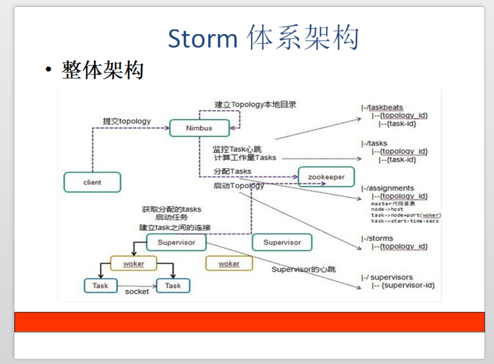

# Storm
1. 一个开源的分布式实时计算系统
2. 可以简单,可靠的处理大量的数据流
3. 应用场景:实时分析,在线机械学习,持续计算,分布式RPC,ETL等
4. 支持水平扩展,具有高容错性,保证每个消息都会得到处理,而且处理速度很快(在一个小集群中,每个节点每秒可以处理数以百万计的消息)
5. Storm可以使用任意编程语言来开发

## Storm的基本概念
1. Topologies:拓扑,俗称一个任务
2. Spouts:拓扑的消息源
3. Bolts:拓扑的处理逻辑单元
4. tuple:消息元祖
5. Streams:流
6. Stream groupings:流的分组策略
7. Tasks:任务处理单元
8. Executor:工作线程
9. Workers:工作线程
10. Configuration:topology的配置



## Storm集群搭建
1. namenod01作为Nimbus
2. namenode02和resourcemanager01作为Supervisor


### Storm集群角色
1. Nimbus:用作协调管理
2. Supervisor:负责具体的运算

### Storm安装环境
1. Zookeeper集群

### Storm集群安装
1. 安装一个zookeeper集群
2. 上传storm的安装包，解压
3. 修改配置文件storm.yaml
```
storm.zookeeper.servers:
    - "namenode01"
    - "namenode02"
    - "resourcemanager01"
  
nimbus.host: "namenode01"
supervisor.slots.ports
    - 6701
    - 6702
    - 6703
    - 6704
    - 6705
```

#### 启动storm
1. 在Nimbus主机上
```
nohup ./storm nimbus 1> /dev/null 2>&1 &
nohup ./storm ui 1>/dev/null 2>&1 &
```

2. 在Supervisor主机上
```
nohup ./storm supervisor 1>/dev/null 2>&1 &
```

## Storm测试程序
1. 在maven中添加storm依赖
```xml
        <dependency>
            <groupId>org.apache.storm</groupId>
            <artifactId>storm-core</artifactId>
            <version>${storm.version}</version>
            <scope>provided</scope>
        </dependency>
```
2. 编写测试类
3. 上传到服务器执行:`./storm jar ~/package/storm.jar cn.devinkin.storm.TopoMain`
4. 杀掉toplogy任务:
    - 先查找得到:`./storm list`
    - 根据名称杀掉:`./storm kill demopolo`

### Spout类(拓扑消息源)
```java
package cn.devinkin.storm;

import backtype.storm.spout.SpoutOutputCollector;
import backtype.storm.task.TopologyContext;
import backtype.storm.topology.OutputFieldsDeclarer;
import backtype.storm.topology.base.BaseRichSpout;
import backtype.storm.tuple.Fields;
import backtype.storm.tuple.Values;
import backtype.storm.utils.Utils;

import java.util.Map;
import java.util.Random;

public class RandomWordSpout extends BaseRichSpout {
    private SpoutOutputCollector collector;

    String[] words = {"iphone", "xiaomi", "mate", "sony", "sumsung", "moto", "meizu"};


    /**
     * 初始化方法,在spout组件实例化时调用一次
     * @param map
     * @param topologyContext
     * @param spoutOutputCollector
     */
    public void open(Map map, TopologyContext topologyContext, SpoutOutputCollector spoutOutputCollector) {
        this.collector = collector;
    }

    /**
     * 不断地网下一个组件发送tuple消息
     * 这里面是该spout组件的核心逻辑
     */
    public void nextTuple() {
        // 可以kafka消息队列中拿到数据,简便起见,我们从words数组中随机挑选一个商品名发送出去
        Random random = new Random();
        int index = random.nextInt(words.length);

        // 通过随机数拿到一个商品名
        String godName = words[index];

        // 将商品名封装成一个tuple,发送消息给下一个组件
        collector.emit(new Values(godName));

        // 每发送一个消息,休眠500ms
        Utils.sleep(500);
    }

    public void declareOutputFields(OutputFieldsDeclarer outputFieldsDeclarer) {
        outputFieldsDeclarer.declare(new Fields("originname"));
    }
}

```

### Bolt类(拓扑的处理逻辑单元)
1. uppder
```java
package cn.devinkin.storm;

import backtype.storm.topology.BasicOutputCollector;
import backtype.storm.topology.OutputFieldsDeclarer;
import backtype.storm.topology.base.BaseBasicBolt;
import backtype.storm.tuple.Fields;
import backtype.storm.tuple.Tuple;
import backtype.storm.tuple.Values;

public class UpperBolt extends BaseBasicBolt {
    /**
     * 业务处理逻辑
     * @param tuple
     * @param basicOutputCollector
     */
    public void execute(Tuple tuple, BasicOutputCollector basicOutputCollector) {
        // 先获取到上一个组件传递过来的数据,数据在tuple里面
        String godName = tuple.getString(0);

        // 将商品名称转换成大写
        String godNameUpper = godName.toUpperCase();

        // 将转换完成的商品发送出去
        basicOutputCollector.emit(new Values(godNameUpper));
    }

    public void declareOutputFields(OutputFieldsDeclarer outputFieldsDeclarer) {
        outputFieldsDeclarer.declare(new Fields("uppername"));
    }
}

```

2. suffix
```java
package cn.devinkin.storm;

import backtype.storm.task.TopologyContext;
import backtype.storm.topology.BasicOutputCollector;
import backtype.storm.topology.OutputFieldsDeclarer;
import backtype.storm.topology.base.BaseBasicBolt;
import backtype.storm.tuple.Tuple;

import java.io.FileWriter;
import java.io.IOException;
import java.util.Map;
import java.util.UUID;

public class SuffixBolt extends BaseBasicBolt {

    private FileWriter fileWriter = null;

    /**
     * 在bolt组件运行过程中只会被调用一次,用于初始化各种实例
     * @param stormConf
     * @param context
     */
    @Override
    public void prepare(Map stormConf, TopologyContext context) {
        try {
            fileWriter = new FileWriter("/root/stormdata/stormoutput/" + UUID.randomUUID());
        } catch (Exception e) {
            throw new RuntimeException(e);
        }
    }

    /**
     * 该bolt组件的核心处理逻辑
     * 回收到一个tuple消息,就会被调用一次
     * @param tuple
     * @param basicOutputCollector
     */
    public void execute(Tuple tuple, BasicOutputCollector basicOutputCollector) {
        // 先拿到上一个组件发送过来的消息名称
        String upperName = tuple.getString(0);
        String suffixName = upperName + "_itisok";

        // 为上一个组件发送过来的商品名称添加后缀
        try {
            fileWriter.write(suffixName);
            fileWriter.write("\n");
            fileWriter.flush();
        } catch (IOException e) {
            e.printStackTrace();
            throw new RuntimeException(e);
        }

    }

    public void declareOutputFields(OutputFieldsDeclarer outputFieldsDeclarer) {

    }
}

```

### 提交toplogy的主程序
```java
package cn.devinkin.storm;

import backtype.storm.Config;
import backtype.storm.StormSubmitter;
import backtype.storm.generated.AlreadyAliveException;
import backtype.storm.generated.InvalidTopologyException;
import backtype.storm.generated.StormTopology;
import backtype.storm.topology.TopologyBuilder;

/**
 * 组织各个处理组件形成一个完整的处理流程,就是topology
 * 并且该topology提交给storm集群去运行,topology提交到集群后就将永无休止的执行,不会停止
 * @author devinkin
 */
public class TopoMain {
    public static void main(String[] args) throws AlreadyAliveException, InvalidTopologyException {
        TopologyBuilder builder = new TopologyBuilder();

        // 将我们的spout组件设置到topology中,并发度是4
        builder.setSpout("randomspout", new RandomWordSpout(), 4);

        // 将大写转换bolt组件设置到toplogy中,并指定它的randomspout组件的消息m,并发度是4
        builder.setBolt("upperbolt", new UpperBolt(), 4).shuffleGrouping("randomspout");

        // 将后缀转换bolt组件设置到toplogy中,并指定它的upperbolt组件的消息,并发度是4
        builder.setBolt("suffixbolt", new SuffixBolt(), 4).shuffleGrouping("upperbolt");

        // 用builder来创建一个topology
        StormTopology demotop = builder.createTopology();

        // 配置一些topology在集群中运行的参数
        Config conf = new Config();
        // topology设置worker数量
        conf.setNumWorkers(4);
        conf.setDebug(true);
        // 取消toplogy事务机制
        conf.setNumAckers(0);

        // 将这个topology提交给storm集群运行
        StormSubmitter.submitTopology("demotopo", conf, demotop);

    }
}
```


## storm的深入学习
1. 分布式共享锁的实现
2. 事务topology的实现机制及开发模式
3. 在具体场景中的跟其他框架的整合(flume/activemq/kafka(分布式的消息队列系统)/redis/hbase/mysql cluster)

# Kafka
1. 是一个分布式的消息缓存系统
2. kafka集群中的服务器都叫broker
3. kafka有两类客户端,一类叫producer(消息生产者),一类叫customer(消息消费者),客户端和broker服务器之间采用TCP协议连接
4. kafka中不同业务系统的消息可以通过topic进行区分,而且每一个消息topic都会被分区,以分担消息读写的负载
5. 每一个分区都可以有多个副本,以防止数据的丢失
6. 某一个分区中的数据如果需要更新,都必须通过该分区所有副本中的leader来更新
7. 消费者(customer)可以分组,比如有两个消费者组A和B,共同消费一个topic:order_info,A和B所消费的消息都不会重复
8. 消费者在具体消费某个topic中的消息时,可以指定起始偏移量

## Kafka的安装
1. 解压kafka压缩包
2. 启动kafka自带的Zookeeper:`bin/zookeeper-server-start.sh config/zookeeper.properties`
3. 启动kafka:`bin/kafka-server-start.sh config/server.properties 1>/dev/null 2>&1 &`
4. 创建一个topic:`bin/kafka-topics.sh --create --zookeeper localhost:2181 --replication-factor 1 --partitions 1 --topic order_name`
5. 查看topic的列表:`bin/kafka-topics.sh --list --zookeeper localhost:2181`
6. 创建一个生产者发送消息:`bin/kafka-console-producer.sh --broker-list localhost:9092 --topic order_name`
7. 创建一个消费者接受消息:`bin/kafka-console-consumer.sh --zookeeper namenode01:2181 --topic order_name --from-beginning`

## 创建Kafka集群
1. 修改server.properties
```
broker.id=1
zookeeper.connect=namenode01:2181,namenode02:2181,resourcemanager01:2181
```

2. 启动zookeeper:`./zkServer.sh start`

3. 启动kafka:`bin/kafka-server-start.sh config/server.properties 1>/dev/null 2>&1 &`

4. 创建一个topic:`bin/kafka-topics.sh --create --zookeeper namenode01:2181 --replication-factor 3 --partitions 1 --topic mygirl `

5. 查看topic的列表:`bin/kafka-topics.sh --list --zookeeper namenode01:2181`
6. 创建一个生产者发送消息:`bin/kafka-console-producer.sh --broker-list namenode01:9092 --topic mygirls`
7. 创建一个消费者接受消息:`bin/kafka-console-consumer.sh --zookeeper namenode01:2181 --topic mygirls --from-beginning`
8. 查看话题的描述信息:`bin/kafka-topics.sh --describe --zookeeper namenode01:2181 --topic mygirls`


## 编写kafka生产者消费者代码
1. 在maven中导入kafka的依赖
```xml
        <dependency>
            <groupId>org.apache.kafka</groupId>
            <artifactId>kafka_2.10</artifactId>
            <version>${kafka.version}</version>
        </dependency>
```
### 生产者
```java
package cn.devinkin.kafka;

import kafka.javaapi.producer.Producer;
import kafka.producer.KeyedMessage;
import kafka.producer.ProducerConfig;

import java.util.Properties;

public class ProducerDemo {
    public static void main(String[] args) throws InterruptedException {
        Properties props = new Properties();
        props.put("zk.connect", "namenode01:2181,namenode02:2181,resourcemanager01:2181");
        props.put("metadata.broker.list","namenode01:9092,namenode02:9092,resourcemanager01:9092");
        props.put("serializer.class","kafka.serializer.StringEncoder");
        ProducerConfig config = new ProducerConfig(props);
        Producer<String, String> producer = new Producer<String, String>(config);

        // 发送业务消息
        // 读取文件, 读取内存数据库,读socket端口
        for (int i = 0; i < 1000; i++) {
            Thread.sleep(500);
            producer.send(new KeyedMessage<String, String>("mygirls",
                    "i said love you baby for " + i + " times"));
        }
    }
}

```
### 消费者
```java
package cn.devinkin.kafka;

import kafka.consumer.Consumer;
import kafka.consumer.ConsumerConfig;
import kafka.consumer.KafkaStream;
import kafka.javaapi.consumer.ConsumerConnector;
import kafka.message.MessageAndMetadata;

import java.util.HashMap;
import java.util.List;
import java.util.Map;
import java.util.Properties;

public class ConsumerDemo {
    private static final String topic = "mygirls";
    private static final Integer threads = 1;
    public static void main(String[] args) {
        Properties props = new Properties();
        props.put("zookeeper.connect", "namenode01:2181,namenode02:2181,resourcemanager01:2181");
        props.put("group.id", "1111");
        props.put("auto.offset.reset", "smallest");

        ConsumerConfig config = new ConsumerConfig(props);
        ConsumerConnector consumer =  Consumer.createJavaConsumerConnector(config);
        Map<String, Integer> topicCountMap = new HashMap<String, Integer>();
        topicCountMap.put(topic, threads);
        Map<String, List<KafkaStream<byte[], byte[]>>> consumerMap = consumer.createMessageStreams(topicCountMap);
        List<KafkaStream<byte[], byte[]>> streams = consumerMap.get(topic);

        for (final KafkaStream<byte[], byte[]> kafkaStream : streams) {
            new Thread(new Runnable() {
                public void run() {
                    for (MessageAndMetadata<byte[], byte[]> mm : kafkaStream) {
                        String msg = new String(mm.message());
                        System.out.println(msg);
                    }
                }
            }).start();
        }
    }
}

```

## Kafka与Storm整合
1. 在maven中导入kafka与storm整合的依赖
```xml
        <dependency>
            <groupId>org.apache.storm</groupId>
            <artifactId>storm-kafka</artifactId>
            <version>${storm.version}</version>
        </dependency>
```

### 编写KafkaTopo