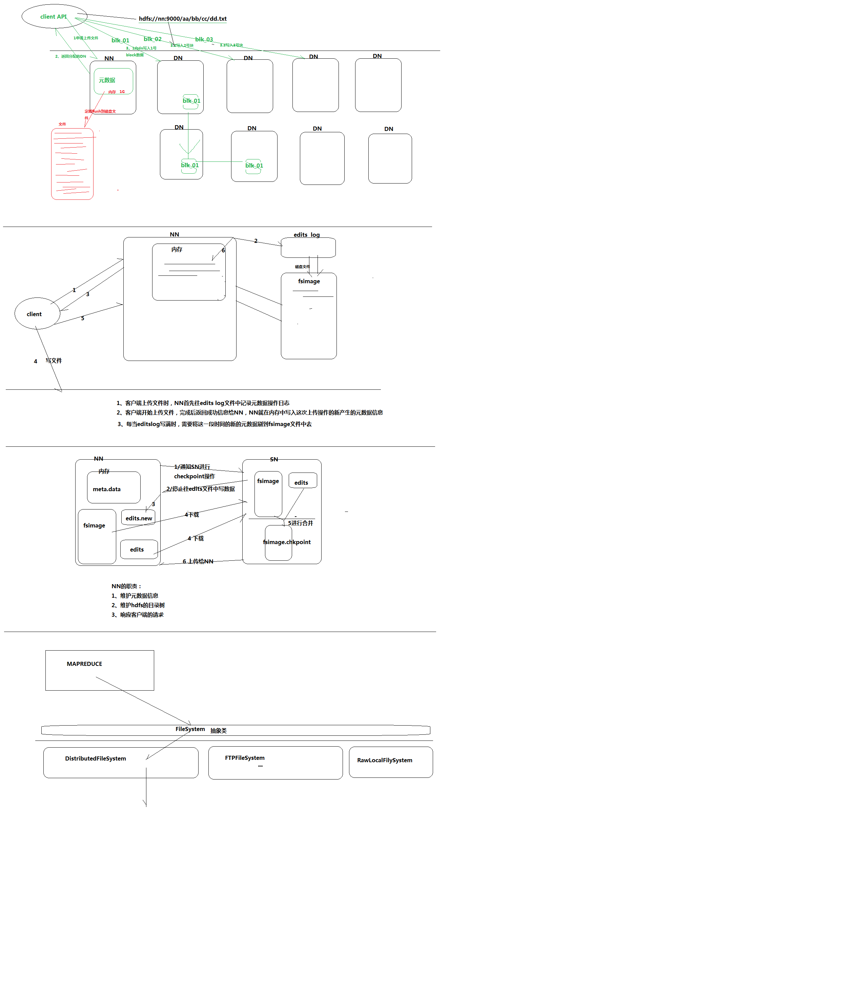
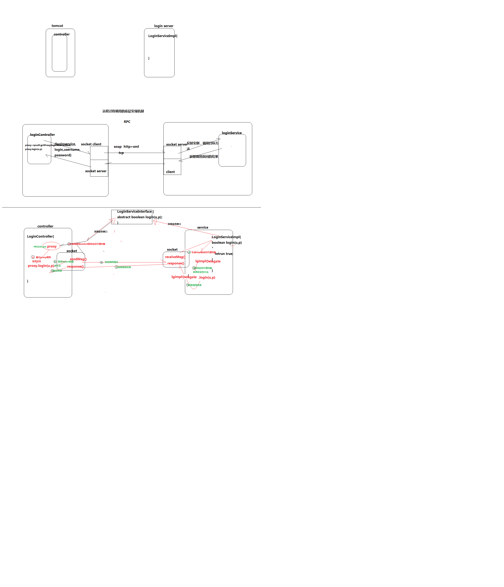

# HDFS
## HDFS架构
1. NameNode
2. DataNode
3. Secondary NameNode

## HDFS的工作机制


### Remote Procedure Call
1. RPC——远程过程调用协议，它是一种通过网络从远程计算机程序上请求服务，而不需要了解底层网络技术的协议。RPC协议假定某些传输协议的存在，如TCP或UDP，为通信程序之间携带信息数据。在OSI网络通信模型中，RPC跨越了传输层和应用层。RPC使得开发包括网络分布式多程序在内的应用程序更加容易。

2. RPC采用客户机/服务器模式。请求程序就是一个客户机，而服务提供程序就是一个服务器。首先，客户机调用进程发送一个有进程参数的调用信息到服务进程，然后等待应答信息。在服务器端，进程保持睡眠状态直到调用信息的到达为止。当一个调用信息到达，服务器获得进程参数，计算结果，发送答复信息，然后等待下一个调用信息，最后，客户端调用进程接收答复信息，获得进程结果，然后调用执行继续进行。

3. hadoop的整个体系结构就是构建在RPC之上的(见org.apache.hadoop.ipc)。



### HDFS读过程
1. 初始化FileSystem，然后客户端(client)用FileSystem的open()函数打开文件
2. FileSystem用RPC调用元数据节点，得到文件的数据块信息，对于每一个数据块，元数据节点返回保存数据块的数据节点的地址。
3. FileSystem返回FSDataInputStream给客户端，用来读取数据，客户端调用stream的read()函数开始读取数据。
4. DFSInputStream连接保存此文件第一个数据块的最近的数据节点，data从数据节点读到客户端(client)
5. 当此数据块读取完毕时，DFSInputStream关闭和此数据节点的连接，然后连接此文件下一个数据块的最近的数据节点。
6. 当客户端读取完毕数据的时候，调用FSDataInputStream的close函数。
7. 在读取数据的过程中，如果客户端在与数据节点通信出现错误，则尝试连接包含此数据块的下一个数据节点。
8. 失败的数据节点将被记录，以后不再连接。

### HDFS写过程
1. 初始化FileSystem，客户端调用create()来创建文件
2. FileSystem用RPC调用元数据节点，在文件系统的命名空间中创建一个新的文件，元数据节点首先确定文件原来不存在，并且客户端有创建文件的权限，然后创建新文件。
3. FileSystem返回DFSOutputStream，客户端用于写数据，客户端开始写入数据。
4. DFSOutputStream将数据分成块，写入data queue。data queue由Data Streamer读取，并通知元数据节点分配数据节点，用来存储数据块(每块默认复制3块)。分配的数据节点放在一个pipeline里。Data Streamer将数据块写入pipeline中的第一个数据节点。第一个数据节点将数据块发送给第二个数据节点。第二个数据节点将数据发送给第三个数据节点。
5. DFSOutputStream为发出去的数据块保存了ack queue，等待pipeline中的数据节点告知数据已经写入成功。
6. 当客户端结束写入数据，则调用stream的close函数。此操作将所有的数据块写入pipeline中的数据节点，并等待ack queue返回成功。最后通知元数据节点写入完毕。
7. 如果数据节点在写入的过程中失败，关闭pipeline，将ack queue中的数据块放入data queue的开始，当前的数据块在已经写入的数据节点中被元数据节点赋予新的标示，则错误节点重启后能够察觉其数据块是过时的，会被删除。失败的数据节点从pipeline中移除，另外的数据块则写入pipeline中的另外两个数据节点。元数据节点则被通知此数据块是复制块数不足，将来会再创建第三份备份。


## NameNode
1. NameNode是整个文件系统的管理节点。它维护着整个文件系统的文件目录树，文件/目录的元信息和每个文件对应的数据块列表。接收用户的操作请求。
文件包括：
    - fsimage:元数据镜像文件。存储某一时段NameNode内存元数据信息。
    - edits:操作日志文件。
    - fstime:保存最近一次checkpoint的时间

2. 以上这些文件是保存在linux的文件系统中。

### NameNode工作特点
1. Namenode始终在内存中保存metedata，用于处理“读请求”
2. 到有“写请求”到来时，namenode会首先写editlog到磁盘，即向edits文件中写日志，成功返回后，才会修改内存，并且向客户端返回
3. Hadoop会维护一个fsimage文件，也就是namenode中metedata的镜像，但是fsimage不会随时与namenode内存中的metedata保持一致，而是每隔一段时间通过合并edits文件来更新内容。Secondary namenode就是用来合并fsimage和edits文件来更新NameNode的metedata的。

### NameNode的职责
1. 维护元数据的信息
2. 维护hdfs的目录树
3. 响应客户端的请求


## SecondaryNameNode
1. HA的一个解决方案。但不支持热备。配置即可。
2. 执行过程：从NameNode上下载元数据信息（fsimage,edits），然后把二者合并，生成新的fsimage，在本地保存，并将其推送到NameNode，替换旧的fsimage.
3. 默认在安装在NameNode节点上，但这样...不安全！

### secondary namenode的工作流程
1. secondary通知namenode切换edits文件
2. secondary从namenode获得fsimage和edits(通过http)
3. secondary将fsimage载入内存，然后开始合并edits
4. secondary将新的fsimage发回给namenode
5. namenode用新的fsimage替换旧的fsimage

### 什么时候checkpooint
1. fs.checkpoint.period:指定两次checkpoint的最大时间间隔，默认3600秒。

2. fs.checkpoint.size:规定edits文件的最大值，一旦超过这个值则强制checkpoint，不管是否到达最大时间间隔。默认大小是64M。


## DataNode
1. 提供真实文件数据的存储服务。
2. 文件块（block）：最基本的存储单位。对于文件内容而言，一个文件的长度大小是size，那么从文件的０偏移开始，按照固定的大小，顺序对文件进行划分并编号，划分好的每一个块称一个Block。HDFS默认Block大小是128MB，以一个256MB文件，共有256/128=2个Block.
    - 配置块大小:`dfs.block.size`
3. 不同于普通文件系统的是，HDFS中，如果一个文件小于一个数据块的大小，并不占用整个数据块存储空间
4. Replication。多复本。默认是三个。


## Maven搭建hadoop开发环境

### pom.xml
```xml
<?xml version="1.0" encoding="UTF-8"?>
<project xmlns="http://maven.apache.org/POM/4.0.0"
         xmlns:xsi="http://www.w3.org/2001/XMLSchema-instance"
         xsi:schemaLocation="http://maven.apache.org/POM/4.0.0 http://maven.apache.org/xsd/maven-4.0.0.xsd">
    <modelVersion>4.0.0</modelVersion>

    <groupId>cn.devinkin</groupId>
    <artifactId>Hadoop</artifactId>
    <version>1.0-SNAPSHOT</version>

    <properties>
        <hadoop.version>2.4.1</hadoop.version>
    </properties>

    <dependencies>
        <dependency>
            <groupId>org.apache.hadoop</groupId>
            <artifactId>hadoop-common</artifactId>
            <version>${hadoop.version}</version>
        </dependency>
        <dependency>
            <groupId>org.apache.hadoop</groupId>
            <artifactId>hadoop-hdfs</artifactId>
            <version>${hadoop.version}</version>
        </dependency>
        <dependency>
            <groupId>org.apache.hadoop</groupId>
            <artifactId>hadoop-client</artifactId>
            <version>${hadoop.version}</version>
        </dependency>
        <dependency>
            <groupId>junit</groupId>
            <artifactId>junit</artifactId>
            <version>4.12</version>
            <scope>test</scope>
        </dependency>
    </dependencies>

</project>
```

### 编写测试代码
1. 将hdfs-site.xml和core-site.xml文件

2. 编写文件下载测试代码
```java
    public static void main(String[] args) throws IOException {
        // 从hdfs下载文件
        Configuration conf = new Configuration();

        FileSystem fs = FileSystem.get(conf);
        Path src = new Path("hdfs://devinkin:9000/jdk-7u65-linux-x64.tar.gz");
        FSDataInputStream inputStream = fs.open(src);
        FileOutputStream outputStream = new FileOutputStream("/home/devinkin/jdk-7u65-linux-x64.tar.gz");

        IOUtils.copy(inputStream, outputStream);
        outputStream.close();
        inputStream.close();
    }
```

3. API测试代码如下
```java
import org.apache.commons.io.IOUtils;
import org.apache.hadoop.conf.Configuration;
import org.apache.hadoop.fs.*;
import org.junit.Before;
import org.junit.Test;

import java.io.FileInputStream;
import java.io.IOException;
import java.net.URI;

public class HdfsUtil {
    private FileSystem fs = null;

    @Before
    public void init() throws Exception {
        // 读取classpath下的xxx-site.xml配置文件,并解析其内容,封装到conf对象中
        Configuration conf = new Configuration();
        // 创建文件系统
        fs = FileSystem.get(new URI("hdfs://devinkin:9000/"), conf, "root");
    }


    /**
     * 上传文件,传统写法
     */
    @Test
    public void upload() throws IOException {

        // 设置上传的路径
        Path dst = new Path("hdfs://devinkin:9000/aa/qingshu.txt");

        // 获取输出流
        FSDataOutputStream os = fs.create(dst);

        // 获取输入流
        FileInputStream is = new FileInputStream("/home/devinkin/JavaCode/WebBackEnd/Hadoop/src/test/resources/qingshu.txt");
        IOUtils.copy(is, os);
        is.close();
        os.close();

    }

    /**
     * 上传文件,封装后的写法
     * @throws IOException
     */
    @Test
    public void upload2() throws IOException {
        fs.copyFromLocalFile(new Path("/home/devinkin/JavaCode/WebBackEnd/Hadoop/src/test/resources/qingshu.txt"), new Path("hdfs://devinkin:9000/aaa/bbb/ccc/qingshu2.txt"));
    }

    /**
     * 下载文件
     */
    @Test
    public void download() throws IOException {
        fs.copyToLocalFile(new Path("hdfs://devinkin:9000/aa/qingshu2.txt"),
                new Path("/home/devinkin/JavaCode/WebBackEnd/Hadoop/src/test/resources/qingshu2.txt"));
    }

    /**
     * 查看文件信息
     */
    @Test
    public void listFiles() throws IOException {
        // 只查看文件
        RemoteIterator<LocatedFileStatus> files = fs.listFiles(new Path("/"), true);
        while (files.hasNext()) {
            LocatedFileStatus file = files.next();
            Path path = file.getPath();
            String name = path.getName();
            System.out.println("fileName: " + name);
        }

        System.out.println("============================================");
        FileStatus[] fileStatuses = fs.listStatus(new Path("/"));
        for (FileStatus status : fileStatuses) {
            System.out.println("fileName: " + status.getPath().getName() + (status.isDirectory() ? " is Directory":""));
        }

    }

    /**
     * 创建目录
     */
    @Test
    public void mkDir() throws IOException {
        fs.mkdirs(new Path("/aaa/bbb/ccc"));
    }

    /**
     * 删除目录
     */
    @Test
    public void rmDir() throws IOException {
        fs.delete(new Path("/aaa"), true);
    }
}

```