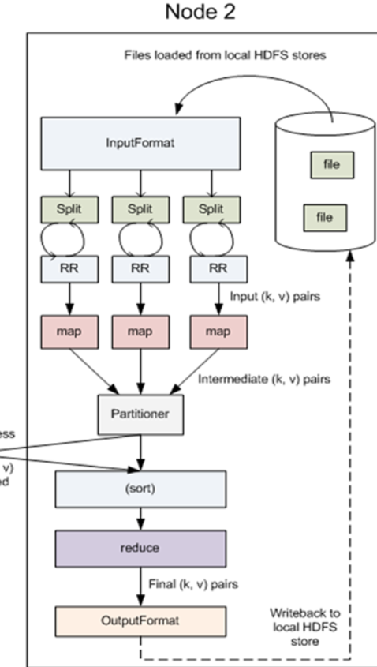

# Hadoop序列化机制
1. JDK序列化与反序列化会保存对象的继承结构
2. Hadoop序列化与反序列化不会保存对象的继承结构
3. Hadoop序列化需要实现Writable接口

# MapReduce程序
1. MapReduce排序程序
2. MapReduce分组程序

## Map的并发
1. map task的并发数是由切片的数量决定的,由多少个切片,就启动多少个map task
2. 切片是一个逻辑的概念,指的就是文件中数据的偏移量范围
3. 切片的具体大小应该根据所处理的文件的大小来调整


## MapReduce排序程序
```java
package cn.devinkin.hadoop.mr.flowsort;

import cn.devinkin.hadoop.mr.flowsum.FlowBean;
import org.apache.commons.lang.StringUtils;
import org.apache.hadoop.conf.Configuration;
import org.apache.hadoop.conf.Configured;
import org.apache.hadoop.fs.Path;
import org.apache.hadoop.io.LongWritable;
import org.apache.hadoop.io.NullWritable;
import org.apache.hadoop.io.Text;
import org.apache.hadoop.mapreduce.Job;
import org.apache.hadoop.mapreduce.Mapper;
import org.apache.hadoop.mapreduce.Reducer;
import org.apache.hadoop.mapreduce.lib.input.FileInputFormat;
import org.apache.hadoop.mapreduce.lib.output.FileOutputFormat;
import org.apache.hadoop.util.Tool;
import org.apache.hadoop.util.ToolRunner;

import java.io.IOException;

public class SortMR {


    public static class SortMapper extends Mapper<LongWritable, Text, FlowBean, NullWritable> {

        @Override
        protected void map(LongWritable key, Text value, Context context) throws IOException, InterruptedException {
            /**
             * 1. 拿到一行数据
             * 2. 切分出各个字段
             * 3. 封装为一个flowbean,作为key输出
             */
            String line = value.toString();

            String[] fields = StringUtils.split(line);

            String phoneNB = fields[0];
            long upFlow = Long.parseLong(fields[1]);
            long downFlow = Long.parseLong(fields[2]);

            context.write(new FlowBean(phoneNB, upFlow, downFlow), NullWritable.get());
        }
    }

    public static class SortReducer extends Reducer<FlowBean, NullWritable,Text, FlowBean> {
        @Override
        protected void reduce(FlowBean key, Iterable<NullWritable> values, Context context) throws IOException, InterruptedException {
            String phoneNB = key.getPhoneNB();
            // 直接输出key即可
            context.write(new Text(phoneNB), key);
        }
    }

    public static class SortRunner extends Configured implements Tool {

        public int run(String[] args) throws Exception {
            Configuration conf = new Configuration();
            Job job = Job.getInstance(conf);

            // 指定执行的Runner类
            job.setJarByClass(SortMR.SortRunner.class);

            // 指定执行的Mapper类和Reducer类
            job.setMapperClass(SortMR.SortMapper.class);
            job.setReducerClass(SortMR.SortReducer.class);

            // 指定Mapper输出的kv类型
            job.setMapOutputKeyClass(FlowBean.class);
            job.setMapOutputValueClass(NullWritable.class);

            // 指定Reducer输出的kv类型
            job.setOutputKeyClass(Text.class);
            job.setOutputValueClass(FlowBean.class);

            FileInputFormat.setInputPaths(job, new Path(args[0]));

            FileOutputFormat.setOutputPath(job, new Path(args[1]));


            return job.waitForCompletion(true)?1:0;
        }
    }

    public static void main(String[] args) throws Exception {
        int res = ToolRunner.run(new Configuration(), new SortRunner(), args);
        System.exit(res);
    }
}

```

## MapReduce分组程序
```java
package cn.devinkin.hadoop.mr.areapartition;

import org.apache.hadoop.mapreduce.Partitioner;

import java.util.HashMap;

public class AreaPartitioner<KEY, VALUE> extends Partitioner<KEY, VALUE> {
    private static HashMap<String, Integer> areaMap = new HashMap<String, Integer>();

    static {
        areaMap.put("135", 0);
        areaMap.put("136", 1);
        areaMap.put("137", 2);
        areaMap.put("138", 3);
        areaMap.put("139", 4);
    }

    public int getPartition(KEY key, VALUE value, int i) {
        // 1. 从key中拿到手机号
        // 2. 查看手机归属字典
        // 3. 不同的省份返回不同的编号

        int areaCode = areaMap.get(key.toString().substring(0,3)) == null?5:areaMap.get(key.toString().substring(0,3));
        return areaCode;
    }
}

```
1. 分组类(Partitioner)实现
```java
package cn.devinkin.hadoop.mr.areapartition;

import org.apache.hadoop.mapreduce.Partitioner;

import java.util.HashMap;

public class AreaPartitioner<KEY, VALUE> extends Partitioner<KEY, VALUE> {
    private static HashMap<String, Integer> areaMap = new HashMap<String, Integer>();

    static {
        areaMap.put("135", 0);
        areaMap.put("136", 1);
        areaMap.put("137", 2);
        areaMap.put("138", 3);
        areaMap.put("139", 4);
    }

    public int getPartition(KEY key, VALUE value, int i) {
        // 1. 从key中拿到手机号
        // 2. 查看手机归属字典
        // 3. 不同的省份返回不同的编号

        int areaCode = areaMap.get(key.toString().substring(0,3)) == null?5:areaMap.get(key.toString().substring(0,3));
        return areaCode;
    }
}

```

## MapReduce倒排索引程序


## shuffle机制
1. 每个map有一个环形的内存缓冲区,用于存储任务的输出.默认大小100MB(io.sort.mb属性),一旦达到阀值0.8(io.sort.spill.percent),一个后台线程把内容写到(split)磁盘的指定目录(mapred.local.dir)下新建一个溢出写文件
2. 写磁盘前,要partition,sort.如果有combiner,conbine排序后数据.
3. 等最后记录写完,合并全部溢出写文件位一个分区且排序的文件.
4. Reducer通过Http方式得到输出文件的分区.
5. TaskTacker为分区文件运行Reduce任务.复制阶段把Map输出复制到Reducer的内存或磁盘.一个Map任务完成,Reduce就开始复制输出
6. 排序阶段合并map输出,然后走Reduce阶段


## MR程序的全貌
