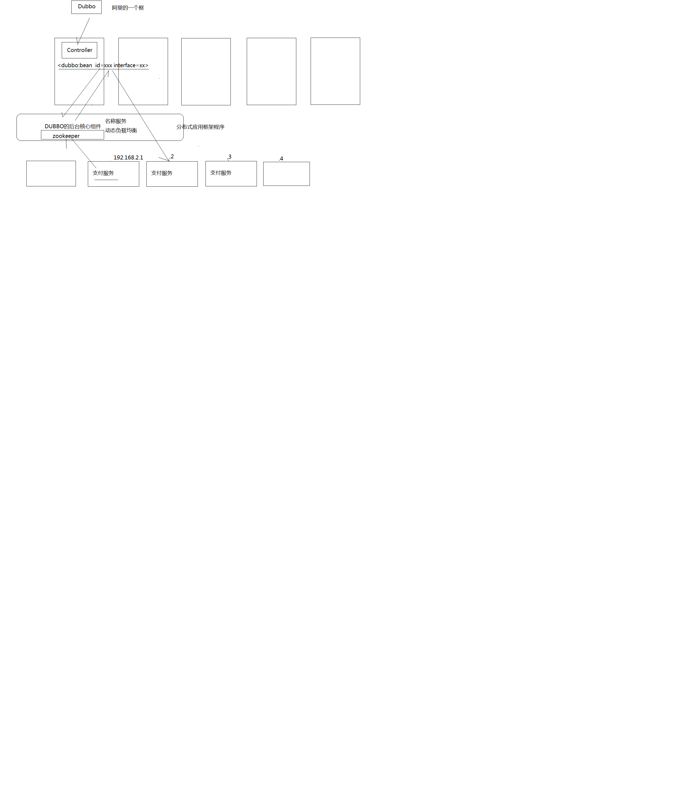
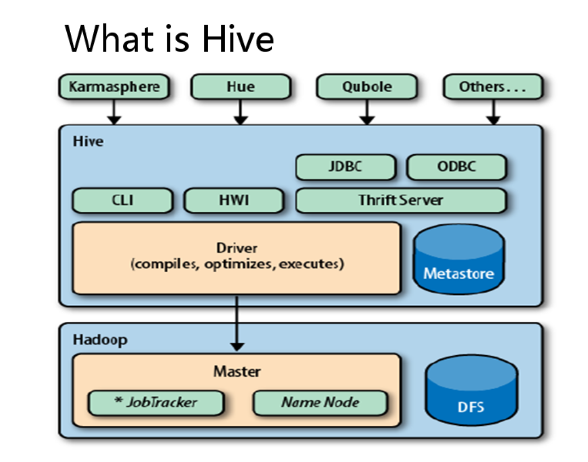

# Zookeeper
1. Zookeeper是Google的Chubby一个开源的实现,是Hadoop的分布式协调服务

2. 它包含一个简单的原语集,分布式应用程序可以基于它实现同步服务,配置维护和命名服务等

3. Zoopkeeper的角色
    - Follower
    - Leader
    

## 为什么使用Zookeeper
1. 大部分分布式应用需要一个主控,协调器或控制器来管理物理分布的子进程(如资源,任务分配等)

2. 目前,大部分应用需要开发私有的协调程序,缺乏一个通用的机制

3. 协调程序的反复编写,且难以形成通用,伸缩性好的协调器

4. Zookeeper提供通用的分布式锁服务,用以协调分布式应用

## Zookeeper的节点
1. Znode有两种类型,短暂(ephemeral)和持久的(peersistent)
2. Znode的类型在创建时确定并且不能再修改
3. 短暂Znode的客户端会话结束时,zookeeper会将该短暂znode删除,短暂znode不可以有子节点
4. 持久znode不依赖于客户端会话,只有当客户端明确要删除该持久znode时才会被删除
5. Znode有四种形式的目录节点,PERSISENT,PERSISTENT,SEQUENTIAL,EPHEMERAL,EPHEMERAL_SEQUENTIAL

## Zookeeper的角色
1. 领导者(leader),负责进行投票的发起和决议,更新系统状态
2. 学习者(learner),包括跟随者(follower)和观察者(observer),follower用于接受客户端请求并向客户端返回结果,在选举过程中参与投票
3. Observer可以接受客户端连接,将写请求转发给leader,但observer不参加投票过程,只同步leader的状态,observer的目的是为了扩展系统,提高读取速度
4. 客户端(client),请求发起方

## Zookeeper的应用场景
1. 统一命名服务
2. 配置管理
3. 共享锁

## Zookeeper的总结
1. Zookeeper作为Hadoop项目中的一个子项目,是Hadoop集群管理的一个必不可少的模块,它主要用来控制集群中的数据,如它管理Hadoop集群中的NameNode,还有HBase,Master Election,Server之间状态同步等
2. Zookeeper提供了一套很好的分布式集群管理机制,就是它这种基于层次型的目录树的数据结构,并对树中的节点进行有效的管理,从而可以设计出多种多样的分布式的数据管理模型

# Hadoop的HA机制
## HA架构



## Hadoop集群搭建
### 准备工作
1. 修改Linux主机名
2. 修改IP
3. 修改主机名和IP的映射关系
4. 关闭防火墙
5. ssh免登陆
6. 安装JDK，配置环境变量等

#### ssh免密码登录
1. 首先要配置namenode01到namenode02、resourcemanager01、resourcemanager02、zookeeper01、zookeeper02、zookeeper03的免密码登陆
2. 在namenode01上生产一对钥匙
ssh-keygen -t rsa
3. 将公钥拷贝到其他节点，包括自己
```
ssh-coyp-id namenode01
ssh-coyp-id namenode02
ssh-coyp-id resourcemanager01
ssh-coyp-id resourcemanager02
ssh-coyp-id zookeeper01
ssh-coyp-id zookeeper02
ssh-coyp-id zookeeper03
```
4. 配置resourcemanager01到resourcemanager02、zookeeper01、zookeeper02、zookeeper03的免密码登陆
5. 在resourcemanager01上生产一对钥匙
```
ssh-keygen -t rsa
```
6. 将公钥拷贝到其他节点
```
ssh-coyp-id resourcemanager02
ssh-coyp-id zookeeper01
ssh-coyp-id zookeeper02
ssh-coyp-id zookeeper03
```
7. 注意：两个namenode之间要配置ssh免密码登陆，别忘了配置namenode02到namenode01的免登陆
8. 在namenode02上生产一对钥匙
```
ssh-keygen -t rsa
ssh-coyp-id -i namenode01
```

### 集群规划：
|主机名|IP|安装的软件|运行的进程|
|---|---|---|---|
|namenode01|192.168.56.201|jdk、hadoop|NameNode、DFSZKFailoverController(zkfc)|
|namenode02|192.168.56.202|jdk、hadoop	|NameNode、DFSZKFailoverController(zkfc)|
|resourcemanager01|192.168.56.203|jdk、hadoop|ResourceManager|
|resourcemanager02|192.168.56.204|jdk、hadoop|ResourceManager|
|zookeeper01|192.168.56.205|jdk、hadoop、zookeeper|DataNode、NodeManager、JournalNode、QuorumPeerMain|
|zookeeper02|192.168.56.206|jdk、hadoop、zookeeper|DataNode、NodeManager、JournalNode、QuorumPeerMain|
|zookeeper03|192.168.56.207|jdk、hadoop、zookeeper|DataNode、NodeManager、JournalNode、QuorumPeerMain|


### core-site.xml
```
<configuration>
	<!-- 指定hdfs的nameservice为ns1 -->
	<property>
		<name>fs.defaultFS</name>
		<value>hdfs://ns1/</value>
	</property>
	<!-- 指定hadoop临时目录 -->
	<property>
		<name>hadoop.tmp.dir</name>
		<value>/home/hadoop/app/hadoop-2.4.1/tmp</value>
	</property>
	
	<!-- 指定zookeeper地址 -->
	<property>
		<name>ha.zookeeper.quorum</name>
		<value>weekend05:2181,weekend06:2181,weekend07:2181</value>
	</property>
</configuration>
```

### hdfs-site.xml
```
<configuration>
	<!--指定hdfs的nameservice为ns1，需要和core-site.xml中的保持一致 -->
	<property>
		<name>dfs.nameservices</name>
		<value>ns1</value>
	</property>
    <!-- ns1下面有两个NameNode，分别是nn1，nn2 -->
	<property>
		<name>dfs.ha.namenodes.ns1</name>
		<value>nn1,nn2</value>
	</property>
	<!-- nn1的RPC通信地址 -->
	<property>
		<name>dfs.namenode.rpc-address.ns1.nn1</name>
		<value>weekend01:9000</value>
	</property>
	<!-- nn1的http通信地址 -->
	<property>
		<name>dfs.namenode.http-address.ns1.nn1</name>
		<value>weekend01:50070</value>
	</property>
	<!-- nn2的RPC通信地址 -->
	<property>
		<name>dfs.namenode.rpc-address.ns1.nn2</name>
		<value>weekend02:9000</value>
	</property>
	<!-- nn2的http通信地址 -->
	<property>
		<name>dfs.namenode.http-address.ns1.nn2</name>
		<value>weekend02:50070</value>
	</property>
	<!-- 指定NameNode的元数据在JournalNode上的存放位置 -->
	<property>
    	<name>dfs.namenode.shared.edits.dir</name>
    	<value>qjournal://weekend05:8485;weekend06:8485;weekend07:8485/ns1</value>
	</property>
	<!-- 指定JournalNode在本地磁盘存放数据的位置 -->
	<property>
		<name>dfs.journalnode.edits.dir</name>
		<value>/home/hadoop/app/hadoop-2.4.1/journaldata</value>
	</property>
	<!-- 开启NameNode失败自动切换 -->
	<property>
		<name>dfs.ha.automatic-failover.enabled</name>
		<value>true</value>
	</property>
	<!-- 配置失败自动切换实现方式 -->
	<property>
		<name>dfs.client.failover.proxy.provider.ns1</name>
		<value>org.apache.hadoop.hdfs.server.namenode.ha.ConfiguredFailoverProxyProvider</value>
	</property>
	<!-- 配置隔离机制方法，多个机制用换行分割，即每个机制暂用一行-->
	<property>
		<name>dfs.ha.fencing.methods</name>
		<value>
    		sshfence
    		shell(/bin/true)
    	</value>
	</property>
	<!-- 使用sshfence隔离机制时需要ssh免登陆 -->
	<property>
		<name>dfs.ha.fencing.ssh.private-key-files</name>
		<value>/home/hadoop/.ssh/id_rsa</value>
	</property>
	<!-- 配置sshfence隔离机制超时时间 -->
	<property>
		<name>dfs.ha.fencing.ssh.connect-timeout</name>
		<value>30000</value>
	</property>
</configuration>
```

### mapred-site.xml
```
<configuration>
	<!-- 指定mr框架为yarn方式 -->
	<property>
		<name>mapreduce.framework.name</name>
		<value>yarn</value>
	</property>
</configuration>
```

### yarn-site.xml
```
<configuration>
	<!-- 开启RM高可用 -->
	<property>
	   <name>yarn.resourcemanager.ha.enabled</name>
	   <value>true</value>
	</property>
	<!-- 指定RM的cluster id -->
	<property>
	   <name>yarn.resourcemanager.cluster-id</name>
	   <value>yrc</value>
	</property>
	<!-- 指定RM的名字 -->
	<property>
	   <name>yarn.resourcemanager.ha.rm-ids</name>
	   <value>rm1,rm2</value>
	</property>
	<!-- 分别指定RM的地址 -->
	<property>
	   <name>yarn.resourcemanager.hostname.rm1</name>
	   <value>weekend03</value>
	</property>
	<property>
	   <name>yarn.resourcemanager.hostname.rm2</name>
	   <value>weekend04</value>
	</property>
	<!-- 指定zk集群地址 -->
	<property>
	   <name>yarn.resourcemanager.zk-address</name>
	   <value>weekend05:2181,weekend06:2181,weekend07:2181</value>
	</property>
	<property>
	   <name>yarn.nodemanager.aux-services</name>
	   <value>mapreduce_shuffle</value>
	</property>
</configuration>
```

### 将配置好的hadoop拷贝到其他节点
```
scp -r /root/app/hadoop-2.4.1/ root@zookeeper01:/root/app
scp -r /root/app/hadoop-2.4.1/ root@zookeeper02:/root/app
scp -r /root/app/hadoop-2.4.1/ root@zookeeper03:/root/app
scp -r /root/app/hadoop-2.4.1/ root@resourcemanager01:/root/app
scp -r /root/app/hadoop-2.4.1/ root@resourcemanager02:/root/app
```

### 启动
#### 启动Zookeeper集群
1. 在zookeeper01,zookeeper02,zookeeper03中执行
```
./zkServer.sh start
./zkServer.sh status
```

#### 启动journalnodee
1. 在zookeeper01,zookeeper02,zookeeper03中执行
```
cd /zookeeper01/hadoop-2.4.1
sbin/hadoop-daemon.sh start journalnode
jps
```

#### 格式化HDFS
1. 在namenode01中执行
```
hdfs namenode -format
```

2. 在namenode02中执行
```
scp -r tmp/ root@namenode02:/root/app/hadoop-2.4.1/
hdfs namenode -bootstrapStandby
```

#### 格式化ZKFC(在namenode01上执行即可)
```
hdfs zkfc -formatZK
```

#### 启动HDFS(在namenode01上执行)
```
start-dfs.sh
```

#### 启动yarn
1. 在namenode,resourcemanager01中启动
```
start-yarn.sh
```

2. 如果resourcemanager02的没有启动,使用如下命令
```
yarn-daemon.sh start resourcemanager
```

### 验证HA
1. 首先向hdfs上传一个文件
```
hadoop fs -put /etc/profile /profile
hadoop fs -ls /
```
2. 然后再kill掉active的NameNode
```
kill -9 <pid of NN>
```
3. 通过浏览器访问：http://192.168.56.14:50070
	- NameNode 'weekend02:9000' (active)
	- 这个时候weekend02上的NameNode变成了active
4. 再执行命令：
```
hadoop fs -ls /
```
5. 刚才上传的文件依然存在！！！
6. 手动启动那个挂掉的NameNode
```
sbin/hadoop-daemon.sh start zkfc 
sbin/hadoop-daemon.sh start namenode
```
7. 通过浏览器访问：http://192.168.56.13:50070


### 手动切换namenode状态
```
hdfs haadmin -transitionToStandby nn1 --forcemanual
hdfs haadmin -transitionToActive nn2 --forcemanual
```

### 获取namenode的状态
```
hdfs haadmin -getServiceState nn2
```

# Hive
## Hive具体结构

1. hive的替代品
    - impala
    - spark shark
    - spark sql

