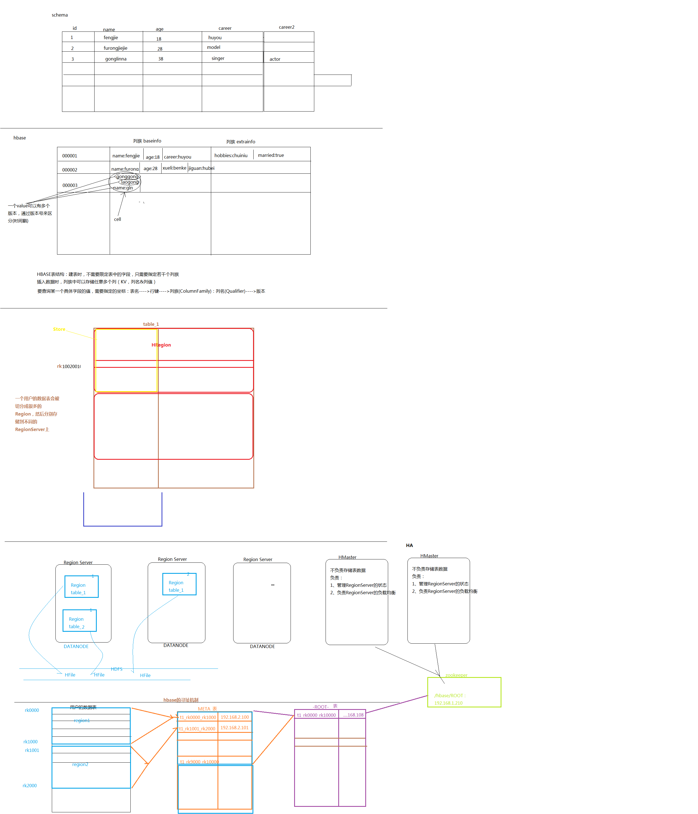

# Hive
1. 将sql语句翻译成mapreduce程序的一个框架

## 使用mysql作为元数据的管理
1. 在conf目录下拷贝一份hive-default.xml,并修改如下配置
```
<configuration>
    <property>
        <name>javax.jdo.option.ConnectionURL</name>
        <value>jdbc:mysql://namenode01:3306/hive?createDatabaseIfNotExist=true</value>
    </property>
    <property>
        <name>javax.jdo.option.ConnectionDriverName</name>
        <value>com.mysql.jdbc.Driver</value>
    </property>
    <property>
        <name>javax.jdo.option.ConnectionUserName</name>
        <value>root</value>
    </property>
    <property>
        <name>javax.jdo.option.ConnectionPassword</name>
        <value>root</value>
    </property>
</configuration>
```

2. 上传mysql链接驱动包到hive的lib目录下


## Hive的语法
1. 官方语法手册:``
### 创建数据库表
```sql
create table page_view(viewTime INT, userid BIGINT,
  page_url STRING, referrer_url STRING,
  ip STRING COMMENT 'IP Address of the User')
  ROW FORMAT DELIMITED
  FIELDS TERMINATED BY '\t'
  STORED AS [SEQUENCEFILE|TEXTFILE];
```


### 往表中导入数据
1. 将数据移动到表所在的目录下
```
load data local inpath '/root/app/ip.txt' into table tab_ext;
```

### 导入hdfs中其他文件的数据
1. 将数据移动到表所在的目录下
```
load data inpath '/hivedata/order3.txt' into table t_order_h;
```

### external导入hdfs中其他文件的数据
1. 数据不会移动到表所在的目录下
2. 删除该表时不会删除数据
#### 创建external表
```
create external table t_order_ext(id int, name string, capacity string, price double)
row format delimited
fields terminated by '\t'
location '/hive_ext';
```

### 根据sql语句建表
1. 一般用于创建一些临时表存储中间结果
```
create table t_order_simple
as
select id,name,price from t_order_h;
```

### 批量插入数据
1. 一般用于向临时表中追加中间结果数据
```
insert overwrite table t_order_simple
select id,name,price from t_order_ext;
```

### 创建可以根据字段分区的表
1. 创建时候,分区语句要在前
```
create table t_order_pt(id int, name string, capacity string, price double)
partitioned by (month string)
row format delimited
fields terminated by '\t';
```
2. 根据分区字段导入数据
```
load data local inpath '/root/hivedata/order3.txt' into table t_order_pt partition(month='January');
```

3. 根据分区字段统计数据
```
select count(*) from t_order_pt where month='January';
```

4. 增加一个分区
```
alter table t_order_pt add partition (month='October') location '/root/hivedata/order.txt'
```

5. 查看表的分区
```
show partitions t_order_pt;
```

### 把select查询结果写到文件中
1. 写入本地文件中
```
insert overwrite local 
```
1. 写入hdfs文件中

## Hql语法和自定义函数
1. 在shell文件中写函数

2. 执行
```
hive -S -e 'select * from hadoop.t_order_h';
```

### 自定义函数
1. 在maven中添加hive的依赖jar包
```xml
        <dependency>
            <groupId>org.apache.hive</groupId>
            <artifactId>hive-jdbc</artifactId>
            <version>${hive.version}</version>
        </dependency>
        <dependency>
            <groupId>org.apache.hive</groupId>
            <artifactId>hive-exec</artifactId>
            <version>${hive.version}</version>
            <exclusions>
                <exclusion>
                    <groupId>org.apache.calcite</groupId>
                    <artifactId>*</artifactId>
                </exclusion>
            </exclusions>
        </dependency>
```

1. 编写包含自定义函数的类
```java
package cn.devinkin.hive;

import org.apache.hadoop.hive.ql.exec.UDF;

import java.util.HashMap;

public class PhoneNumbertoArea extends UDF {
    private static HashMap<String, String > areaMap = new HashMap<String, String>();
    static {
        areaMap.put("1388", "beijing");
        areaMap.put("1399", "tianjin");
        areaMap.put("1366", "nanjing");
    }
    public String evaluate(String phoneNumber) {
        String result = areaMap.get(phoneNumber.substring(0,4)) == null? phoneNumber + "\thuoxing" : phoneNumber + "\t" + areaMap.get(phoneNumber.substring(0,4));
        return result;
    }
}

```

1. 打包成jar包发送到hive所在的服务器

2. 在hive-cli中添加jar包
```
add jar /root/package/hivearea.jar;
```
1. 在hive-cli中自定义函数
```
create temporary function getarea as 'cn.devinkin.hive.PhoneNumbertoArea';
```
1. 测试数据:flow.data
```
1399766545,224,300
1344476655,254,300
1366766545,267,300
```
1. 创建测试的表
```
create table t_flow(phonenbr string, upflow int, downflow int)
row format delimited
fields terminated by ',';
```
1. 导入数据
```
load data local inpath '/root/hivedata/flow.data' into table t_flow;
```

1. 执行自定义函数
```
select getarea(phonenbr),upflow,downflow from t_flow;
```

# HBase
1. nosql数据库
2. 分布式,面向列的开源数据库

## HBase表结构
1. 建表时,不需要限定表中的数据,只需要指定若干个列族
2. 插入数据时,列族中可以存储任意多个列(KV,列名和列值)
3. 要查询某个具体字段的值,需要指定的坐标:表名->行键->列族(Column Family):列名(qulifier)->版本
4. 表名,行键,列族,列值,版本

4. Hbase的寻址机制
    - ROOT表
    - META表
    - 用户数据表
    - RegionServer
    


## HBase集群搭建
1. 上传hbase安装包

2. 解压habase安装包

### 集群结构
1. resourcemanager01:安装HMaster
2. resourcemanager02:安装HMaster
3. zookeeper01:安装regionserver
4. zookeeper02:安装regionserver
5. zookeeper03:安装regionserver


### 配置HBase集群
1. 把hadoop的hdfs-site.xml和core-site.xml放到hbase/conf目录下

2. 修改hbase-env.sh
    - `export JAVA_HOME=xxx`
    - 告诉hbase使用外部zk:`export HBASE_MANAGES_ZK=false`

3. 修改hbase-site.xml
```xml
	<configuration>
		<!-- 指定hbase在HDFS上存储的路径 -->
        <property>
                <name>hbase.rootdir</name>
                <value>hdfs://ns1/hbase</value>
        </property>
		<!-- 指定hbase是分布式的 -->
        <property>
                <name>hbase.cluster.distributed</name>
                <value>true</value>
        </property>
		<!-- 指定zk的地址，多个用“,”分割 -->
        <property>
                <name>hbase.zookeeper.quorum</name>
                <value>zookeeper01:2181,zookeeper02:2181,zookeeper03:2181</value>
        </property>
	</configuration>
```

4. 配置regionserver
```java
vim regionservers
zookeeper01
zookeeper02
zookeeper03
```

5. 拷贝hbase到其他节点
```
scp -r /root/app/hbase-0.96.2-hadoop2/ root@resourcemanager01:/root/app
scp -r /root/app/hbase-0.96.2-hadoop2/ root@resourcemanager02:/root/app
scp -r /root/app/hbase-0.96.2-hadoop2/ root@zookeeper01:/root/app
scp -r /root/app/hbase-0.96.2-hadoop2/ root@zookeeper02:/root/app
scp -r /root/app/hbase-0.96.2-hadoop2/ root@zookeeper03:/root/app
```

6. 将配置好的HBase拷贝到每一个节点并同步时间
```
vim /etc/crontab

0-59/10 * * * * /usr/sbin/ntpdate us.pool.ntp.org | logger -t NTP
```

7. 启动所有的hbase
```
./zkServer.sh start
start-dfs.sh
./start-hbase.sh
./hbase-daemon.sh start master
```

8. 通过浏览器访问hbase管理页面:`192.168.56.10:60010`

9. 为保证集群的可靠性，要启动多个HMaster:`hbase-daemon.sh start master`
   	
   	
## HBase Shell
1. 启动hbase命令行客户端:`./hbase shell`

2. help查看命令帮助

3. 创建表
```
create 'mygirls', {NAME => 'base_info', VERSIONS => 3}, {NAME => 'extra_info'}
```

4. 列出表:list

5. 查看表详情:`describe mygirls`

6. 删除表
    - 先disable:`disable 'mygirls'`
    - 在删除表:`drop 'mygirls'`
    
7. 插入数据
    - `put 'mygirls','0001','base_info:name','fengjie'`
    - `put 'mygirls','0001','base_info:age','18'
`   - `put 'mygirls','0001','base_info:sex','male'`
    - `put 'mygirls', '0001','extra_info:boyfriend','xiaoming'`
    
8. 查询表数据
    - `get 'mygirls' '0001'`
    - `get 'mygirls','0001',{COLUMN => 'base_info:name',VERSIONS => 10}`
    - `scan 'mygirls'`
    - `scan 'mygirls',{RAW => true, VERSIONS => 10}`
    
9. 修改表数据
    - `put 'mygirls','0001','base_info:name','fengbaobao'`
    
    
## HBase Java API
1. 在maven中导入Hbase相关依赖
```xml
        <dependency>
            <groupId>org.apache.hbase</groupId>
            <artifactId>hbase-server</artifactId>
            <version>${hbase.version}</version>
        </dependency>
        <dependency>
            <groupId>org.apache.hbase</groupId>
            <artifactId>hbase-client</artifactId>
            <version>${hbase.version}</version>
        </dependency>
```
2. 编写测试代码
```java
package cn.devinkin.hbase;

import org.apache.hadoop.conf.Configuration;
import org.apache.hadoop.hbase.*;
import org.apache.hadoop.hbase.client.*;
import org.apache.hadoop.hbase.filter.Filter;
import org.apache.hadoop.hbase.filter.PrefixFilter;
import org.apache.hadoop.hbase.util.Bytes;
import org.junit.Before;
import org.junit.Test;

import java.util.ArrayList;
import java.util.List;

public class HbaseDao {

    private HBaseAdmin admin = null;
    private Configuration conf = null;

    @Before
    public void init() throws Exception {
        conf = HBaseConfiguration.create();
        conf.set("hbase.cluster.distributed", "true");
        conf.set("hbase.zookeeper.quorum", "zookeeper01:2181,zookeeper02:2181,zookeeper03:2181");

        admin = new HBaseAdmin(conf);
    }

    @Test
    public void testCreateTable() throws Exception {

        // 设置表名
        TableName tableName = TableName.valueOf("hbaseJavaapi");
        // 设置表信息描述
        HTableDescriptor descriptor = new HTableDescriptor(tableName);

        // 添加列族
        HColumnDescriptor baseInfo = new HColumnDescriptor("base_info");
        HColumnDescriptor extraInfo = new HColumnDescriptor("extra_info");
        // 设置列族版本号,最多保存5个版本
        baseInfo.setMaxVersions(5);
        extraInfo.setMaxVersions(5);
        descriptor.addFamily(baseInfo);
        descriptor.addFamily(extraInfo);

        admin.createTable(descriptor);

    }

    @Test
    public void testPut() throws Exception {
        // 获得表对象
        HTable hbaseJavaapi = new HTable(conf, "hbaseJavaapi");

        // 获得Put对象,给定行键初始化
        Put name = new Put(Bytes.toBytes("rk0003"));
        // 设定列族,键,值
        name.add(Bytes.toBytes("base_info"), Bytes.toBytes("name"), Bytes.toBytes("hanxin"));

        Put age = new Put(Bytes.toBytes("rk0003"));
        age.add(Bytes.toBytes("base_info"), Bytes.toBytes("age"), Bytes.toBytes(30));

        // 将put对象加入put数组
        ArrayList<Put> puts = new ArrayList<Put>();
        puts.add(name);
        puts.add(age);

        // 插入数据
        hbaseJavaapi.put(puts);
        hbaseJavaapi.close();
    }

    @Test
    public void testGet() throws Exception {
        // 获取表对象
        HTable hbaseJavaapi = new HTable(conf, "hbaseJavaapi");

        // 获取Get对象
        Get get = new Get(Bytes.toBytes("rk0001"));
        // 设置get的最大版本数
        get.setMaxVersions(5);
        // 获取结果对象
        Result result = hbaseJavaapi.get(get);
        List<Cell> cells = result.listCells();

        // 使用KeyValue遍历结果
        for (KeyValue kv : result.list()) {
            // 获取族名
            String family = new String(kv.getFamily());
            System.out.println(family);
            // 获取列名(key)
            String quaifier = new String(kv.getQualifier());
            System.out.println(quaifier);
            // 获取列值(value)
            System.out.println(kv.getValue());

            // 可以从reesult取出特定的value
            byte[] bytes = result.getValue(Bytes.toBytes("base_info"), Bytes.toBytes("name"));
            System.out.println(new String(bytes));
        }
        hbaseJavaapi.close();
    }

    @Test
    public void testScan() throws Exception {
        // 获取表对象
        HTable hbaseJavaapi = new HTable(conf, "hbaseJavaapi");

        // 获取Scan对象,设置起始行键,结束行键
        Scan scan = new Scan(Bytes.toBytes("rk0001"), Bytes.toBytes("rk0003"));

        // 获取Filter对象,前缀过滤器,针对行键
        Filter filter = new PrefixFilter(Bytes.toBytes("rk"));

        // 添加列族
        scan.addFamily(Bytes.toBytes("base_info"));
        // 获取结果过滤器
        ResultScanner scanner = hbaseJavaapi.getScanner(scan);

        // 遍历结果
        for (Result r : scanner) {
            byte[] bytes = r.getValue(Bytes.toBytes("base_info"), Bytes.toBytes("name"));
            System.out.println(new String(bytes));
        }
        hbaseJavaapi.close();
    }

    @Test
    public void testDel() throws Exception {
        // 获取表对象
        HTable hbaseJavaapi = new HTable(conf, "hbaseJavaapi");

        // 获取删除对象,用行键进行初始化
        Delete del = new Delete(Bytes.toBytes("rk0001"));
        // 删除列,指定列族和列名
        del.deleteColumn(Bytes.toBytes("base_info"), Bytes.toBytes("age"));
        // 执行删除
        hbaseJavaapi.delete(del);
        hbaseJavaapi.close();

    }

    @Test
    public void testDrop() throws Exception {
        // 获取admin对象
        admin.disableTable("hbaseJavaapi");
        admin.deleteTable("hbaseJavaapi");
        admin.close();
    }

}

```