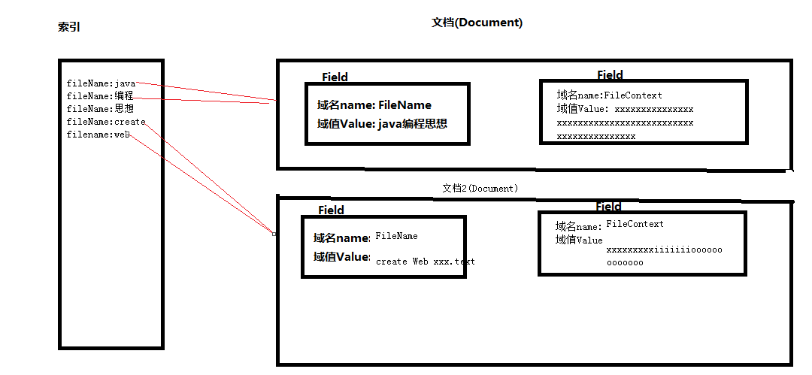

# 数据的分类
1. 结构化数据
2. 非结构化数据
## 结构化数据
1. 有固定类型或者有固定长度的数据

## 非结构化数据
1. 没有固定类型和固定长度的数据

### 非结构化数据搜索方法
1. 顺序扫描法
    - 优点: 如果文档中存在要找的关键字就一定能找到想要的内容
	- 缺点: 慢, 效率低
2. 全文检索算法(倒排索引算法)
    - 优点: 搜索速度快
    - 缺点: 因为创建的索引需要占用磁盘空间,所以这个算法会使用掉更多的磁盘空间,这是用空间换时间
    
# Lucene

## 什么是Lucene
1. Lucene是apache旗下的顶级项目,是一个全文检索工具包
2. Lucene就是一个可以创建全文检索引擎系统的一堆jar包.可以使用它来构建全文检索引擎系统,但是它不能独立运行

## 全文检索引擎
1. 放在tomcat下可以独立运行,对外提供全文检索服务

## Lucene应用领域
1. 互联网全文检索引擎(比如百度,  谷歌,  必应)
2. 站内全文检索引擎(淘宝, 京东搜索功能)
3. 优化数据库查询(因为数据库中使用like关键字是全表扫描也就是顺序扫描算法,查询慢)

## Lucene下载
1. 官方网站：http://lucene.apache.org/ 

## Lucene结构


### 索引
1. 域名(key):词(value),这样的形式,它里面有指针执行这个词来源的文档

2. 索引库: 放索引的文件夹(这个文件夹可以自己随意创建,在里面放索引就是索引库)

3. Term词元: 就是一个词, 是lucene中词的最小单位

### 文档
1. Document对象,一个Document中可以有多个Field域对象,Field域对象中是key-value键值对的形式:域名(key)和域值(value)
2. 一个document就是数据库表中的一条记录, 一个Filed域对象就是数据库表中的一行一列,这是一个通用的存储结构
3. 创建索引和所有时所用的分词器必须一致

## 域的详细介绍

### 是否分词
1. 分词的作用是为了索引
2. 需要分词: 文件名称, 文件内容
3. 不需要分词: 不需要索引的域不需要分词,还有就是分词后无意义的域不需要分词,比如: id, 身份证号

### 是否索引
1. 索引的的目的是为了搜索
2. 需要搜索的域就一定要创建索引,只有创建了索引才能被搜索出来
3. 不需要搜索的域可以不创建索引
4. 需要索引: 文件名称, 文件内容, id, 身份证号等
5. 不需要索引: 比如图片地址不需要创建索引,`e:\\xxx.jpg`因为根据图片地址搜索无意义

### 是否存储
1. 存储的目的是为了显示
2. 是否存储看个人需要,存储就是将内容放入Document文档对象中保存出来,会额外占用磁盘空间, 如果搜索的时候需要马上显示出来可以放入document中也就是要存储,这样查询显示速度快, 如果不是马上立刻需要显示出来,则不需要存储,因为额外占用磁盘空间不划算

### 域的各种类型
|Field类|数据类型|Analzed(是否分析)|Indexed(是否索引)|Stored(是否存储)|说明|
|---|---|---|---|---|---|
|StringField(FieldName, FieldValue,Store.YES))|字符串|N|Y|Y或N|这个Field用来构建一个字符串Field，但是不会进行分析，会将整个串存储在索引中，比如(订单号,姓名等),是否存储在文档中用Store.YES或Store.NO决定|
|LongField(FieldName, FieldValue,Store.YES)|Long型|Y|Y|Y或N|这个Field用来构建一个Long数字型Field，进行分析和索引，比如(价格),是否存储在文档中用Store.YES或Store.NO决定|
|StoredField(FieldName, FieldValue)|重载方法，支持多种类型|N|N|Y|这个Field用来构建不同类型Field,不分析，不索引，但要Field存储在文档中|
|TextField(FieldName, FieldValue, Store.NO)或TextField(FieldName, reader)|字符串或流|Y|Y|Y或N|如果是一个Reader, lucene猜测内容比较多,会采用Unstored的策略|
1. Lucene底层的算法,金钱是需要分词的,因为要根据价格区间(100-200)类似的分词,可以实现根据价钱进行对比
2. StoredField可作为存储图片的域,所以不需要分词也不需要索引,但是要存储

### 文档的删除
#### 删除所有索引
```java
    @Test
    public void testIndexDel() throws Exception{
        // 创建分词器
        // StandardAnalyzer标准分词器,标准分词器对英文分词效果很好,对中文单字分词
        Analyzer analyzer = new StandardAnalyzer();
//        Analyzer analyzer = new IKAnalyzer();


        // FS:FileSystem,指定索引和文档存储的目录
        Directory directory = FSDirectory.open(new File("F:\\WebBackEnd\\Lucene\\lucene01\\dict").toPath());
        // 创建写对象的初始化对象
        IndexWriterConfig config = new IndexWriterConfig(analyzer);
        // 创建索引和文档写对象
        // 第一个参数:Directory,指定索引和文档存储的目录
        // 第二个参数:IndexWriterConfig,写对象的初始化对象
        IndexWriter indexWriter = new IndexWriter(directory, config);

        // 删除所有索引
        indexWriter.deleteAll();
        // 提交
        indexWriter.commit();

        // 关闭流
        indexWriter.close();
    }
```
#### 根据词元(域的内容)删除索引
```java        
// 根据名称删除索引
// Term为词元,就是一个词
// 第一个参数:域名
// 第二个参数:要删除含有此关键词的数据
indexWriter.deleteDocuments(new Term("fileName", "apache"));
```

### 文档的更新
1. 更新就是按照传入的Term进行搜索,如果找到结果那么删除,将更新的内容重新生成一个Document对象
2. 如果没有搜索到结果,那么将更新的内容直接添加一个新的Document对象
3. 测试代码
```java
    /**
     * 更新就是按照传入的Term进行搜索
     * 如果找到结果,删除,将更新的内容重新生成一个Document对象
     * 如果没找到结果,将更新的内容直接生成一个新的Document对象
     * @throws Exception
     */
    @Test
    public void testIndexUpdate() throws Exception {
        // 创建分词器
        // StandardAnalyzer标准分词器,标准分词器对英文分词效果很好,对中文单字分词
        Analyzer analyzer = new StandardAnalyzer();


        // FS:FileSystem,指定索引和文档存储的目录
        Directory directory = FSDirectory.open(new File("F:\\WebBackEnd\\Lucene\\lucene01\\dict").toPath());
        // 创建写对象的初始化对象
        IndexWriterConfig config = new IndexWriterConfig(analyzer);
        // 创建索引和文档写对象
        // 第一个参数:Directory,指定索引和文档存储的目录
        // 第二个参数:IndexWriterConfig,写对象的初始化对象
        IndexWriter indexWriter = new IndexWriter(directory, config);

        // 根据文件名称进行更新
        // 无法被搜索到
//        Term term = new Term("fileName", "1.create web page.txt");

        Term term = new Term("fileName", "web");
        // 更新的对象
        Document doc = new Document();
        doc.add(new TextField("fileName", "xxxxxx", Field.Store.YES));
        doc.add(new TextField("fileContext", "Think in java xxxxxx", Field.Store.YES));
        // 更新
        indexWriter.updateDocument(term, doc);

        // 提交
        indexWriter.commit();

        // 关闭流
        indexWriter.close();

    }

```

## 索引库的查询
1. 使用query的子类查询
2. 使用queryparser查询
### 使用query的子类查询
1. TermQuery
2. NumericRangeQuery
3. BooleanQuery
4. MatchAllDocsQuery

#### TermQuery
1. 根据词进行搜索(只能从文本中进行搜索)
2. 测试代码
```java
    @Test
    public void testIndexTermQuery() throws Exception {
        // 创建分词器(创建索引和搜索时所用的分词器必须一致)
        Analyzer analyzer = new StandardAnalyzer();

        // 创建词元
        Term term = new Term("fileName", "apache");
        // 使用TermQuery查询,根据term对象进行查询
        TermQuery termQuery = new TermQuery(term);

        // 指定索引和文档的目录
        Directory directory = FSDirectory.open(new File("F:\\WebBackEnd\\Lucene\\lucene01\\dict").toPath());

        // 索引和文档的读取对象
        IndexReader indexReader = DirectoryReader.open(directory);

        // 创建索引的搜索对象
        IndexSearcher indexSearcher = new IndexSearcher(indexReader);
        // 搜索
        // 第一个参数:Query,为查询语句对象
        // 第二个参数:int,指定显示多少条
//        TopDocs topDocs = indexSearcher.search(query, 10);
        TopDocs topDocs = indexSearcher.search(termQuery, 5);

        System.out.println("==========count==========");
        // 一共搜索到多少条记录
        System.out.println(topDocs.totalHits);
        System.out.println("=========================");
        // 从搜索结果对象中获取结果集
        ScoreDoc[] scoreDocs = topDocs.scoreDocs;
        for (ScoreDoc scoreDoc : scoreDocs) {
            // 获取docId
            int docId = scoreDoc.doc;
            // 通过文档id从硬盘中读取出对应的文档
            Document document = indexReader.document(docId);
            // 可以通过域名取出值
            System.out.println("fileName: " + document.get("fileName"));
            System.out.println("fileSize: " + document.get("fileSize"));
            System.out.println("=====================================");
        }
    }

```

#### NumericRangeQuery
1. 从数值范围进行搜索
2. 测试代码
```java
    @Test
    public void testIndexNumericRangeQuery() throws Exception {
        // 创建分词器(创建索引和搜索时所用的分词器必须一致)
        Analyzer analyzer = new StandardAnalyzer();

        // 根据数字范围查询
        // 查询文件大小,大于100小于1000的文章
        // 第一个参数:域名
        // 第二个参数:最小值
        // 第三个参数:最大值
        // 第四个参数:是否包含最小值
        // 第五个参数:是否包含最大值
        Query query = NumericRangeQuery.newLongRange("fileSize", 100L,1000L, true, true);

        // 指定索引和文档的目录
        Directory directory = FSDirectory.open(new File("F:\\WebBackEnd\\Lucene\\lucene01\\dict"));

        // 索引和文档的读取对象
        IndexReader indexReader = DirectoryReader.open(directory);

        // 创建索引的搜索对象
        IndexSearcher indexSearcher = new IndexSearcher(indexReader);
        // 搜索
        // 第一个参数:Query,为查询语句对象
        // 第二个参数:int,指定显示多少条
//        TopDocs topDocs = indexSearcher.search(query, 10);
        TopDocs topDocs = indexSearcher.search(query, 5);

        System.out.println("==========count==========");
        // 一共搜索到多少条记录
        System.out.println(topDocs.totalHits);
        System.out.println("=========================");
        // 从搜索结果对象中获取结果集
        ScoreDoc[] scoreDocs = topDocs.scoreDocs;
        for (ScoreDoc scoreDoc : scoreDocs) {
            // 获取docId
            int docId = scoreDoc.doc;
            // 通过文档id从硬盘中读取出对应的文档
            Document document = indexReader.document(docId);
            // 可以通过域名取出值
            System.out.println("fileName: " + document.get("fileName"));
            System.out.println("fileSize: " + document.get("fileSize"));
            System.out.println("=====================================");
        }
    }
```

#### BooleanQuery
1. Occur.MUST相当于and
2. Occur.MUST_NOT相当于not
3. Occur.SHOULD相当于or
4. 单独使用must_not或者单独使用must没有任何意义
6. 组合查询,可以设置组合条件,and,or,not,从多个域中进行查找
7. 测试代码
```java
    @Test
    public void testBooleanQuery() throws Exception {
        //创建分词器(创建索引和所有时所用的分词器必须一致)
        Analyzer analyzer = new IKAnalyzer();

        // 布尔查询,可以根据多个条件组合进行查询
        // 文件名称包含apache的,并且文件大小大于等于100小于等于100字节的文件
        BooleanQuery query = new BooleanQuery();

        //根据数字范围查询
        //查询文件大小,大于100 小于1000的文章
        //第一个参数:域名      第二个参数:最小值,  第三个参数:最大值, 第四个参数:是否包含最小值,   第五个参数:是否包含最大值
        Query numericRangeQuery = NumericRangeQuery.newLongRange("fileSize", 100L, 1000L, true, true);

        // 创建词元
        Term term = new Term("fileName", "apache");
        // 使用TermQuery查询,根据term对象进行查询
        TermQuery termQuery = new TermQuery(term);

        //must相当于and
        //must_not相当于not
        //should相当于or
        query.add(numericRangeQuery, BooleanClause.Occur.SHOULD);
        query.add(termQuery, BooleanClause.Occur.MUST);

        //指定索引和文档的目录
        Directory dir = FSDirectory.open(new File("F:\\WebBackEnd\\Lucene\\lucene01\\dict"));
        //索引和文档的读取对象
        IndexReader indexReader = IndexReader.open(dir);
        //创建索引的搜索对象
        IndexSearcher indexSearcher = new IndexSearcher(indexReader);
        //搜索:第一个参数为查询语句对象, 第二个参数:指定显示多少条
        TopDocs topdocs = indexSearcher.search(query, 5);
        //一共搜索到多少条记录
        System.out.println("=====count=====" + topdocs.totalHits);
        //从搜索结果对象中获取结果集
        ScoreDoc[] scoreDocs = topdocs.scoreDocs;

        for (ScoreDoc scoreDoc : scoreDocs) {
            //获取docID
            int docID = scoreDoc.doc;
            //通过文档ID从硬盘中读取出对应的文档
            Document document = indexReader.document(docID);
            //get域名可以取出值 打印
            System.out.println("fileName:" + document.get("fileName"));
            System.out.println("fileSize:" + document.get("fileSize"));
            System.out.println("============================================================");
        }
    }
```

#### MatchAllDocsQuery
1. 查询出所有文档(Document)
2. 测试代码
```java
    @Test
    public void testMatchAllQuery() throws Exception {
        //创建分词器(创建索引和所有时所用的分词器必须一致)
        Analyzer analyzer = new IKAnalyzer();

        // 查询所有文档
        MatchAllDocsQuery query = new MatchAllDocsQuery();


        //指定索引和文档的目录
        Directory dir = FSDirectory.open(new File("F:\\WebBackEnd\\Lucene\\lucene01\\dict"));
        //索引和文档的读取对象
        IndexReader indexReader = IndexReader.open(dir);
        //创建索引的搜索对象
        IndexSearcher indexSearcher = new IndexSearcher(indexReader);
        //搜索:第一个参数为查询语句对象, 第二个参数:指定显示多少条
        TopDocs topdocs = indexSearcher.search(query, 5);
        //一共搜索到多少条记录
        System.out.println("=====count=====" + topdocs.totalHits);
        //从搜索结果对象中获取结果集
        ScoreDoc[] scoreDocs = topdocs.scoreDocs;

        for (ScoreDoc scoreDoc : scoreDocs) {
            //获取docID
            int docID = scoreDoc.doc;
            //通过文档ID从硬盘中读取出对应的文档
            Document document = indexReader.document(docID);
            //get域名可以取出值 打印
            System.out.println("fileName:" + document.get("fileName"));
            System.out.println("fileSize:" + document.get("fileSize"));
            System.out.println("============================================================");
        }
    }
```

#### 使用queryparser查询
1. QueryParser
2. MulitFieldQueryParser

### 使用queryparser查询
1. 需要导入`lucene-queryparser-4.10.3.jar`
#### QueryParser
1. 根据域名进行查询,可以设置默认搜索域,推荐使用(只能从文本中进行搜索)
2. 测试代码
```java
    @Test
    public void testIndexSearch() throws Exception {
        // 创建分词器(创建索引和搜索时所用的分词器必须一致)
        Analyzer analyzer = new StandardAnalyzer();
//        Analyzer analyzer = new IKAnalyzer();

        // 创建查询对象
        // 第一个参数:默认搜索域,如果query中没有指定域名,从默认搜索域的域中搜索,如果query指定了域,就在query指定域中搜索
        // 第二个参数,分词器
        QueryParser queryParser = new QueryParser("fileContext", analyzer);
        // 查询语法=域名:搜索的关键字
//        Query query = queryParser.parse("fileName:apache");
        Query query = queryParser.parse("fileName:apache");

        // 指定索引和文档的目录
//        Directory directory = FSDirectory.open(new File("F:\\WebBackEnd\\Lucene\\lucene01\\dict").toPath());
        Directory directory = FSDirectory.open(new File("F:\\WebBackEnd\\Lucene\\lucene01\\dict"));

        // 索引和文档的读取对象
        IndexReader indexReader = DirectoryReader.open(directory);

        // 创建索引的搜索对象
        IndexSearcher indexSearcher = new IndexSearcher(indexReader);
        // 搜索
        // 第一个参数:Query,为查询语句对象
        // 第二个参数:int,指定显示多少条
//        TopDocs topDocs = indexSearcher.search(query, 10);
        TopDocs topDocs = indexSearcher.search(query, 5);

        System.out.println("==========count==========");
        // 一共搜索到多少条记录
        System.out.println(topDocs.totalHits);
        System.out.println("=========================");
        // 从搜索结果对象中获取结果集
        ScoreDoc[] scoreDocs = topDocs.scoreDocs;
        for (ScoreDoc scoreDoc : scoreDocs) {
            // 获取docId
            int docId = scoreDoc.doc;
            // 通过文档id从硬盘中读取出对应的文档
            Document document = indexReader.document(docId);
            // 可以通过域名取出值
            System.out.println("fileName: " + document.get("fileName"));
            System.out.println("fileSize: " + document.get("fileSize"));
            System.out.println("=====================================");
        }
    }
```

#### MulitFieldQueryParser
1. 可以从多个域中进行查询,只要这些域中有关键词的存在,就查询出来
2. 测试代码
```java
    @Test
    public void testMultifieldQuery() throws Exception {
        // 创建分词器(创建索引和搜索时所用的分词器必须一致)
        Analyzer analyzer = new StandardAnalyzer();
//        Analyzer analyzer = new IKAnalyzer();


        String[] fields = {"fileName", "fileContext"};

        // 从文件名称和文件内容中查询,只有含有apache关键字的就查出来
        MultiFieldQueryParser multiFieldQueryParser = new MultiFieldQueryParser(fields, analyzer);
        Query query = multiFieldQueryParser.parse("apache");


        // 指定索引和文档的目录
//        Directory directory = FSDirectory.open(new File("F:\\WebBackEnd\\Lucene\\lucene01\\dict").toPath());
        Directory directory = FSDirectory.open(new File("F:\\WebBackEnd\\Lucene\\lucene01\\dict"));

        // 索引和文档的读取对象
        IndexReader indexReader = DirectoryReader.open(directory);

        // 创建索引的搜索对象
        IndexSearcher indexSearcher = new IndexSearcher(indexReader);
        // 搜索
        // 第一个参数:Query,为查询语句对象
        // 第二个参数:int,指定显示多少条
//        TopDocs topDocs = indexSearcher.search(query, 10);
        TopDocs topDocs = indexSearcher.search(query, 5);

        System.out.println("==========count==========");
        // 一共搜索到多少条记录
        System.out.println(topDocs.totalHits);
        System.out.println("=========================");
        // 从搜索结果对象中获取结果集
        ScoreDoc[] scoreDocs = topDocs.scoreDocs;
        for (ScoreDoc scoreDoc : scoreDocs) {
            // 获取docId
            int docId = scoreDoc.doc;
            // 通过文档id从硬盘中读取出对应的文档
            Document document = indexReader.document(docId);
            // 可以通过域名取出值
            System.out.println("fileName: " + document.get("fileName"));
            System.out.println("fileSize: " + document.get("fileSize"));
            System.out.println("=====================================");
        }
    }
}

```

## LuceneDemo

### 所需的jar包
1. lucene-core-7.4.0.jar
2. lucene-analyzers-common-7.4.0.jar
3. lucene-queryparser-7.4.0.jar
4. commons-io-2.5.jar

### 编写索引生成测试代码
```java
package cn.devinkin.lucene;
import org.apache.commons.io.FileUtils;
import org.apache.lucene.analysis.Analyzer;
import org.apache.lucene.analysis.standard.StandardAnalyzer;
import org.apache.lucene.document.Document;
import org.apache.lucene.document.Field;
import org.apache.lucene.document.TextField;
import org.apache.lucene.index.IndexWriter;
import org.apache.lucene.index.IndexWriterConfig;
import org.apache.lucene.store.Directory;
import org.apache.lucene.store.FSDirectory;
import org.junit.Test;

import java.io.File;
import java.util.ArrayList;
import java.util.List;


public class IndexManagerTest {
    @Test
    public void testIndexCreate() throws Exception{
        // 采集文件系统中的文档数据,放入Lucene中

        // 创建文档列表,保存多个Document
        List<Document> docList = new ArrayList<Document>();

        // 指定文件所在目录
        File dir = new File("F:\\WebBackEnd\\Lucene\\lucene01\\searchsource");
        for (File file : dir.listFiles()) {
            // 文件名称
            String fileName = file.getName();
            // 文件内容
            String fileContext = FileUtils.readFileToString(file);
            // 文件大小
            Long fileSize = FileUtils.sizeOf(file);

            // 文档对象,文件系统中的一个文件就是一个Document对象
            Document doc = new Document();

            // 第一个参数:域名(key)
            // 第二个参数:域值(value)
            // 第三个参数:是否存储,YES或NO
            TextField  nameField = new TextField("fileName", fileName, Field.Store.YES);
            TextField  contextField = new TextField("fileContext", fileContext, Field.Store.YES);
            TextField  sizeField = new TextField("fileSize", fileSize.toString(), Field.Store.YES);

            // 将所有的域存入document中
            doc.add(nameField);
            doc.add(contextField);
            doc.add(sizeField);

            // 将文档存入文档集合中
            docList.add(doc);
        }

        // 创建分词器
        // StandardAnalyzer标准分词器,标准分词器对英文分词效果很好,对中文单字分词
        Analyzer analyzer = new StandardAnalyzer();


        // FS:FileSystem,指定索引和文档存储的目录
        Directory directory = FSDirectory.open(new File("F:\\WebBackEnd\\Lucene\\lucene01\\dict").toPath());
        // 创建写对象的初始化对象
        IndexWriterConfig config = new IndexWriterConfig(analyzer);
        // 创建索引和文档写对象
        // 第一个参数:Directory,指定索引和文档存储的目录
        // 第二个参数:IndexWriterConfig,写对象的初始化对象
        IndexWriter indexWriter = new IndexWriter(directory, config);

        // 将文档加入到索引和文档的写对象中
        for (Document doc : docList) {
            indexWriter.addDocument(doc);
        }

        // 提交索引和文档写对象
        indexWriter.commit();
        // 关闭流
        indexWriter.close();
    }

}
```

### 预览索引文件
1. 下载luke工具
    - 下载地址:`https://github.com/dmitrykey/luke`
    - 下载命令:`git clone https://github.com/dmitrykey/luke`
    
2. 通过mvn命令安装luke工具:`mvn install`

3. 启动luke工具:`luke.bat`

### 编写搜索测试代码
1. 创建索引和搜索时所用的分词器必须一致,因为相同的分词器进行分词的形式才相同
```java
package cn.devinkin.lucene;

import org.apache.lucene.analysis.Analyzer;
import org.apache.lucene.analysis.standard.StandardAnalyzer;
import org.apache.lucene.document.Document;
import org.apache.lucene.index.DirectoryReader;
import org.apache.lucene.index.IndexReader;
import org.apache.lucene.queryparser.classic.QueryParser;
import org.apache.lucene.search.IndexSearcher;
import org.apache.lucene.search.Query;
import org.apache.lucene.search.ScoreDoc;
import org.apache.lucene.search.TopDocs;
import org.apache.lucene.store.Directory;
import org.apache.lucene.store.FSDirectory;
import org.junit.Test;

import java.io.File;

public class IndexSearchTest {

    @Test
    public void testIndexSearch() throws Exception {
        // 创建分词器(创建索引和搜索时所用的分词器必须一致)
        Analyzer analyzer = new StandardAnalyzer();

        // 创建查询对象
        // 第一个参数:默认搜索域,如果query中没有指定域名,从默认搜索域的域中搜索,如果query指定了域,就在query指定域中搜索
        // 第二个参数,分词器
        QueryParser queryParser = new QueryParser("fileContext", analyzer);
        // 查询语法=域名:搜索的关键字
//        Query query = queryParser.parse("fileName:apache");
        Query query = queryParser.parse("fileContext:java");

        // 指定索引和文档的目录
        Directory directory = FSDirectory.open(new File("F:\\WebBackEnd\\Lucene\\lucene01\\dict").toPath());

        // 索引和文档的读取对象
        IndexReader indexReader = DirectoryReader.open(directory);

        // 创建索引的搜索对象
        IndexSearcher indexSearcher = new IndexSearcher(indexReader);
        // 搜索
        // 第一个参数:Query,为查询语句对象
        // 第二个参数:int,指定显示多少条
//        TopDocs topDocs = indexSearcher.search(query, 10);
        TopDocs topDocs = indexSearcher.search(query, 5);

        System.out.println("==========count==========");
        // 一共搜索到多少条记录
        System.out.println(topDocs.totalHits);
        System.out.println("=========================");
        // 从搜索结果对象中获取结果集
        ScoreDoc[] scoreDocs = topDocs.scoreDocs;
        for (ScoreDoc scoreDoc : scoreDocs) {
            // 获取docId
            int docId = scoreDoc.doc;
            // 通过文档id从硬盘中读取出对应的文档
            Document document = indexReader.document(docId);
            // 可以通过域名取出值
            System.out.println("fileName: " + document.get("fileName"));
            System.out.println("fileSize: " + document.get("fileSize"));
            System.out.println("=====================================");
        }
    }
}

```

## Filed域的改造
```java
// 是否分词:要,因为它要索引,并且它不是一个整体,分词有意义,所以要分词
// 是否索引:要索引,因为要通过文件名进行搜索
// 是否存储:要,因为要直接在页面上显示
TextField nameField = new TextField("fileName", fileName, Field.Store.YES);
// 是否分词:要,因为要根据文件内容进行索引,并且它分词有意义
// 是否索引:要,因为要根据文件内容进行搜索
// 是否存储:可以要,也可以不要,不存储,搜索完内容就提取不出来
TextField contextField = new TextField("fileContext", fileContext, Field.Store.NO);
// 是否分词:不要,大小索引没有意义,因为大小的字符串不需要分割
// 是否索引:要,因为要根据文件大小进行搜索
// 是否存储:要,因为要显示文档大小
// NumericDocValuesField提供索引,评分,排序功能,但不提供存储功能,需要额外添加StoredField进行存储
NumericDocValuesField numericDocValuesField = new NumericDocValuesField("fileSize", fileSize);
// 要存储值,必须要添加一个同名的文件大小字段
StoredField storedField = new StoredField("fileSize", fileSize.toString());
```

## 中文分词器
1. Lucene自带的中文分词器:CJKAnalyzer
2. 第三方中文分词器:IKAnalyzer

### IKAnalyzer安装
1. 克隆源码:`git clone https://github.com/wks/ik-analyzer.git`
2. mvn上传到本地服务器:`mvn install -Dmaven.test.skip=true`
3. pom.xml中添加如下依赖
```xml
    <dependency>
        <groupId>org.wltea.ik-analyzer</groupId>
        <artifactId>ik-analyzer</artifactId>
        <version>3.2.8</version>
	</dependency>
```

