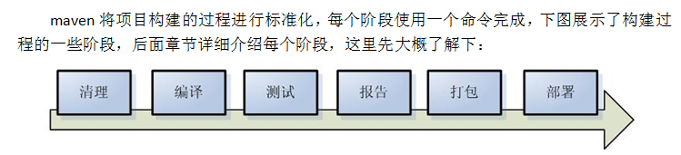
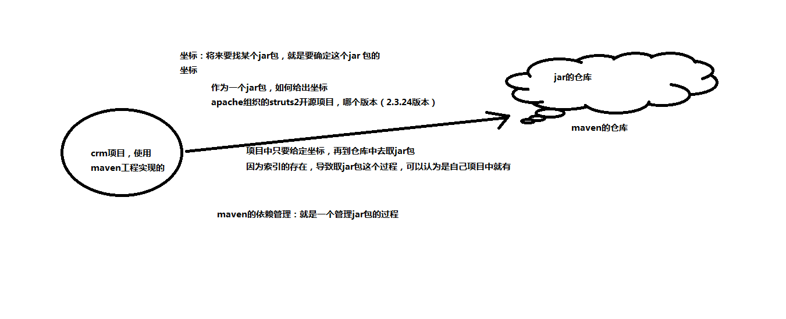
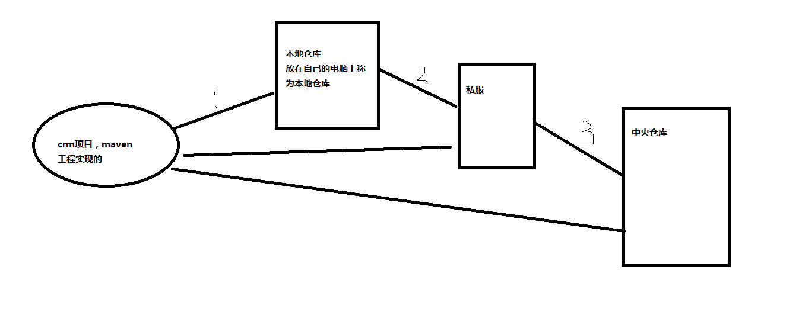
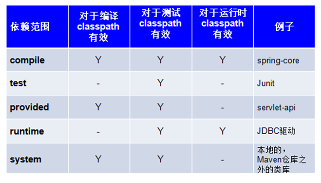

# Maven的好处
1. 同样的项目使用maven，项目源码容量更小，maven项目没有jar包
2. maven方便管理项目的各个模块
3. 项目的一键构建

## Maven项目的构建过程
1. 指的是项目从编译，测试，运行，打包，安装整个过程都交给maven进行管理，这个过程称为构建



## maven自动查找jar包实现原理



# maven的安装
## 环境
1. deepin-linux 15.6

## 安装过程
1. 从apache maven官网获取maven的压缩包
    - 地址如下：`http://maven.apache.org/download.cgi`
    
2. 解压maven

3. 配置maven环境变量(.bash_profile)
```
# maven
export MAVEN_HOME=/opt/apache-maven-3.5.4
export CLASSPATH=$CLASSPATH:$MAVEN_HOME/lib
export PATH=$PATH:$MAVEN_HOME/bin
```

# Maven目录结构
## src下的目录结构说明
1. main
    - java：放入项目源码
    - resource：放入与源码相关的配置文件
    - webapp：页面素材
    
2. test
    - java：测试源码
    - resources：测试源码相关的配置文件
    

# maven的仓库

## 仓库类型
1. 本地仓库
2. 远程仓库
3. 中央仓库



## 本地仓库的配置
1. 找到`conf/settings.xml`文件
2. 配置`<settings>`标签下的`<localRepository>`标签进行配置


# Maven常用命令
1. `mvn clean`：清理maven项目生成的文件
2. `mvn compile`：编译maven工程，将java文件编译成class文件放入target目录
3. `mvn package`：打包maven工程，java工程执行package打包成jar包，对web工程，打包成war包
4. `mvn install`：maven的安装命令，将maven打包成jar包或war包发布到本地仓库
5. 当后面的命令执行时，前面的操作过程也会自动执行


# Maven的生命周期
1. CleanLifecycle：在进行真正的构建之前进行一些清理工作。
2. DefaultLifecycle：构建的核心部分：编译，测试，打包，部署等
3. SIteLifecycle：生成项目报告，站点，发布站点


# 依赖范围
1. 添加jar包的坐标时，还可以指定这个jar包将来的作用范围，使用`<dependency scope="">"`
2. 依赖范围包括
    - compile：编译范围，指定A在编译时依赖B，此范围为默认依赖范围，编译范围的依赖会在编译、测试、运行，由于运行时需要所以编译范围的依赖会被打包
    - provided：provided依赖只有当JDK或者一个容器已提供该依赖之后才使用，provided依赖在编译和测试时需要，在运行时不需要，比如：servlet api被tongcat容器提供
    - runtime：runtime依赖在运行和测试系统的时候需要，但在编译的时候不需要，比如jdbc的驱动包，由于运行时需要所以runtime范围的依赖会被打包
    - test：test范围依赖，在编译和运行时都不需要，它们只有在测试编译和测试运行阶段可用，比如：junit，由于运行时不需要所以test范围依赖不会被打包
    - system：system范围依赖与provided类似，但是你必须显式的提供一个对于本地系统中JAR文件的路径，需要指定systemPath磁盘路径，system依赖不推荐使用
3. 坐标=groupId+artifactId+version
    
