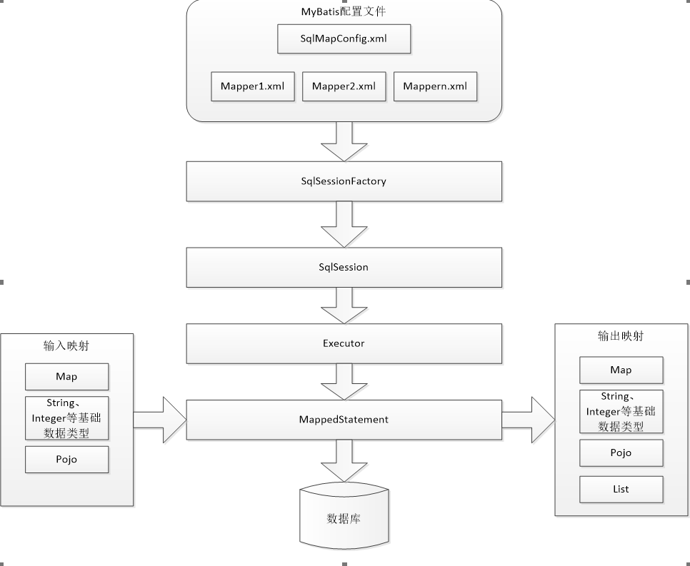

# MyBatis简介
1. MyBatis 本是apache的一个开源项目iBatis, 2010年这个项目由apache software foundation 迁移到了google code，并且改名为MyBatis 。2013年11月迁移到Github。
2. MyBatis是一个优秀的持久层框架，它对jdbc的操作数据库的过程进行封装，使开发者只需要关注 SQL 本身，而不需要花费精力去处理例如注册驱动、创建connection、创建statement、手动设置参数、结果集检索等jdbc繁杂的过程代码。
3. Mybatis通过xml或注解的方式将要执行的各种statement（statement、preparedStatement、CallableStatement）配置起来，并通过java对象和statement中的sql进行映射生成最终执行的sql语句，最后由mybatis框架执行sql并将结果映射成java对象并返回。

# JDBC编程总结
## 名词
1. pojo:不按mvc分层,只是Java bean有一些属性,还有get set方法
2. domain:不按mvc分层,只是Java bean有一些属性,还有get set方法
3. po:用在持久层,还可以再增加或者修改的时候,从页面直接传入Action中,JavaBean的类名等于表名,属性名等于表的字段名,还有对应的get,set方法
3. vo:view object,表现层对象,主要用于在高级查询中从页面接收传过来的各种参数,扩展性强
4. bo:用在service层,现在企业基本不用

## 编程流程
1.	加载数据库驱动
2.	创建并获取数据库链接
3.	创建jdbc statement对象
4.	设置sql语句
5.	设置sql语句中的参数(使用preparedStatement)
6.	通过statement执行sql并获取结果
7.	对sql执行结果进行解析处理
8.	释放资源(resultSet、preparedstatement、connection)

## 测试代码
```java
package cn.devinkin.jdbc;

import java.sql.*;

public class JDBCTest {
    public static void main(String[] args) {
        Connection connection = null;
        PreparedStatement preparedStatement = null;
        ResultSet resultSet =null;

        try {
            // 加载数据库驱动
            Class.forName("com.mysql.jdbc.Driver");

            // 通过驱动管理类获取数据库连接
            connection = DriverManager.getConnection("jdbc:mysql://localhost:3306/mybatis?characterEncoding=utf-8",
                    "dbuser", "111111");
            String sql = "select * from user where username = ?";
            // 定义sql语句,?表示占位符
            preparedStatement = connection.prepareStatement(sql);
            // 设置参数,第一个参数为sql语句的序号(从1开始),第二个为设置参数的值
            preparedStatement.setString(1, "王五");
            // 向数据库发出sql执行查询,查询出结果集
            resultSet = preparedStatement.executeQuery();
            // 遍历查询结果集
            while (resultSet.next()) {
                System.out.println(resultSet.getString("id") + ": " +resultSet.getString("username"));
            }
        } catch (ClassNotFoundException e) {
            e.printStackTrace();
        } catch (SQLException e) {
            e.printStackTrace();
        } finally {
            try {
                if (resultSet != null) {
                    resultSet.close();
                }
                if (preparedStatement != null) {
                    preparedStatement.close();
                }
                if (connection != null) {
                    connection.close();
                }
            } catch (SQLException e) {
                e.printStackTrace();
            }
        }
    }
}
```

## 问题总结
1.	数据库链接创建、释放频繁造成系统资源浪费从而影响系统性能，如果使用数据库链接池可解决此问题。
2.	Sql语句在代码中硬编码，造成代码不易维护，实际应用sql变化的可能较大，sql变动需要改变java代码。
3.	使用preparedStatement向占有位符号传参数存在硬编码，因为sql语句的where条件不一定，可能多也可能少，修改sql还要修改代码，系统不易维护。
4.	对结果集解析存在硬编码（查询列名），sql变化导致解析代码变化，系统不易维护，如果能将数据库记录封装成pojo对象解析比较方便。

# MyBatis架构
## 架构图


## 说明
1. mybatis配置
    - SqlMapConfig.xml，此文件作为mybatis的全局配置文件，配置了mybatis的运行环境等信息。
    - cn.devinkin.test.mapper.xml文件即sql映射文件，文件中配置了操作数据库的sql语句。此文件需要在SqlMapConfig.xml中加载。
2.	通过mybatis环境等配置信息构造SqlSessionFactory即会话工厂
3.	由会话工厂创建sqlSession即会话，操作数据库需要通过sqlSession进行。
4.	mybatis底层自定义了Executor执行器接口操作数据库，Executor接口有两个实现，一个是基本执行器、一个是缓存执行器。
5.	Mapped Statement也是mybatis一个底层封装对象，它包装了mybatis配置信息及sql映射信息等。cn.devinkin.test.mapper.xml文件中一个sql对应一个Mapped Statement对象，sql的id即是Mapped statement的id。
6.	Mapped Statement对sql执行输入参数进行定义，包括HashMap、基本类型、pojo，Executor通过Mapped Statement在执行sql前将输入的java对象映射至sql中，输入参数映射就是jdbc编程中对preparedStatement设置参数。
7.	Mapped Statement对sql执行输出结果进行定义，包括HashMap、基本类型、pojo，Executor通过Mapped Statement在执行sql后将输出结果映射至java对象中，输出结果映射过程相当于jdbc编程中对结果的解析处理过程。

# MyBatis入门
## 工程搭建
1. 创建java工程

## 导入jar包
```xml
    <dependencies>
        <!-- mysql驱动-->
        <dependency>
            <groupId>mysql</groupId>
            <artifactId>mysql-connector-java</artifactId>
            <version>5.1.25</version>
        </dependency>

        <!-- junit -->
        <dependency>
            <groupId>junit</groupId>
            <artifactId>junit</artifactId>
            <version>4.12</version>
        </dependency>

        <!-- log4j -->
        <dependency>
            <groupId>log4j</groupId>
            <artifactId>log4j</artifactId>
            <version>1.2.17</version>
        </dependency>

        <!-- mybatis -->
        <dependency>
            <groupId>org.mybatis</groupId>
            <artifactId>mybatis</artifactId>
            <version>3.4.6</version>
        </dependency>

        <!-- slf4j -->
        <dependency>
            <groupId>org.slf4j</groupId>
            <artifactId>slf4j-api</artifactId>
            <version>1.7.25</version>
        </dependency>
        <dependency>
            <groupId>org.slf4j</groupId>
            <artifactId>slf4j-log4j12</artifactId>
            <version>1.7.25</version>
        </dependency>
    </dependencies>
```

## 创建log4j配置文件
```properties
# Global logging configuration
log4j.rootLogger=DEBUG, stdout
# Console output...
log4j.appender.stdout=org.apache.log4j.ConsoleAppender
log4j.appender.stdout.layout=org.apache.log4j.PatternLayout
log4j.appender.stdout.layout.ConversionPattern=%5p [%t] - %m%n

```

## 创建SqlMapConfig配置文件
```xml
<?xml version="1.0" encoding="UTF-8"?>
<!DOCTYPE configuration
        PUBLIC "-//mybatis.org//DTD Config 3.0//EN"
        "http://mybatis.org/dtd/mybatis-3-config.dtd">
<configuration>
    <!-- 和spring整合后environments配置将废除 -->
    <environments default="development">
        <environment id="development">
            <transactionManager type="JDBC"/>
            <dataSource type="POOLED">
                <property name="driver" value="com.mysql.jdbc.Driver"/>
                <property name="url" value="jdbc:mysql://localhost:3306/mybatis?characterEncoding=utf-8"/>
                <property name="username" value="dbuser"/>
                <property name="password" value="111111"/>
            </dataSource>
        </environment>
    </environments>
    
    <mappers>
        <cn.devinkin.test.mapper resource="User.xml"/>
    </mappers>
</configuration>
```

## po类的编写
```java
package cn.devinkin.pojo;


import lombok.Data;

import java.util.Date;

@Data
public class User {
    private int id;
    // 用户名
    private String username;
    // 性别
    private String sex;
    // 生日
    private Date birthday;
    // 地址
    private String adress;

}
```

## pojo类配置文件编写
```xml
<?xml version="1.0" encoding="UTF-8"?>
<!DOCTYPE cn.devinkin.test.mapper
        PUBLIC "-//mybatis.org//DTD Mapper 3.0//EN"
        "http://mybatis.org/dtd/mybatis-3-cn.devinkin.test.mapper.dtd">
<!-- namespace:命名空间,做sql隔离 -->
<cn.devinkin.test.mapper namespace="test">

    <!--
    id:sql语句唯一标识
    parameterType:指定传入参数类型
    resultType:返回结果集类型
    #{}占位符:起到占位作用,如果传入的是基本类型(string,long,double,int,boolean,float等),那么#{}中的变量名称可以随意写.
     -->
    <select id="findUserById" parameterType="java.lang.Integer" resultType="cn.devinkin.pojo.User">
		select * from user where id=#{id}
	</select>

    <!--
    如果返回结果为集合,可以调用selectList方法,这个方法返回的结果是一个集合
    所以映射文件中,返回类型应该配置成集合泛型的类型
    ${}拼接符:字符串原样拼接,如果传入的参数是基本类型,那么${}中的变量名称必须是value
    注意:拼接符有sql注入的风险,所以要慎重使用,
    -->
    <select id="findUserByUserName" parameterType="java.lang.Integer" resultType="cn.devinkin.pojo.User">
		select * from user where username like '%${value}%'
	</select>

    <!--
    #{}:如果传入的参数是pojo类型,那么${}中的变量名称必须是pojo中对应的属性
    如果要返回数据库自增主键:可以使用 select LAST_INSERT_ID()
    -->
    <insert id="insertUser" parameterType="cn.devinkin.pojo.User">
        <!-- 执行 LAST_INSERT_ID()数据库函数,返回自增的主键
        keyProperty:将返回的主键放入传入参数的Id中保存.
        order:当前函数相对于insert语句的执行顺序
        resultType:id的类型,也就是keyProperty中属性的类型
        -->
        <selectKey keyProperty="id" order="AFTER" resultType="java.lang.Integer">
            select LAST_INSERT_ID();
        </selectKey>
        insert into user(username, birthday, sex, address) values (#{username}, #{birthday}, #{sex}, #{address})
    </insert>
    
	<insert id="insertUser2" parameterType="cn.devinkin.pojo.User2">
		<selectKey keyProperty="id" order="BEFORE" resultType="java.lang.String">
			select uuid()
		</selectKey>
        insert into user2(id,username, birthday, sex, address) values (#{id}, #{username}, #{birthday}, #{sex}, #{address})
	</insert>

    <delete id="delUser" parameterType="int">
		delete from user where id = #{id}
	</delete>

    <update id="updateUserById" parameterType="cn.devinkin.pojo.User">
        update user set username=#{username} where id=#{id}
    </update>
</cn.devinkin.test.mapper>
```

## 编写测试代码
```java
package cn.devinkin.test;

import cn.devinkin.pojo.User;
import cn.devinkin.pojo.User2;
import org.apache.ibatis.io.Resources;
import org.apache.ibatis.session.SqlSession;
import org.apache.ibatis.session.SqlSessionFactory;
import org.apache.ibatis.session.SqlSessionFactoryBuilder;
import org.junit.Test;

import java.io.InputStream;
import java.util.Date;
import java.util.List;

public class UserTest {

    @Test
    public void testFindUserById() throws Exception{
        String resource = "SqlMapConfig.xml";
        // 通过流将核心配置文件读取进来
        InputStream inputStream = Resources.getResourceAsStream(resource);
        // 通过核心配置文件输入流来创建会话工厂
        SqlSessionFactory sqlSessionFactory = new SqlSessionFactoryBuilder().build(inputStream);
        // 通过工厂创建会话
        SqlSession sqlSession = sqlSessionFactory.openSession();
        // 第一个参数:所调用的sql语句=namespace+sql的ID
        User user = sqlSession.selectOne("test.findUserById",1);
        System.out.println(user);
        sqlSession.close();
    }

    @Test
    public void testFindUserByUserName() throws Exception {
        String resource = "SqlMapConfig.xml";
        // 通过流将核心配置文件读取进来
        InputStream inputStream = Resources.getResourceAsStream(resource);
        // 通过核心配置文件输入流来创建会话工厂
        SqlSessionFactory sqlSessionFactory = new SqlSessionFactoryBuilder().build(inputStream);
        // 通过工厂创建会话
        SqlSession sqlSession = sqlSessionFactory.openSession();
        // 第一个参数:所调用的sql语句=namespace+sql的ID
        List<Object> selectList = sqlSession.selectList("test.findUserByUserName", "王");
        System.out.println(selectList);
    }

    @Test
    public void testInsertUser() throws Exception {
        String resource = "SqlMapConfig.xml";
        // 通过流将核心配置文件读取进来
        InputStream inputStream = Resources.getResourceAsStream(resource);
        // 通过核心配置文件输入流来创建会话工厂
        SqlSessionFactory sqlSessionFactory = new SqlSessionFactoryBuilder().build(inputStream);
        // 通过工厂创建会话
        SqlSession sqlSession = sqlSessionFactory.openSession();

        User user = new User();
        user.setUsername("小明");
        user.setBirthday(new Date());
        user.setSex("男");
        user.setAddress("广东佛山");
        sqlSession.insert("test.insertUser", user);
        // 提交事务(mybatis会自动开启事务,但不知道什么时候提交,需要手动提交事务)
        sqlSession.commit();

        System.out.println(user);
    }

    @Test
    public void testInsertUser2() throws Exception {
        String resource = "SqlMapConfig.xml";
        // 通过流将核心配置文件读取进来
        InputStream inputStream = Resources.getResourceAsStream(resource);
        // 通过核心配置文件输入流来创建会话工厂
        SqlSessionFactory sqlSessionFactory = new SqlSessionFactoryBuilder().build(inputStream);
        // 通过工厂创建会话
        SqlSession sqlSession = sqlSessionFactory.openSession();

        User2 user = new User2();
        user.setUsername("小明");
        user.setBirthday(new Date());
        user.setSex("男");
        user.setAddress("广东佛山");
        sqlSession.insert("test2.insertUser2", user);
        // 提交事务(mybatis会自动开启事务,但不知道什么时候提交,需要手动提交事务)
        sqlSession.commit();

        System.out.println(user);
    }

    @Test
    public void testDelUser() throws Exception {
        String resource = "SqlMapConfig.xml";
        // 通过流将核心配置文件读取进来
        InputStream inputStream = Resources.getResourceAsStream(resource);
        // 通过核心配置文件输入流来创建会话工厂
        SqlSessionFactory sqlSessionFactory = new SqlSessionFactoryBuilder().build(inputStream);
        // 通过工厂创建会话
        SqlSession sqlSession = sqlSessionFactory.openSession();

        sqlSession.delete("test.delUser",29);

        // 提交事务(mybatis会自动开启事务,但不知道什么时候提交,需要手动提交事务)
        sqlSession.commit();
    }

    @Test
    public void testUpdateUser() throws Exception {
        String resource = "SqlMapConfig.xml";
        // 通过流将核心配置文件读取进来
        InputStream inputStream = Resources.getResourceAsStream(resource);
        // 通过核心配置文件输入流来创建会话工厂
        SqlSessionFactory sqlSessionFactory = new SqlSessionFactoryBuilder().build(inputStream);
        // 通过工厂创建会话
        SqlSession sqlSession = sqlSessionFactory.openSession();

        User user = new User();
        user.setId(26);
        user.setUsername("瓜娃子");
        sqlSession.update("test.updateUserById", user);

        // 提交事务(mybatis会自动开启事务,但不知道什么时候提交,需要手动提交事务)
        sqlSession.commit();
    }
}

```

# 占位符和拼接符
1. 占位符:`#{}`
2. 拼接符:`${}`

## 占位符:占位
1. 如果传入的是基本类型,那么`#{}`中的变量名称可以随意些
2. 如果传入的参数是pojo类型,那么`#{}`中的变量名称必须是pojo中的属性

## 拼接符:字符串原样拼接
1. 如果传入的是基本类型,那么`${}`中的变量名必须是value
2. 如果传入的参数是pojo类型,那么`${}`中的变量名必须是pojo中的属性
3. 注意:使用拼接符有可能造成sql注入,在页面输入的时候可以加入校验,不可以输入sql关键字,不可以输入空格

# Mybatis的dao开发
## 原生dao开发方式
### 编写dao接口
```java
package cn.devinkin.dao;

import cn.devinkin.pojo.User;

import java.util.List;

public interface UserDao {
    public User findUserById(Integer id);

    public List<User> findUserByUserName(String username);
}

```

### 编写dao实现类
```java
package cn.devinkin.dao;

import cn.devinkin.pojo.User;
import org.apache.ibatis.session.SqlSession;
import org.apache.ibatis.session.SqlSessionFactory;

import java.util.List;

public class UserDaoImpl implements UserDao {
    private SqlSessionFactory sqlSessionFactory;

    // 通过构造方法注入
    public UserDaoImpl(SqlSessionFactory sqlSessionFactory) {
        this.sqlSessionFactory = sqlSessionFactory;
    }

    public User findUserById(Integer id) {
        // sqlSession是线程不安全的,所以它的最佳使用范围在方法体内
        SqlSession openSession = sqlSessionFactory.openSession();
        User user = openSession.selectOne("test.findUserById",id);
        return user;
    }

    public List<User> findUserByUserName(String username) {
        // sqlSession是线程不安全的,所以它的最佳使用范围在方法体内
        SqlSession openSession = sqlSessionFactory.openSession();
        List<User> userList = openSession.selectList("test.findUserByUserName", username);
        return userList;
    }
}

```

### 测试
```java
package cn.devinkin.test;

import cn.devinkin.dao.UserDao;
import cn.devinkin.dao.UserDaoImpl;
import cn.devinkin.pojo.User;
import org.apache.ibatis.io.Resources;
import org.apache.ibatis.session.SqlSessionFactory;
import org.apache.ibatis.session.SqlSessionFactoryBuilder;
import org.junit.Before;
import org.junit.Test;

import java.io.InputStream;
import java.util.List;

public class UserDaoTest {
    private SqlSessionFactory factory;

    // 作用,在测试方法前执行该方法
    @Before
    public void setUp() throws Exception {
        String resource = "SqlMapConfig.xml";
        // 通过流将核心配置文件读取进来
        InputStream inputStream = Resources.getResourceAsStream(resource);
        // 通过核心配置文件输入流来创建会话工厂
        factory = new SqlSessionFactoryBuilder().build(inputStream);
    }

    @Test
    public void testFindUserById() throws Exception {
        // 将初始化好的工厂注入到实现类中
        UserDao userDao = new UserDaoImpl(factory);
        User user = userDao.findUserById(1);
        System.out.println(user);
    }

    @Test
    public void testFindUserByUserName() throws Exception {
        // 将初始化好的工厂注入到实现类中
        UserDao userDao = new UserDaoImpl(factory);
        List<User> userList = userDao.findUserByUserName("王");
        System.out.println(userList);
    }
}

```

## 动态代理开发方式
### mapper接口代理实现编写规则
1. 映射文件中namespace要等于接口的全路径名称
2. 映射文件中sql语句id要等于接口的方法名称
3. 映射文件中传入参数要等于接口方法的传入参数类型
4. 映射文件中返回结果集类型要等于接口方法的返回值类型

### 编写po类映射文件
```xml
<?xml version="1.0" encoding="UTF-8"?>
<!DOCTYPE cn.devinkin.test.mapper
        PUBLIC "-//mybatis.org//DTD Mapper 3.0//EN"
        "http://mybatis.org/dtd/mybatis-3-cn.devinkin.test.mapper.dtd">
<!--
mapper接口代理实现编写规则
    1. 映射文件中namespace要等于接口的全路径名称
    2. 映射文件中sql语句id要等于接口的方法名称
    3. 映射文件中传入参数要等于接口方法的传入参数类型
    4. 映射文件中返回结果集类型要等于接口方法的返回值类型
    -->
<!-- namespace:命名空间,做sql隔离 -->
<cn.devinkin.test.mapper namespace="cn.devinkin.test.mapper.cn.devinkin.test.mapper.UserMapper">
    <!--
    id:sql语句唯一标识
    parameterType:指定传入参数类型
    resultType:返回结果集类型
    #{}占位符:起到占位作用,如果传入的是基本类型(string,long,double,int,boolean,float等),那么#{}中的变量名称可以随意写.
     -->
    <select id="findUserById" parameterType="java.lang.Integer" resultType="cn.devinkin.pojo.User">
		select * from user where id=#{id}
	</select>

    <!--
    如果返回结果为集合,可以调用selectList方法,这个方法返回的结果是一个集合
    所以映射文件中,返回类型应该配置成集合泛型的类型
    ${}拼接符:字符串原样拼接,如果传入的参数是基本类型,那么${}中的变量名称必须是value
    注意:拼接符有sql注入的风险,所以要慎重使用,
    -->
    <select id="findUserByUserName" parameterType="java.lang.Integer" resultType="cn.devinkin.pojo.User">
		select * from user where username like '%${value}%'
	</select>

    <!--
    #{}:如果传入的参数是pojo类型,那么${}中的变量名称必须是pojo中对应的属性
    如果要返回数据库自增主键:可以使用 select LAST_INSERT_ID()
    -->
    <insert id="insertUser" parameterType="cn.devinkin.pojo.User">
        <!-- 执行 LAST_INSERT_ID()数据库函数,返回自增的主键
        keyProperty:将返回的主键放入传入参数的Id中保存.
        order:当前函数相对于insert语句的执行顺序
        resultType:id的类型,也就是keyProperty中属性的类型
        -->
        <selectKey keyProperty="id" order="AFTER" resultType="java.lang.Integer">
            select LAST_INSERT_ID();
        </selectKey>
        insert into user(username, birthday, sex, address) values (#{username}, #{birthday}, #{sex}, #{address})
    </insert>

    <delete id="delUser" parameterType="int">
		delete from user where id = #{id}
	</delete>

    <update id="updateUserById" parameterType="cn.devinkin.pojo.User">
        update user set username=#{username} where id=#{id}
    </update>
</cn.devinkin.test.mapper>

```

### 编写mapper接口
```java
package mapper.cn.devinkin.test.mapper;

import cn.devinkin.pojo.User;

import java.util.List;

public interface UserMapper {
    public User findUserById(Integer id);

    public List<User> findUserByUserName(String username);

    public void insertUser(User user);

    public void delUser(User user);

    public void updateUserById(User user);
}

```

### 在全局配置文件中引入Mapper映射文件
1. 使用class属性引入接口的全路径名称:
    - 接口名称和映射文件名称除扩展名外要完全一致
    - 接口和映射文件要放在同一个目录下
```xml
    <mappers>
        <cn.devinkin.test.mapper resource="User.xml"/>
        <cn.devinkin.test.mapper resource="User2.xml"/>
        <!--
        使用class属性引入接口的全路径名称:
        使用规则
            1. 接口名称和映射文件名称除扩展名外要完全一致
            2. 接口和映射文件要放在同一个目录下
        -->
        <cn.devinkin.test.mapper class="cn.devinkin.test.mapper.cn.devinkin.test.mapper.UserMapper"/>
    </mappers>
```

### 编写测试代码
```java
package cn.devinkin.test;

import cn.devinkin.mapper.UserMapper;
import cn.devinkin.pojo.User;
import org.apache.ibatis.io.Resources;
import org.apache.ibatis.session.SqlSession;
import org.apache.ibatis.session.SqlSessionFactory;
import org.apache.ibatis.session.SqlSessionFactoryBuilder;
import org.junit.Before;
import org.junit.Test;

import java.io.InputStream;
import java.util.Date;
import java.util.List;

public class UserMapperTest {
    private SqlSessionFactory factory;

    // 作用,在测试方法前执行该方法
    @Before
    public void setUp() throws Exception {
        String resource = "SqlMapConfig.xml";
        // 通过流将核心配置文件读取进来
        InputStream inputStream = Resources.getResourceAsStream(resource);
        // 通过核心配置文件输入流来创建会话工厂
        factory = new SqlSessionFactoryBuilder().build(inputStream);
    }

    @Test
    public void testFindUserById() throws Exception {
        SqlSession openSession = factory.openSession();
        // 通过getMapper方法来实例化接口
        UserMapper userMapper = openSession.getMapper(UserMapper.class);
        User user = userMapper.findUserById(1);
        System.out.println(user);
    }

    @Test
    public void testFindUserByUserName() throws Exception {
        SqlSession openSession = factory.openSession();
        // 通过getMapper方法来实例化接口
        UserMapper userMapper = openSession.getMapper(UserMapper.class);
        List<User> userList = userMapper.findUserByUserName("王");
        System.out.println(userList);
    }

    @Test
    public void testInsertUser() {
        SqlSession openSession = factory.openSession();
        // 通过getMapper方法来实例化接口
        UserMapper userMapper = openSession.getMapper(UserMapper.class);
        User user1 = new User();
        user1.setUsername("拉拉仔");
        user1.setAddress("广东湛江");
        user1.setSex("女");
        user1.setBirthday(new Date());
        userMapper.insertUser(user1);
        openSession.commit();
    }

    @Test
    public void testDelUser() {
        SqlSession openSession = factory.openSession();
        // 通过getMapper方法来实例化接口
        UserMapper userMapper = openSession.getMapper(UserMapper.class);
        userMapper.delUser(30);
        openSession.commit();
    }

    @Test
    public void testUpdateUserById() {
        SqlSession openSession = factory.openSession();
        // 通过getMapper方法来实例化接口
        UserMapper userMapper = openSession.getMapper(UserMapper.class);
        User user = new User();
        user.setId(31);
        user.setUsername("小拉拉");
        userMapper.updateUser(user);
        openSession.commit();
    }
}

```

### Maven工程的配置
1. 需要在pom.xml中配置
```xml
    <build>
        <resources>
            <resource>
                <directory>src/main/java</directory>
                <includes>
                    <include>**/*.properties</include>
                    <include>**/*.xml</include>
                </includes>
                <filtering>false</filtering>
            </resource>
            <resource>
                <directory>src/main/resource</directory>
                <includes>
                    <include>**/*.properties</include>
                    <include>**/*.xml</include>
                </includes>
            </resource>


            <resource>
                <directory>src/test/java</directory>
                <includes>
                    <include>**/*.properties</include>
                    <include>**/*.xml</include>
                </includes>
                <filtering>false</filtering>
            </resource>
            <resource>
                <directory>src/test/resource</directory>
                <includes>
                    <include>**/*.properties</include>
                    <include>**/*.xml</include>
                </includes>
            </resource>
        </resources>
    </build>
```


# SqlMapConfig.xml说明
## 配置内容
1. SqlMapConfig.xml的内容和顺序如下
    1. properties(属性)
    2. settings(全局配置参数)
    3. typeAliases(类型别名)
    4. typeHandlers(类型处理器)
    5. objectFactory(对象工厂)
    6. plugins(插件)
    7. environments(环境集合属性对象)
        - environment(环境子属性对象)
        - transactionManager(事务管理)
        - dataSource(数据源)
        - mappers(映射器)

## typeAliases(类型别名)
1. mybatis支持别名

|别名|映射的类型|
|---|---|
|_byte|byte|
|_long|long|
|_short|short|
|_int|int|
|_integer|integer|
|_double|double|
|_float|float|
|_double|double|
|_boolean|boolean|
|string|String|
|byte|Byte|
|long|Long|
|short|Short|
|int|Integer|
|integer|Integer|
|double|Double|
|float|Float|
|boolean|Boolean|
|date|Date|
|decimal|BigDecimal|
|bigdecimal|BigDecimal|
|map|Map|

### 自定义别名
1. 在SqlMapConfig.xml中配置：
```xml
<typeAliases>
	<!-- 单个别名定义 -->
	<typeAlias alias="user" type="cn.itcast.mybatis.po.User"/>
	<!-- 批量别名定义，扫描整个包下的类，别名为类名（首字母大写或小写都可以） -->
	<package name="cn.itcast.mybatis.po"/>
	<package name="其它包"/>
</typeAliases>
```

## properties(属性)
1. 引入jdbc连接配置
```xml
    <properties resource="db.properties"/>
```

## package标签
1. 注册指定包下的所有mapper接口,如：`<package name="cn.itcast.mybatis.mapper"/>`
2. 注意：此种方法要求mapper接口名称和mapper映射文件名称相同，且放在同一个目录中。
3. package可用在别名里,也可以用在mapper标签里


# hibernate和mybatis的区别
1. hibernate:它是一个标准的orm框架,比较重量级,学习成本高
    - hibernate优点:高度封装,使用起来不用写sql语句,开发的时候时间短,会降低开发周期
    - hibernate缺点:sql语句无法优化
    - 应用场景:oa(办公自动化系统),erp(企业的流程系统)等,还有一些政府项目,在用户量不大,并发量小的时候使用

2. mybatis:它不是一个orm框架,它是对jdbc的轻量级封装,学习成本低,比较简单
    - 优点:学习成本低,sql语句可以优化,执行效率高
    - 缺点:编码量比较大,会延长开发周期
    - 应用场景:互联网项目,比如电商,p2p,总的来说,是用户量较大,并发高的项目使用mybatis框架较多