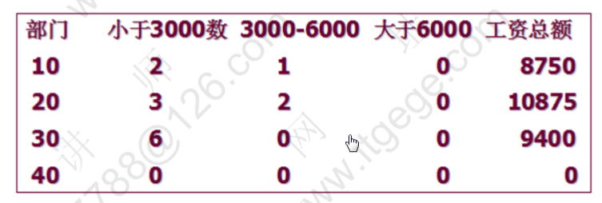

# PLSQL
## 什么是PL/SQL
1. PL/SQL(Procedure Language/SQL)
2. PLSQL是postgresplsql对sql语言的过程化扩展，指在SQL命令语言中增加了过程处理语句(如分支，循环等)，使SQL语言具有过程处理能力与过程语言的数据处理能力结合起来，使得PLSQL在面向过程但比过程语言简单、高效、灵活和使用。

## PL/SQL程序结构
```postgresplsql
declare
    说明部分 (变量说明，光标申明，例外说明)
begin
    语句序列 (DML语句)
exception
    例外处理语句
end;
```

## 说明部分

### 变量和常量说明
1. 说明变量
    1. char
    2. varchar2
    3. date
    4. number
    5. boolean
    6. long

2. 例
```postgresplsql
---说明变量名、数据类型和长度后用分号结束说明语句
var1 char(15);
married boolean := true;
psal number(7,2);
---引用型变量，即my_name的类型与emp表中ename列的类型一致
my_name emp.ename%type;
---记录型变量
emp_rec emp%rowtype;
```

引用变量实例
```postgresplsql
-- 查询并打印7839的姓名和薪水
declare
  -- 定义变量保存姓名和薪水
  --pename varchar2(20);
  --psal number;
  pename emp.ename%type;
  psal emp.sal%type;
begin
  -- 得到7839的姓名和薪水
  select ename,sal into pename,psal from emp where empno=7839;
  -- 打印
  dbms_output.put_line(pename||'的薪水是'||psal);
end;
```

### 记录变量分量的引用
```postgresplsql
-- 查询并但因7839的姓名和薪水
declare
  -- 定义记录型变量：代表一行
  emp_rec emp%rowtype;
begin
  select * into emp_rec from emp where empno=7839;
  dbms_output.put_line(emp_rec.ename||'的薪水是'||emp_rec.sal);
end;
```

### 常量的声明
1. 只需在声明语句中，变量名和变量类型之间加入constant即可


## IF语句

### 语法1
```postgresplsql
IF 条件 THEN 语句1;
语句2;
END IF;
```

### 语法2
```postgresplsql
IF 条件 THEN 语句序列1;
ELSE 语句序列2;
END IF;
```

### 语法3
```postgresplsql
IF 条件 THEN 语句;
ELSIF 语句 THEN 语句;
ELSE 语句;
END IF;
```

### if语句例
```postgresplsql
-- 判断用户从键盘输入的数字
-- 接收键盘输入
-- num: 地址值，在该地址上保存了输入的值
accept num prompt '请输入一个数字:';
declare
  -- 定义变量保存数字
  pnum number := &num;
begin
  if pnum = 0 then dbms_output.put_line('你输入的是0');
     elsif pnum = 1 then dbms_output.put_line('您输入的是1');
     elsif pnum = 2 then dbms_output.put_line('您输入的是2');
     else dbms_output.put_line('其他数字');
  end if;
end;
```

## 循环语句
### 语法1
```postgresplsql
WHILE total <= 25000
LOOP
...
total := total + salary;
END LOOP;
```


### 语法2
```postgresplsql
Loop
EXIT[when 条件];
...
End loop;
```

### 语法3
```postgresplsql
FOR I IN 1..3
LOOP
语句序列;
END LOOP;
```

### 循环实例
```postgresplsql
-- 打印1-10
declare
  -- Local variables here
  pnum number :=1;
begin
  dbms_output.put_line('loop 循环');
  loop
    --循环
    --退出条件
    exit when pnum > 10;
    dbms_output.put_line(pnum);
    --加1
    pnum := pnum + 1;
  end loop;
  dbms_output.put_line('while 循环');
  while pnum < 20
    loop
      dbms_output.put_line(pnum);
      pnum := pnum + 1;
    end loop;
  dbms_output.put_line('for 循环');
  for i in 1..10
    loop
      dbms_output.put_line(i);
    end loop;
end;
```

## 光标(Cursor) == ResultSet
1. 光标的初始位置为元素集合中第一个元素
### 说明光标语法：
```postgresplsql
CURSOR 光标名 [(参数名 数据类型[,参数名　数据类型]...)]
    IS SELECT 语句;
```

### 用于存储在一个查询的返回多行数据
定义： `pename emp.ename%type`;

```postgresplsql
cursor c1 is select ename from emp;
```

### 打开光标
```postgresplsql
open c1;
```

### 光标的属性
1. `%isopen`
2. `%rowcount`(影响的行数)
3. `%found`
4. `%notfound`

### 取出一行光标的值到变量中
```postgresplsql
fetch c1 into pename;
```

### 关闭光标
```postgresplsql
c1ose c1;
```

### 游标的结束方式
```postgresplsql
exit when c1%nofound;
```

### 例子
```postgresplsql
-- 查询并打印员工的姓名和薪水
/*
光标的属性：
%isopen
%rowcount(影响的行数)
%found
%nofound
*/
declare
  -- 定义光标
  cursor cemp is select ename,sal from emp;
  pename emp.ename%type;
  psal emp.sal%type;
begin
  -- 打开光标
  open  cemp;
  loop
    --取当前记录
    fetch cemp into pename, psal;
    --没有取到记录，退出
    exit when cemp%notfound;
    dbms_output.put_line(pename||'的薪水是'||psal);
  end loop;
  --关闭光标
  close cemp;
end;
```

### 涨工资，总裁1000，经理800，其他400
```postgresplsql
-- 涨工资
declare
  -- 定义光标
  cursor cemp is select empno,job from emp;
  pempno emp.empno%type;
  pjob emp.job%type;

begin
  rollback;
  -- 打开光标
  open cemp;
  loop
    --取一个员工
    fetch cemp into pempno,pjob;
    exit when cemp%notfound;
    --判断职位
    if pjob = 'PRESIDENT' then update emp set sal=sal+1000 where empno=pempno;
       elsif pjob = 'MANAGER' then update emp set sal=sal+800 where empno=pempno;
       else update emp set sal=sal+400 where empno=pempno;
    end if;
  end loop;
  -- 关闭光标
  close cemp;
  -- 提交
  commit;
  dbms_output.put_line('完成');
end;
```

### 带参数的光标
```postgresplsql
-- 查询某个部门的员工姓名
declare
  cursor cemp(dno number) is select ename from emp where deptno=dno;
  pename emp.ename%type;
begin
  --打开光标
  open cemp(10);
  loop
    fetch cemp into pename;
    exit when cemp%notfound;
    dbms_output.put_line(pename);
  end loop;
  --光比光标
  close cemp;
end;
```

# Oracle的异常处理
1. 系统定义例外
2. 用户定义的例外
## 系统定义例外
|系统定义例外|说明|
|---|---|
|No_data_found|没有找到数据|
|Too_many_rows|select...into语句匹配多个行|
|Zero_Divide|被零除|
|Value_error|算数或转换错误|
|Timeout_on_resource|在等待资源|


## 例1：写出被0除的异常的plsql程序
```postgresplsql
-- 被0除
declare
  pnum number;
begin
  pnum := 1/0;
exception
  when zero_divide then dbms_output.put_line('1:0不能做分母');
                         dbms_output.put_line('2:0不能做分母');
  when value_error then dbms_output.put_line('算术或者转换错误');
  when others then dbms_output.put_line('其他例外');
end;
```

## 例2：用户定义例外以及处理例外
1. 使用函数`raise_application_error(errno,errmsg);`
    1. errno为错误代码，在区间`-20000~-20999`之间
    2. errmsg为错误信息


## 进程监视器进程(PMON)
1. 在用户进程失败时执行进程恢复
    1. 清除数据缓存区高速缓存
    2. 释放该用户进程使用的资源
2. 监视会话，查看是否发生空闲会话超时
3. 在监听程序中注册数据库服务
4. 所以在上面的例子中，光标因为异常抛出而没有关闭，由PMON清理

##plsql实例
### 实例1：统计每年入职的员工个数
#### SQL语句
```oracle
SELECT to_char(hiredate,'YYYY') from emp;
--->光标--->循环--->退出条件:notfound;
```
#### 变量
1. count80 number := 0;
2. count81 number := 0;
3. count82 number := 0;
4. count87 number := 0;

#### 代码
```postgresplsql
/*
SQL语句

SELECT to_char(hiredate,'YYYY') from emp;
--->光标--->循环--->退出条件:notfound;

变量：1、初始值 2、最终得到
1. count80 number := 0;
2. count81 number := 0;
3. count82 number := 0;
4. count87 number := 0;
*/
declare
  -- 入职年份
  cursor cemp is select to_char(hiredate,'yyyy') from emp;
  phiredate varchar2(4);
  --每年入职的人数
  count80 number := 0;
  count81 number := 0;
  count82 number := 0;
  count87 number := 0;
begin
  open cemp;
  loop
    -- 取一个员工的入职年份
    fetch cemp into phiredate;
    exit when cemp%notfound;
    -- 判断年份
    if phiredate = '1980' then count80 := count80 + 1;
       elsif phiredate = '1981' then count81 := count81 + 1;
       elsif phiredate = '1981' then count81 := count82 + 1;
       else count87 := count87 + 1;
    end if;
  end loop;
  close cemp;
  --输出结果
  dbms_output.put_line('Total:'||(count80+count81+count82+count87));
  dbms_output.put_line('1980:'||count80);
  dbms_output.put_line('1981:'||count81);
  dbms_output.put_line('1982:'||count82);
  dbms_output.put_line('1987:'||count87);
end;
```
### 实例2
1. 为员工涨工资。从 最低工资调起每个人涨10%，但工资总额不能超过5万元，请计算涨工资人数和涨工资后的工资总额，并输出涨工资人数以及工资总数
#### SQL语句
```oracle
select empno, sal from emp order by sal;
--->光标--->循环--->退出条件:1. 工资总额>5W 2.notfound 3. 下一个员工涨工资后超过了限额，不涨
```
#### 变量
1. 涨工资的人数：countEmp number := 0;
2. 涨后的工资总额：salTotal number;
    1. select sum(sal) into salTotal from emp;
    2. 涨后=涨前+sal*0.1

#### 代码
```postgresplsql
/*
1. 为员工涨工资。从 最低工资调起每个人涨10%，但工资总额不能超过5万元，请计算涨工资人数和涨工资后的工资总额，并输出涨工资人数以及工资总数
SQL语句
select empno, sal from emp order by sal;
--->光标--->循环--->退出条件:1. 工资总额>5W 2.notfound


1. 涨工资的人数：countEmp number := 0;
2. 涨后的工资总额：salTotal number;
    1. select sum(sal) into salTotal from emp;
    2. 涨后=涨前+sal*0.1
*/
declare
  cursor cemp is select empno, sal from emp order by sal;
  pempno emp.empno%type;
  psal emp.sal%type;
  -- 涨工资的人数
  countEmp number := 0;
  -- 涨工资总额;
  salTotal number;
begin
  -- 得到初始化的工资总额
  select sum(sal) into salTotal from emp;
  open cemp;
  loop
    --1、总额>5W
    exit when salTotal > 80000;
    --取一个员工涨工资
    fetch cemp into pempno, psal;
    --下一个员工工资涨了之后超出预算，退出
    exit when (salTotal + psal*0.1) > 80000;
    --2、notfound
    exit when cemp%notfound;
    --涨工资
    update emp set sal=sal*1.1 where empno=pempno;
    --人数+1
    countEmp := countEmp + 1;
    --2.涨后=涨前+sal*0.1
    salTotal := salTotal + psal*0.1;
  end loop;
  close cemp;
  commit;
  dbms_output.put_line('涨后的工资总额：'||salTotal||'涨工资的人数：'||countEmp);
end;
```
### 实例3
1. 用PL/SQL语言编写一程序，实现按部门分段(6000以上、(6000,3000)、3000元一下)统计各工资段的职工人数、以及各部门的工资总额(工资总额不包含奖金)，参考如下格式：


2. 创建一张表用于保存数据
```oracle
create table msg1
(
deptno number,
emp_num1 number,
emp_num2 number,
emp_num3 number.
sum_sal number
);
```

#### SQL语句
1. 部门：`select deptno from dept;`
2. 查部门中的员工薪水：`select sal from emp where deptno=??`

#### 变量
1. 每个段的人数
    1. count1 number;
    2. count2 number;
    3. count3 number;
2. 部门的工资总额：salTotal number := 0;
    1. `select sum(sal) into salTotal from emp where deptno=??`
    2. 累加
3. 存储光标取出的值
    1. 部门号：pdeptno dept.deptno%type;
    2. 工资：psal emp.sal%type;

```postgresplsql
/*
SQL语句
1. 部门：`select deptno from dept;`
2. 查部门中的员工薪水：`select sal from emp where deptno=??`
变量
1. 每个段的人数
    1. count1 number;
    2. count2 number;
    3. count3 number;
2. 部门的工资总额：salTotal number := 0;
    1. `select sum(sal) into salTotal from emp where deptno=??`
    2. 累加
*/
declare
  -- 外循环光标
  cursor cdeptno is select deptno from dept;
  -- 内循环光标
  cursor csal(dno number) is select sal from emp where deptno=dno;
  --每个段的人数
  count1 number := 0;
  count2 number := 0;
  count3 number := 0;
  --部门工资总额
  salTotal number := 0;
  --存储光标取出的值
  pdeptno dept.deptno%type;
  psal emp.sal%type;
begin
  -- 打开外光标
  open cdeptno;
  loop
    --清空统计数量
    count1 := 0;
    count2 := 0;
    count3 := 0;
    --清空部门工资总额
    salTotal := 0;
    --从外光标取出部门号
    fetch cdeptno into pdeptno;
    exit when cdeptno%notfound;
    --打开内光标
    open csal(pdeptno);
    loop
      fetch csal into psal;
      exit when csal%notfound;
      if psal < 3000 then count1 := count1 + 1;
         elsif psal < 6000 then count2 := count2 + 1;
         else count3 := count3 + 1;
      end if;
      salTotal := salTotal + psal;
    end loop;
    close csal;
    dbms_output.put_line('outer');
    insert into msg1 values(pdeptno,count1,count2,count3,salTotal);
  end loop;
  close cdeptno;
  commit;
  dbms_output.put_line('完成');
end;
```

# 存储过程和存储函数
1. 指存储在数据库中供所有用户程序调用的子程序叫存储过程、存储函数。
2. 存储过程不能通过return子句返回函数值
3. 存储函数可以通过return子句返回函数值
4. 一般不在存储过程和存储函数提交或者回滚

## 创建存储过程
1. 用`CREATE PROCEDURE`命令建立存储过程
2. 语法：
```postgresplsql
create [or replace] PROCEDURE 过程名(参数列表)
AS|IS
    PLSQL子程序体;
```

## 调用存储过程
1. 语法：
```oracle
exec procedure_name();
--或者
begin
    procedure_name();
    procedure_name();
end;
```

## 删除存储过程
1. 语法:
```oracle
drop procedure procedure_name;
```

## 例
```postgresplsql
create or replace procedure raiseSalary(eno in number)
as
  --定义变量保存涨前的薪水
  psal emp.sal%type;
begin
  --得到涨前的薪水
  select sal into psal from emp where empno=eno;
  --涨100
  update emp set sal=sal+100 where empno=eno;
  dbms_output.put_line('涨前：'||psal||'涨后：'||(psal+100));
end;
```


## 创建存储函数
1. 函数(Function)为一命名的存储过程，可待参数，并返回一个计算值，函数和过程的结构类似，但必须有一个`RETURN`子句，用于返回函数值。函数说明要指定函数名、结果值的类型，以及参数类型等。
2. 建立存储函数的语法：
```oracle
create [or replace] function 函数名(参数列表)
RETURN 函数值类型
AS
    PLSQL子程序体;
```

## 删除存储函数
1. 语法：
```oracle
drop function function_name;
```


### 查询某个员工的年收入
```postgresplsql
create or replace function queryEmpIncome(eno in number)
return number
as
    --月薪和奖金
    psal emp.sal%type;
    pcomm emp.comm%type;
begin
    --得到月薪和奖金
    select sal,comm into psal,pcomm from emp where empno=eno;
    --返回年收入
    return psal*12+nvl(pcomm,0);
end;
```

### 绑定变量
1. `:result`

## 过程和函数中的in和out
1. 一般来讲，过程和函数的区别在于函数可以有一个返回值；而过程没有返回值
2. 但过程和函数都可以通过out指定一个或多个输出参数。我们可以利用out参数，在过程和函数中实现返回多个值

### 在out参数中使用游标
问题：查询某个部门中所有员工的所有信息
- 声明包结构
```oracle
CREATE OR REPLACE PACKAGE MYPACKAGE AS
    type empcursor is ref cursor
    procedure queryEmpList(dno in number, empList out empcursor);
END MYPACKAGE;
```
- 创建包体
```oracle
CREATE OR REPLACE PACKAGE BODY MYPACKAGE AS
    procedure queryEmpList(dno in number, empList out empcursor) AS
    BEGIN
        open empList for select * from emp where deptno=dno;
    END queryEmpList;
END MYPACKAGE;
```


## 什么时候用存储过程/存储函数
1. 原则：如果只有一个返回值，用存储函数；否则，就用存储过程

# 触发器
1. 数据库触发器是一个与表相关联的、存储的PL/SQL程序。每当一个特定的数据操作语句(Insert,update,delete)在指定的表上发出时，Oracle自动地执行触发器中定义的语句序列。

## 触发器类型
1. 语句触发器
    1. 在指定的操作语句操作之前或之后执行一次，不管这条语句影响了多少行。

2. 行触发器(FOR EACH ROW)
    1. 触发语句作用的每一条记录都被触发。在行级触发器中使用`:old`和`:new`伪记录变量，识别值的状态。

## 触发器的作用
1. 数据确认
2. 实施复杂的安全性检查
3. 做审计，跟踪表上所做的数据操作等
4. 数据的备份和同步


## 查询触发器、过程及函数
```oracle
--查询用户触发器
select * from user_triggers;
--查询用户过程及函数
select * from user_source;
```

## 创建触发器
```oracle
CREATE [or REPLACE] TRIGGER 触发器名
{BEFORE|AFTER}
{DELETE|INSERT|UPDATE[OF 列名]}
ON 表名
[FOR EACH ROW [WHEN(条件)]]
PLSQL程序块
```

## 触发语句与伪记录变量的值
|触发器语句|:old|:new|
|---|---|---|
|Insert|所有字段都是空(null)|将要插入的数据|
|Update|更新以前该行的值|更新后的值|
|delete|删除以前该行的值|所有字段都是空(null)|

