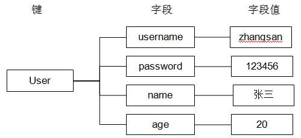

# Redis
## 简介
1. Redis是NoSQL数据库
2. 是一家意大利的创业公司出品的,后来被VMware公司赞助,底层使用C语言编写
3. Redis是将数据存放到内存中,由于内容存取速度快所以redis被广泛应用在互联网项目中
4. Redis优点:存取速度快,官方称读取速度会达到30万次每秒,写速度在10万次每秒左右,具体限制于硬件
5. Redis缺点:对持久化支持不够良好,所以Redis一般不作为数据的主数据库存储,一般配合传统的关系型数据库使用
6. Redis应用领域
    - 分布式缓存
    - 分布式Session
    - 保存博客或者论坛的留言回复等
    - 使用在数据量大,并发量高的情况下


### NoSQL数据库
1. NoSQL，泛指非关系型的数据库
    - 关系型数据:以二维表形式存储数据
    - 非关系型数据库:以键值对形式存储数据(key-value)形式
2. NoSQL即Not-Only SQL，它可以作为关系型数据库的良好补充。随着互联网web2.0网站的兴起，非关系型的数据库现在成了一个极其热门的新领域，非关系数据库产品的发展非常迅速。而传统的关系数据库在应付web2.0网站，特别是超大规模和高并发的SNS类型的web2.0纯动态网站已经显得力不从心，暴露了很多难以克服的问题

#### NoSQL数据库四大分类
1. 键值(key-value)存储数据库
    - 相关产品: Tokyo Cabinet/Tyrant、Redis、Voldemort、Berkeley DB
    - 典型应用: 内容缓存，主要用于处理大量数据的高访问负载。 
    - 数据模型: 一系列键值对
    - 优势: 快速查询
    - 劣势: 存储的数据缺少结构化

2. 列存储数据库
    - 相关产品: Cassandra, HBase, Riak
    - 典型应用: 分布式的文件系统
    - 数据模型: 以列簇式存储，将同一列数据存在一起
    - 优势: 查找速度快，可扩展性强，更容易进行分布式扩展
    - 劣势: 功能相对局限

3. 文档型数据库
    - 相关产品: CouchDB、MongoDB
    - 典型应用: Web应用（与Key-Value类似，Value是结构化的）
    - 数据模型: 一系列键值对
    - 优势: 数据结构要求不严格
    - 劣势: 查询性能不高，而且缺乏统一的查询语法

4. 图形数据库
    - 相关数据库: Neo4J、InfoGrid、Infinite Graph
    - 典型应用: 社交网络
    - 数据模型: 图结构
    - 优势: 利用图结构相关算法。
    - 劣势: 需要对整个图做计算才能得出结果，不容易做分布式的集群方案。

## 源码编译安装Redis
1. 环境: Centos7
2. Redis版本: 4.0.11

### 下载源码并解压
```
$ wget http://download.redis.io/releases/redis-4.0.11.tar.gz
$ tar -xzf redis-4.0.11.tar.gz
$ cd redis-4.0.11
```
1. 相关文件相关说明
    - redis-server: Redis服务器
    - redis-cli: Redis命令
    - redis-benchmark: Redis性能测试工具

### 编译Redis源码
1. 安装编译工具
```
$ yum -y install gcc gcc-c++ kernel-devel
```
2. 编译
```
$ make
```

### 安装
```
$ make PREFIX=/usr/local/redis install
$ mkdir /usr/local/redis/etc/
$ cp redis.conf /usr/local/redis/etc/
$ cd /usr/local/redis/bin/
$ cp redis-benchmark redis-cli redis-server /usr/bin/
```

### 修改配置
打开Redis的配置文件
```
$ vim /usr/local/redis/etc/redis.conf
```
修改如下配置
```
daemonize yes

loglevel verbose

logfile stdout
```

### 配置环境变量
打开/etc/profile
```
$ vim /etc/profile
```

配置环境变量
```
export PATH="$PATH:/usr/local/redis/bin"
```

环境变量立即生效
```
$ source /etc/profile
```

### 配置启动脚本
```
!/bin/bash
chkconfig: 2345 80 90
Simple Redis init.d script conceived to work on Linux systems
as it does use of the /proc filesystem.

PATH=/usr/local/bin:/sbin:/usr/bin:/bin
REDISPORT=6379
EXEC=/usr/local/redis/bin/redis-server
REDIS_CLI=/usr/local/redis/bin/redis-cli
   
PIDFILE=/var/run/redis.pid
CONF="/usr/local/redis/etc/redis.conf"
   
case "$1" in
    start)
        if [ -f $PIDFILE ]
        then
                echo "$PIDFILE exists, process is already running or crashed"
        else
                echo "Starting Redis server..."
                $EXEC $CONF
        fi
        if [ "$?"="0" ] 
        then
              echo "Redis is running..."
        fi
        ;;
    stop)
        if [ ! -f $PIDFILE ]
        then
                echo "$PIDFILE does not exist, process is not running"
        else
                PID=$(cat $PIDFILE)
                echo "Stopping ..."
                $REDIS_CLI -p $REDISPORT SHUTDOWN
                while [ -x ${PIDFILE} ]
               do
                    echo "Waiting for Redis to shutdown ..."
                    sleep 1
                done
                echo "Redis stopped"
        fi
        ;;
   restart|force-reload)
        ${0} stop
        ${0} start
        ;;
  *)
    echo "Usage: /etc/init.d/redis {start|stop|restart|force-reload}" >&2
        exit 1
esac
```

### Redis开启开机自启动
```
$ cp redis /etc/init.d/

$ chmod +x /etc/init.d/redis

$ chkconfig --list

$ chkconfig --add redis

$ chkconfig --level 2345 redis on
```

### 启动测试
```
$ systemctl start redis   #或者 /etc/init.d/redis start  
$ systemctl stop redis   #或者 /etc/init.d/redis stop

$ ps -el|grep redis

$ netstat -an|grep 6379
```

### 启动Redis进程
1. `redis-server redis.conf --port 6380` 

### Redis停止
1. 强行终止Redis进程可能会导致redis持久化数据丢失。正确停止Redis的方式应该是向Redis发送SHUTDOWN命令，方法为
```
$ redis-cli shutdown
```

## Redis客户端
1. 连接到本地Redis服务端:`$ redis-cli`
2. 指定Redis服务的ip和端口: `$ redis-cli -h 192.168.85.131 -p 6379`

### 向Redis服务端发送命令
1. `ping`
    - Redis提供了PING命令来测试客户端与Redis的连接是否正常，如果连接正常会收到回复PONG
2. `keys *`
    - 查看当前库中所有的key值


## Redis多数据库

### Redis实例
1. 一个redis进程就是一个redis实例，一台服务器可以同时有多个redis实例，不同的redis实例提供不同的服务端口对外提供服务，每个redis实例之间互相影响。每个redis实例都包括自己的数据库，数据库中可以存储自己的数据。 

### 多数据库测试
1. 一个Redis实例可以包括多个数据库，客户端可以指定连接某个redis实例的哪个数据库，就好比一个mysql中创建多个数据库，客户端连接时指定连接哪个数据库。
2. 一个redis实例最多可提供16个数据库，下标从0到15，客户端默认连接第0号数据库，也可以通过select选择连接哪个数据库
    - `select 1`

### 注意的问题
1. 不同的数据库可以将另一个数据库存储的数据给清除
2. 不同的应用系统要使用不同的redis实例而不是使用同一个redis实例下的不同数据库。

## Jedis
1. Redis不仅是使用命令来操作，现在基本上主流的语言都有客户端支持，比如java、C、C#、C++、php、Node.js、Go等。
2. 如果linux防火墙开启,需要将redis服务端口设置为开放
```
$ iptables -I INPUT -p tcp --dport 6379 -j ACCEPT
$ iptables-save
```

### 通过Jedis连接单机Redis
#### 导入jar包
1. pom坐标:
```xml
	<dependency>
	    	<groupId>redis.clients</groupId>
	    	<artifactId>jedis</artifactId>
	    	<version>2.7.0</version>
	</dependency>
```

#### 单实例连接
1. 通过创建单实例jedis对象连接redis服务，如下代码
```java
    @Test
    public void testJedis1() throws Exception {
        // 创建和Redis的连接
        Jedis jedis = new Jedis("172.16.27.127", 6379);

        // 存入
        jedis.set("key2", "2");

        // 取出
        System.out.println(jedis.get("key2"));
        // 关闭
        jedis.close();
    }
```

#### 使用连接池连接
1. 通过单实例连接redis不能对redis连接进行共享，可以使用连接池对redis连接进行共享，提高资源利用率，使用jedisPool连接redis服务，如下代码
```java
    @Test
    public void testJedisPool() throws Exception {
        // 创建Jedis连接池
        JedisPool jedisPool = new JedisPool("172.16.27.127", 6379);

        // 获取Jedis连接
        Jedis jedis = jedisPool.getResource();

        // 存入
        jedis.set("key3", "aaa");

        // 取出
        System.out.println(jedis.get("key3"));

        // 使用连接时,连接使用完后一定要关闭,关闭后连接会自动归还到连接池
        jedis.close();

        // 关闭连接池
        jedisPool.close();
    }

```

#### Jedis和Spring整合
1. Spring配置文件applicationContext.xml
```xml
package cn.devinkin.redis;

import org.junit.Before;
import org.junit.Test;
import org.springframework.context.ApplicationContext;
import org.springframework.context.support.ClassPathXmlApplicationContext;
import redis.clients.jedis.Jedis;
import redis.clients.jedis.JedisPool;

public class JedisSpringTest {

    private ApplicationContext applicationContext;

    @Before
    public void setUp() throws Exception {
        String configLocation = "classpath:applicationContext.xml";
        applicationContext = new ClassPathXmlApplicationContext(configLocation);
    }

    @Test
    public void testJedisSpring() throws Exception {
        // 获取连接池
        JedisPool jedisPool = (JedisPool) applicationContext.getBean("jedisPool");

        // 获取连接
        Jedis jedis = jedisPool.getResource();

        // 存入
        jedis.set("key4", "bbb");

        // 取出
        System.out.println(jedis.get("key4"));

    }
}
```

## Redis数据类型
1. 字符串:String(SDS,简单动态字符串)
2. 列表:List
3. 散列:Hash
    - 应用场景:一般用于将Redis作为分布式缓存,存储数据库中的数据对象
4. 集合:Set
5. 有序集合:Zset

### String字符串
1. redis中没有使用C语言的字符串表示，而是自定义一个数据结构叫SDS（simple dynamic string）即简单动态字符串。

#### Redis String相关命令
1. 赋值
    - `SET key value`:一次只能设置一个键值对
    - `MSET key value [key value …]`:同时设置/获取多个键值
2. 取值
    - `GET key`
2. 删除
    - `DEL key`:删除指定key的内容
4. 数字自增
    - `INCR key`:递增数字
    - `INCRBY key increment`:递增数字,且可以指定增量
5. 数字自减
    - `DECR key`:递减数字
    - `DECRBY key increment`:递减数字,且可以指定增量
6. 键值追加
    - `APPEND key value`:APPEND的作用是向键值的末尾追加value。如果键不存在则将该键的值设置为value
7. 获取字符串长度:
    - `STRLEN key`:获取字符串长度,如果键不存在则返回0
### Hash散列
1. hash叫散列类型，它提供了字段和字段值的映射。字段值只能是字符串类型，不支持散列类型、集合类型等其它类型



#### Redis Hash相关命令
1. 赋值
    - `HSET key field value`:一次只能设置一个字段值
    - `HMSET key field value [field value ...]`:一次可以设置多个字段值
2. 取值
    - `HGET key field`:一次只能获取一个字段值
    - `HMGET key field [field ...]`:一次可以获取多个字段值
    - `HGETALL key`:获取key中所有的字段和字段值
3. 删除
    - `HDEL key field [field ...]`:可以删除一个或多个字段，返回值是被删除的字段个数
4. 数字自增
    - `HINCRBY key field increment`:field的值自增increment的增量
5. 判断字段是否存在
    - `HEXISTS key field`:键存在,返回值
    - `HSETNX key field value`:当键对应字段不存在时赋值,字段存在了,不做任何操作
6. 只获取字段名或字段值 
    - `HKEYS key`:只获取字段名
    - `HVALS key`:只获取字段值
7. 获取字段数量
    - HLEN key:键存在,返回字段数量,不存在,则返回0
    
### List列表
1. ArrayList使用数组方式存储数据，所以根据索引查询数据速度快，而新增或者删除元素时需要设计到位移操作，所以比较慢
2. LinkedList使用双向链接方式存储数据，每个元素都记录前后元素的指针，所以插入、删除数据时只是更改前后元素的指针指向即可，速度非常快，然后通过下标查询元素时需要从头开始索引，所以比较慢，但是如果查询前几个元素或后几个元素速度比较快

#### Redis List介绍
1. 列表类型（list）可以存储一个有序的字符串列表，常用的操作是向列表两端添加元素，或者获得列表的某一个片段。
2. 列表类型内部是使用双向链表（double linked list）实现的，所以向列表两端添加元素的时间复杂度为0(1)，获取越接近两端的元素速度就越快。这意味着即使是一个有几千万个元素的列表，获取头部或尾部的10条记录也是极快的。

#### 使用命令
1. 向列表两端增加元素
    - `LPUSH key value [value ...]`:向列表左边增加元素
    - `RPUSH key value [value ...]`:向列表右边增加元素
2. 查看列表
    - `LRANGE key start stop`:start和stop都是索引下标,索引从0开始,-1代表最后边的一个元素。
3. 从列表两端弹出元素 
    - `LPOP key`:LPOP命令从列表左边弹出一个元素，会分两步完成，第一步是将列表左边的元素从列表中移除，第二步是返回被移除的元素值
    - `RPOP key`:RPOP命令从列表右边弹出一个元素，会分两步完成，第一步是将列表右边的元素从列表中移除，第二步是返回被移除的元素值
4. 获取列表中元素的个数
    - `LLEN key`
5. 删除列表中指定的值
    - `LREM key count value`:LREM命令会删除列表中前count个值为value的元素，返回实际删除的元素个数。根据count值的不同，该命令的执行方式会有所不同
        - 当count>0时，LREM会从列表左边开始删除
        - 当count<0时，LREM会从列表后边开始删除
        - 当coun=0时，LREM删除所有值为value的元素
6. 获得/设置指定索引的元素值
    - `LINDEX key index`:获取指定索引的元素值
    - `LSET key index value`:设置指定索引的元素值
7. 只保留列表指定片段
    - `LTRIM key start stop`:指定范围和LRANGE一致
8. 向列表中插入元素
    - `LINSERT key BEFORE|AFTER value`:该命令首先会在列表中从左到右查找值为value的元素，然后根据第二个参数是BEFORE还是AFTER来决定将value插入到该元素的前面还是后面
9. 将元素从一个列表转移到另一个列表中
    - `RPOPLPUSH source destination`
    
### Set集合
1. 在集合中的每个元素不允许重复，且无序
2. 集合类型的常用操作是向集合中加入或删除元素、判断某个元素是否存在等，由于集合类型的Redis内部是使用值为空的散列表实现，所有这些操作的时间复杂度都为0(1)。 
3. Redis还提供了多个集合之间的交集、并集、差集的运算。

#### Redis Set相关命令
1. 增加/删除元素
    - `SADD key member [member ...]`:增加元素
    - `SREM key member [member ...]`:删除元素
2. 获得集合中的所有元素
    - `SMEMBERS key`:获取集合所有元素
    - `SISMEMBER key member`:判断元素是否在集合中，无论集合中有多少元素都可以极速的返回结果
        - 返回1证明集合存在元素
        - 返回0证明集合不存在元素

3. 集合的差集运算 A-B
    - `SDIFF keyA [keyB ...]`:属于keyA并且不属于keyB的元素构成的集合

4. 集合的交集运算 A ∩ B
    - `SINTER keyA [keyB ...]`:属于A且属于B的元素构成的集合

5. 集合的并集运算 A ∪ B
    - `SUNION key [key ...]`:属于A或者属于B的元素构成的集合
    
6. 获得集合中元素的个数 
    - `SCARD key`
7. 从集合中弹出一个元素
    - `SPOP key`:由于集合是无序的，所有SPOP命令会从集合中随机选择一个元素弹出
### Sorted Set有序结合
1. 有序集合和列表相似点
    - 二者都是有序的 
    - 二者都可以获得某一范围的元素
2. 有序集合和列表区别
    - 列表类型是通过链表实现的，获取靠近两端的数据速度极快，而当元素增多后，访问中间数据的速度会变慢
    - 有序集合类型使用散列表实现，所有即使读取位于中间部分的数据也很快
    - 列表中不能简单的调整某个元素的位置，但是有序集合可以（通过更改分数实现）
    - 有序集合要比列表类型更耗内存
#### Redis Sorted Set相关命令
1. 增加元素
    - `ZADD key score member [score member ...]`:集合中包含该元素,则返回原有的集合数量,不包含,则返回添加该元素后元素总数
2. 删除元素
    - `ZREM key member [member ...]`:移除有序集key中的一个或多个成员，不存在的成员将被忽略。当key存在但不是有序集类型时，返回一个错误。
3. 获得排名在某个范围的元素列表
    - `ZRANGE key start stop [WITHSCORES]`:照元素分数从小到大的顺序返回索引从start到stop之间的所有元素（包含两端的元素）
    - 需要获得元素的分数的可以在命令尾部加上WITHSCORES参数
4. 获得指定分数范围的元素
    - `ZRANGEBYSCORE key min max [WITHSCORES] [LIMIT offset count]`
5. 增加某个元素的分数
    - `ZINCRBY  key increment member`:返回值是更改后的分数
6. 获得集合中元素的数量
    - `ZCARD key`
7. 获得指定分数范围内的元素个数
    - `ZCOUNT key min max`
8. 按照排名范围删除元素
    - `ZREMRANGEBYRANK key start stop`
9. 获取元素的排名
    - `ZRANK key member`:从小到大
    - `ZREVRANK key member`:从大到小
    
## keys命令
1. Redis在实际使用过程中更多的用作缓存，然而缓存的数据一般都是需要设置生存时间的，即：到期后数据销毁。

### 设置key的生存时间
1. 设置key的生存时间（单位：秒）key在多少秒后会自动删除
    - `EXPIRE key seconds`

2. 查看key剩余的生存时间
    - `TTL key`
   
3. 清除生存时间
    - `PERSIST key`
    
4. 生存时间设置单位为：毫秒 
    - `PEXPIRE key milliseconds`

### keys相关命令
1. 返回满足给定pattern的所有key
    - `KEYS pattern`
    
2. 确认一个key是否存在
    - `KEYS pattern`:返回0,不存在,返回1,存在
    
3. 重命名key
    - `RENAME key newkey`
   
4. 返回值的类型
    - `TYPE key`
    
    
    
## Redis服务器命令
1. 测试连接是否存活
    - `ping`
    
2. 在命令行打印一些内容
    - `select`
    
3. 退出连接
    - `quit`
    
4. 返回当前数据库中key的数目
    - `dbsize`
    
5. 获取服务器的信息和统计
    - `info`
    
6. 删除当前选择数据库中的所有key
    - `flushdb`
7. 删除所有数据库中的所有key
    - `flushall`
    
## Redis持久化
1. Redis的高性能是由于其将所有数据都存储在了内存中，为了使Redis在重启之后仍能保证数据不丢失，需要将数据从内存中同步到硬盘中，这一过程就是持久化。
2. Redis支持两种方式的持久化，一种是RDB方式，一种是AOF方式。可以单独使用其中一种或将二者结合使用
3. RDB:可以设置间隔多长时间保存一次
    - 优点:让Redis的数据存取速度变快
    - 缺点:服务器断电时会丢失部分数据(数据的完整性得不到保证)
4. AOF:可以设置实时保存
    - 优点:持久化良好,能保证数据的完整性
    - 缺点:大大降低了Redis系统的存取速度

### RDB持久化
1. RDB方式的持久化是通过快照（snapshotting）完成的，当符合一定条件时Redis会自动将内存中的数据进行快照并持久化到硬盘
2. RDB是Redis默认采用的持久化方式，在redis.conf配置文件中默认有此下配置
    - save 900 1
    - save 300 10
    - save 60 10000
    
3. save开头的一行就是持久化配置，可以配置多个条件（每行配置一个条件），每个条件之间是“或”的关系，“save 900 1”表示15分钟（900秒钟）内至少1个键被更改则进行快照，“save 300 10”表示5分钟（300秒）内至少10个键被更改则进行快照

4. 在redis.conf中：
    - 配置dir指定rdb快照文件的位置
   	- 配置dbfilenam指定rdb快照文件的名称

5. Redis启动后会读取RDB快照文件，将数据从硬盘载入到内存。根据数据量大小与结构和服务器性能不同，这个时间也不同。通常将记录一千万个字符串类型键、大小为1GB的快照文件载入到内存中需要花费20～30秒钟

6. 通过RDB方式实现持久化，一旦Redis异常退出，就会丢失最后一次快照以后更改的所有数据。这就需要开发者根据具体的应用场合，通过组合设置自动快照条件的方式来将可能发生的数据损失控制在能够接受的范围。如果数据很重要以至于无法承受任何损失，则可以考虑使用AOF方式进行持久化


### AOF持久化
1. 默认情况下Redis没有开启AOF（append only file）方式的持久化，可以通过appendonly参数开启
    - `appendonly yes`
2. 开启AOF持久化后每执行一条会更改Redis中的数据的命令，Redis就会将该命令写入硬盘中的AOF文件。AOF文件的保存位置和RDB文件的位置相同，都是通过dir参数设置的，默认的文件名是appendonly.aof，可以通过appendfilename参数修改：appendfilename appendonly.aof


## 主从复制
1. 持久化保证了即使redis服务重启也会丢失数据，因为redis服务重启后会将硬盘上持久化的数据恢复到内存中，但是当redis服务器的硬盘损坏了可能会导致数据丢失，如果通过redis的主从复制机制就可以避免这种单点故障
2. 主redis中的数据有两个副本（replication）即从redis1和从redis2，即使一台redis服务器宕机其它两台redis服务也可以继续提供服务。
3. 主redis中的数据和从redis上的数据保持实时同步，当主redis写入数据时通过主从复制机制会复制到两个从redis服务上。
4. 只有一个主redis，可以有多个从redis。
5. 主从复制不会阻塞master，在同步数据时，master可以继续处理client请求
6. 一个redis可以即是主又是从

### 主从配置
1. 主redis不用配置

#### 从redis配置
1. 修改从redis服务器上的redis.conf文件，添加slaveof 主redisip 主redis端口

#### 完整复制
1. slave 服务启动，slave 会建立和master 的连接，发送sync 命令。
2. master启动一个后台进程将数据库快照保存到RDB文件中,注意：此时如果生成RDB文件过程中存在写数据操作会导致RDB文件和当前主redis数据不一致，所以此时master 主进程会开始收集写命令并缓存起来。
3. master 就发送RDB文件给slave
4. slave 将文件保存到磁盘上，然后加载到内存恢复
5. master把缓存的命令转发给slave,注意：后续master 收到的写命令都会通过开始建立的连接发送给slave。当master 和slave 的连接断开时slave 可以自动重新建立连接。如果master 同时收到多个slave 发来的同步连接命令，只会启动一个进程来写数据库镜像，然后发送给所有slave。

#### 部分复制
1. 从机连接主机后，会主动发起 PSYNC 命令，从机会提供 master的runid(机器标识，随机生成的一个串) 和 offset（数据偏移量，如果offset主从不一致则说明数据不同步），主机验证 runid 和 offset 是否有效， runid 相当于主机身份验证码，用来验证从机上一次连接的主机，如果runid验证未通过则，则进行全同步，如果验证通过则说明曾经同步过，根据offset同步部分数据。
