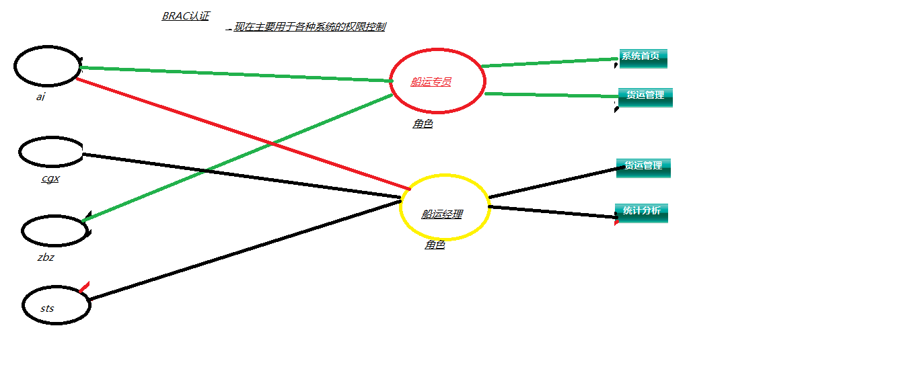

# 认证的传统与BRAC认证方式

## 传统
1. 传统方式认证的过程是查看状态字段，符合要求就可以访问功能模块

## BRAC认证方式
1. Base Role Access Controller：基于角色的访问控制
2. 多对多关系

## inverse 和 cascade的区别
1. inverse主要用于控制权是否要反转，一般将控制权放在多方。True就是把控制权交给多方，False就是把控制权交个一方。效率会提高。
