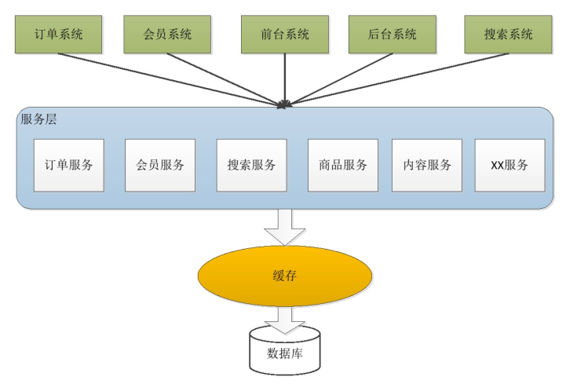
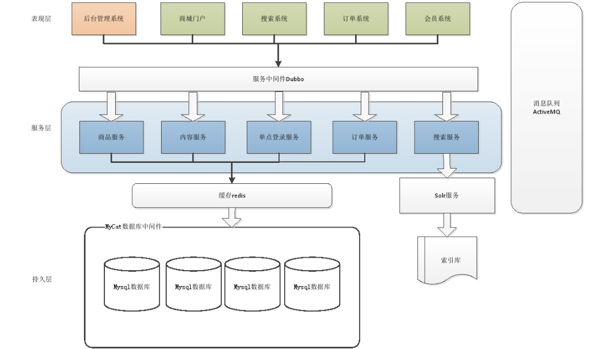

# 淘淘商城介绍
1. 淘淘网上商城是一个B2C平台

## 电商行业技术特点
1. 技术新
2. 技术范围广
3. 分布式
4. 高并发,集群,负载均衡,高可用
5. 海量数据
6. 业务复杂
7. 系统安全

## 电商模式
1. B2B:商家到商家,alibaba,慧聪网,铭万网
2. B2C:商家到用户,京东
3. C2C:用户到用户,淘宝
4. B2B2C:商家到商家到用户,天猫
5. O2O:线上到线下:美团外卖,饿了么

## 分布式
1. 需要按照功能点把系统拆分,拆分成独立的功能.单独为某一个节点添加服务器,需要系统之间配合才能完成整个逻辑业务.叫做分布式

### 分布式和集群
1. 分布式：一个业务分拆多个子业务，部署在不同的服务器上
2. 集群：同一个业务，部署在多个服务器上

## 基于SOA架构
1. SOA:Service Oriented Architecture,面向服务的架构.也就是把工程拆分成服务层,表现层两个工程.服务层中包含业务逻辑,只需要对外提供服务即可.表现层只需要处理和页面交互,业务逻辑都是调用服务层的服务来实现的



## 淘淘商城架构


## 后台工程分析
1. Taotao-parent:父工程,打包方式pom,管理jar包的版本号
    - 项目中所有工程都应该继承父工程
2. Taotao-common:通用的工具类,通用的pojo,打包方式:jar
3. Taotao-manager:服务层工程.聚合工程,pom打包方式
    - Taotao-manager-dao:打包方式:jar
    - Taotao-manager-pojo:打包方式:jar
    - Taotao-manager-interface:打包方式:jar
    - Taotao-manager-service:打包方式:war
4. Taotao-manager-web:表现层工程.打包方式war

### Maven
1. Maven 使用 dependencyManagement 来统一模块见的依赖版本问题。
2. 在父项目的POM文件中，我们会使用到dependencyManagement元素。通过它来管理jar包的版本，让子项目中引用一个依赖而不用显示的列出版本号。Maven会沿着父子层次向上走，直到找到一个拥有dependencyManagement元素的项目，然后它就会使用在dependencyManagement元素中指定的版本号。

#### dependencies与dependencyManagement区别总结
1. dependencies即使在子项目中不写该依赖项，那么子项目仍然会从父项目中继承该依赖项（全部继承）
2. dependencyManagement里只是声明依赖，并不实现引入，因此子项目需要显示的声明需要用的依赖。如果不在子项目中声明依赖，是不会从父项目中继承下来的；只有在子项目中写了该依赖项，并且没有指定具体版本，才会从父项目中继承该项，并且version和scope都读取自父pom;另外如果子项目中指定了版本号，那么会使用子项目中指定的jar版本。

#### tomcat插件
1. 可以启动多个tomcat
```xml
<!-- 配置tomcat插件 -->
<plugin>
    <groupId>org.apache.tomcat.maven</groupId>
    <artifactId>tomcat7-maven-plugin</artifactId>
    <configuration>
        <path>/</path>
        <port>8081</port>
    </configuration>
</plugin>
```