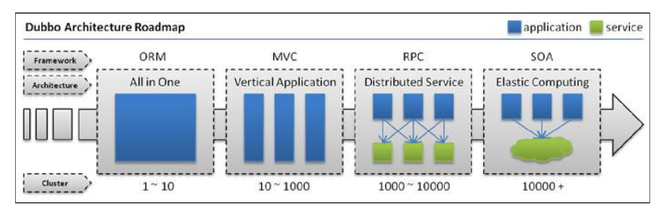
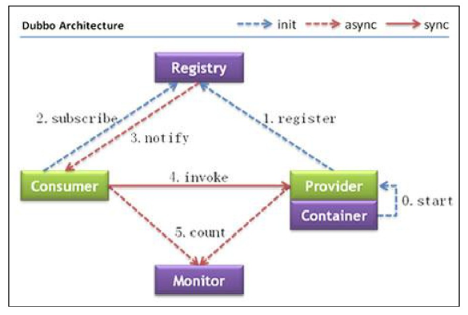

# dubbo
## dubbo简介


1. 随着互联网的发展,网站应用的规模不断扩大,常规的垂直应用框架已无法应对,分布式服务架构以及流动计算框架势在必行,需要一个治理系统确保框架有条不紊的演进

2. 单一应用架构
    - 当网站流量很小时,只需一个应用,将所有功能都部署在一起,以减少部署节点和成本.
    - 此时,用于简化增删改查工作量的数据访问框架(ORM)是关键.
3. 垂直应用架构
    - 当访问量逐渐增大,单一应用增加机器带来的加速度越来越小,将应用拆分成互不相干的几个应用,以提升效率.
    - 此时,用于加速前端页面开发的Web框架(MVC)是关键

4. 分布式服务架构
    - 当垂直应用越来越多,应用之间交互不可避免,将核心业务抽取出来,作为独立的服务.逐渐形成稳定的服务中心,使前段应用能更快速的响应多变的市场需求.
    - 此时,用于提高业务复用及整合的分布式服务框架(RPC)是关键.

5. 流动计算框架
    - 当服务越来越多,容量的评估,小服务资源的浪费等问题逐渐显现,此时需增加一个调度中心基于访问压力实时管理集群容量,提高集群利用率
    - 此时,用于提高机器利用率的,资源调度和管理中心(SOA)是关键.
    
6. Dubbo就是资源调度和治理中心的管理工具

### 如何实现远程通信
1. WebService,效率不高,基于soap协议,项目中不推荐使用
2. 使用restful形式的服务: http+json,很多项目中应用.如果服务太多,服务之间调用关系混乱,需要治疗服务
3. 使用dubbo,使用rpc协议进行远程调用,直接使用socket通信.传输效率高,并且可以统计出系统之间的调用关系,调用次数.


## Dubbo架构


1. 节点角色说明
    - Provider:暴露服务的服务提供方
    - Customer:调用远程服务的服务消费方
    - Registry:服务注册与发现的注册中心
    - Monitor:统计服务的调用次数和调用时间的监控中心
    - Container:服务运行容器
    
2. 调用关系说明
    - 0: 服务容器负责启动,加载,运行服务提供者.
    - 1: 服务提供者在启动时,向注册中心注册自己提供的服务
    - 2: 服务消费者在启动时,向注册中心订阅自己所需的服务
    - 3: 注册中心返回服务提供者地址列表给消费者,如果有变更,注册中心将基于长连接推送变更数据给消费者
    - 4: 服务消费者,从提供者地址列表中,基于软负载均衡算法,选一台提供者进行调用,如果调用失败,再选另一台调用.
    - 5: 服务消费者和提供者,在内存中累计调用次数和调用时间,定时每分钟发送一次统计数据到监控中心
    
### 注册中心
1. dubbo建议使用Zookeeper作为注册中心
2. Zookeeper是Apache Hadoop的子项目,是一个树型的目录服务,支持变更推送,适合作为Dubbo服务的周测中心,工业强度比较高,可用于生产环境,推荐使用

#### Zookeeper的安装
1. 安装jdk
2. 解压zookeeper压缩包
3. 将conf文件夹下zoo_sample.cfg复制一份,改名为zoo.cfg
4. 修改dataDir属性,指定一个真实目录
5. 启动Zookeeper: `bin/zkServer.sh start`
    - 关闭Zookeeper: `bin/zkServer.sh stop`
    - 查看Zookeeper状态: `bin/zkServer.sh status`
    
    
### 监控中心
1. 在tomcat中部署dubbo-admin.war即可
2. dubbo-admin默认登录账号密码为root/root,登录地址默认为`http://localhost:8080/dubbo-admin`
3. 如果dubbo-admin运行不在dubbo所在环境,需要修改dubbo-admin的配置文件`webapps/dubbo-admin/WEB-INF/dubbo.properties`
4. 修改配置文件中的注册中心地址即可

## Dubbo使用方法
1. Dubbo采用全Spring配置方式,透明化接入应用,对应用没有任何API侵入,只需用Spring加载Dubbo的配置即可,Dubbo基于Spring的Schema扩展进行加载.
### 发布服务
```xml
    <!-- 发布dubbo服务 -->
    <!-- 提供方应用信息,用于计算依赖关系 -->
    <dubbo:application name="taotao-manager"/>
    <!-- 注册中心的地址 -->
    <dubbo:registry protocol="zookeeper" address="192.168.85.133:2181"/>
    <!-- 用dubbo协议在20880端口暴露服务 -->
    <dubbo:protocol name="dubbo" port="20880"/>
    <!-- 声明需要暴露的服务接口 -->
    <dubbo:service interface="cn.devinkin.service.ItemService" ref="itemServiceImpl" timeout="300000"></dubbo:service>
```

### 调用服务
```xml
    <!-- 引用dubbo服务 -->
    <dubbo:application name="taotao-manager-web"/>
    <dubbo:registry protocol="zookeeper" address="192.168.85.133:2181"/>
    <dubbo:reference interface="cn.devinkin.service.ItemService" id="itemService"/>
```


# 分页插件
## Mybatis分页插件-PageHelper说明
1. 如果使用Mybatis,建议使用该分页插件,这个插件目前支持Oracle,MySQL,MariaDB,SQLite,Hsqldb,PostgreSQL

## 使用方法
1. 导入jar包
2. 在Mybatis配置xml中配置拦截器插件
3. 在代码中使用
### 在Mybatis配置xml中配置拦截器插件
```xml
    <plugins>
        <!-- PageHelper类所在包名 -->
        <plugin interceptor="com.github.pagehelper.PageHelper">
            <!-- 设置数据库类型 -->
            <property name="dialect" value="mysql"/>
        </plugin>
    </plugins>

```
### 在代码中使用
```java
package cn.devinkin.pagehelper;

import cn.devinkin.mapper.TbItemMapper;
import cn.devinkin.pojo.TbItem;
import cn.devinkin.pojo.TbItemExample;
import com.github.pagehelper.PageHelper;
import com.github.pagehelper.PageInfo;
import org.junit.Test;
import org.springframework.context.ApplicationContext;
import org.springframework.context.support.ClassPathXmlApplicationContext;

import java.util.List;

/**
 * @author devinkin
 * <p>Title: </p>
 * <p>Description: </p>
 * @version 1.0
 * @see
 * @since 16:16 2018/9/19
 */
public class TestPageHelper {
    @Test
    public void testPageHelper() throws Exception {
        // 1. 在执行查询之前配置分页条件,使用PageHelper的静态方法
        PageHelper.startPage(1, 10);
        // 2. 执行查询
        ApplicationContext applicationContext = new ClassPathXmlApplicationContext("classpath:spring/applicationContext-dao.xml");
        TbItemMapper itemMapper = applicationContext.getBean(TbItemMapper.class);
        // 创建Example对象
        TbItemExample example = new TbItemExample();
        List<TbItem> list = itemMapper.selectByExample(example);
        // 3. 取分页信息.使用PageInfo对象获取.
        PageInfo<TbItem> pageInfo = new PageInfo<>(list);
        System.out.println("总记录数: " + pageInfo.getTotal());
        System.out.println("总页数: " + pageInfo.getPages());
        System.out.println("返回的记录数: " + list.size());
    }
}

```
