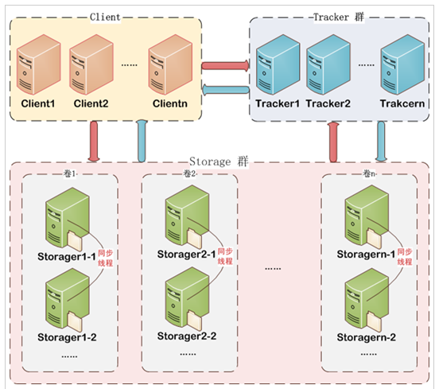
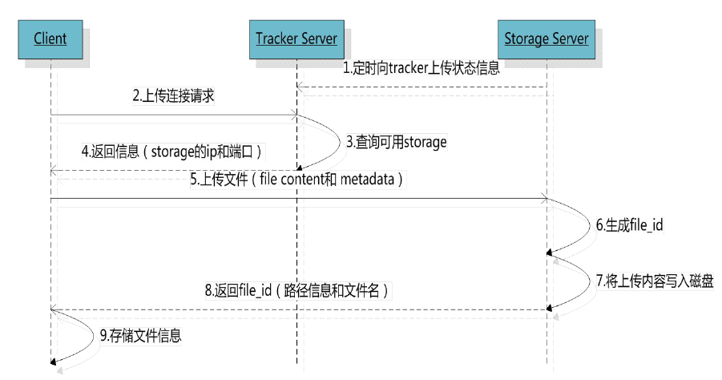
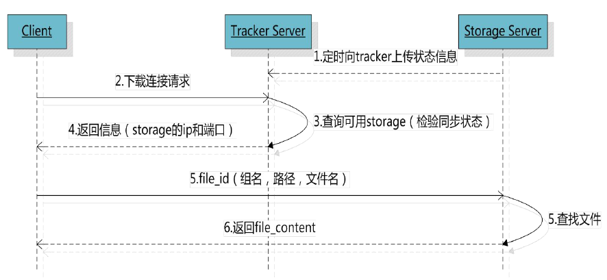

# 图片上传
## 图片服务器的安装
1. 存储空间可扩展。
2. 提供一个统一的访问方式。
3. 使用FastDFS，分布式文件系统。存储空间可以横向扩展，可以实现服务器的高可用。支持每个节点有备份机。

## 图片服务器FastDFS
FastDFS是用c语言编写的一款开源的分布式文件系统。FastDFS为互联网量身定制，充分考虑了冗余备份、负载均衡、线性扩容等机制，并注重高可用、高性能等指标，使用FastDFS很容易搭建一套高性能的文件服务器集群提供文件上传、下载等服务。

## FastDFS结构
1. FastDFS架构包括 Tracker server和Storage server。客户端请求Tracker server进行文件上传、下载，通过Tracker server调度最终由Storage server完成文件上传和下载。
2. Tracker server作用是负载均衡和调度，通过Tracker server在文件上传时可以根据一些策略找到Storage server提供文件上传服务。可以将tracker称为追踪服务器或调度服务器。
3. Storage server作用是文件存储，客户端上传的文件最终存储在Storage服务器上，Storage server没有实现自己的文件系统而是利用操作系统 的文件系统来管理文件。可以将storage称为存储服务器。
4. 服务端两个角色：
    - Tracker：管理集群，tracker也可以实现集群。每个tracker节点地位平等。收集Storage集群的状态。
    - Storage：实际保存文件,Storage分为多个组，每个组之间保存的文件是不同的。每个组内部可以有多个成员，组成员内部保存的内容是一样的，组成员的地位是一致的，没有主从的概念。
  


## 文件上传流程
1. 客户端上传文件后存储服务器将文件ID返回给客户端，此文件ID用于以后访问该文件的索引信息。文件索引信息包括：组名，虚拟磁盘路径，数据两级目录，文件名。
    - 组名：文件上传后所在的storage组名称，在文件上传成功后有storage服务器返回，需要客户端自行保存。 
    - 虚拟磁盘路径：storage配置的虚拟路径，与磁盘选项store_path*对应。如果配置了store_path0则是M00，如果配置了store_path1则是M01，以此类推。
    - 数据两级目录：storage服务器在每个虚拟磁盘路径下创建的两级目录，用于存储数据文件。
    - 文件名：与文件上传时不同。是由存储服务器根据特定信息生成，文件名包含：源存储服务器IP地址、文件创建时间戳、文件大小、随机数和文件拓展名等信息。
    


## 文件下载流程


## Centos7安装/配置FastDFS/Nginx
### 安装开发环境
```
$ yum groupinstall "Development Tools" "Server platform Development"
```

### 安装 libfastcommon
```
$ cd /opt/
$ git clone https://github.com/happyfish100/libfastcommon.git 
$ cd libfastcommon/ 
$ ./make.sh 
$ ./make.sh install
```

### 安装 FastDFS
```
$ cd /opt
$ git clone https://github.com/happyfish100/fastdfs.git 
$ cd fastdfs/ 
$ ./make.sh 
$ ./make.sh install
```

### 配置tracker
```
$ cd /etc/fdfs 
$ cp tracker.conf.sample tracker.conf 
$ vim /etc/fdfs/tracker.conf

===modify content===
disabled=false
port=22122（默认为22122） 
base_path=/data/fdfs/tracker
===modify content===
```

#### 配置client.conf
```
$ cd /etc/fdfs 
$ cp client.conf.sample client.conf 
$ vim /etc/fdfs/client.conf

==============
base_path=/data/fdfs/tracker 
tracker_server=192.168.83.134:22122
==============
```
#### 创建tracker目录
```
$ mkdir -pv /data/fdfs/tracker
```

### 启动tracker
```
$ /etc/init.d/fdfs_trackerd start
```

#### 查看fdfs进程
```
$ ps -ef | grep fdfs
```

### 配置storage 
```
cd /etc/fdfs 
cp storage.conf.sample storage.conf 
vim /etc/fdfs/storage.conf

=======================================
disabled=false
port=23000
group_name=group1 
base_path=/data/fdfs/storage
store_path_count=2
store_path0=/data/fdfs/storage/m0
store_path1=/data/fdfs/storage/m1
tracker_server=192.168.85.134:22122
http.server_port=8888
=======================================

$ mkdir -pv /data/fdfs/storage/{m0,m1}
```

### 启动storage
1. 必须先启动tracker，再启动storage
```
$ /etc/init.d/fdfs_storaged start
$ ps -el | grep fdfs
```

#### 开放端口问题
1. 如果发现storage无法启动,查看错误日志,所在目录为`/data/fdfs/storage/logs/`
2. 开放22122端口
```
$ yum install iptables-services
$ vim /etc/sysconfig/iptables

==============add content
-A INPUT -m state --state NEW -m tcp -p tcp --dport 22122 -j ACCEPT
==============
```

### 文件上传测试
```
/usr/bin/fdfs_upload_file /etc/fdfs/client.conf /home/alex/test.png 
```

### 存储服务器（storage server）安装并配置nginx
```
$ cd /opt
$ git clone https://github.com/happyfish100/fastdfs-nginx-module 
$ cp /opt/fastdfs-nginx-module/src/mod_fastdfs.conf /etc/fdfs/ 
vim /etc/fdfs/mod_fastdfs.conf

===================================
connect_timeout=10 
base_path=/tmp（默认为/tmp） 
tracker_server=192.168.85.134:22122 
storage_server_port=23000（默认配置为23000） 
url_have_group_name = true 
store_path_count=2 # 设置设备数量 
store_path0=/data/fdfs/storage/m0 
store_path0=/data/fdfs/storage/m1 
group_name=group1（默认配置为group1）
```

### 安装Nginx依赖库
```
$ yum -y install pcre-devel zlib-devel 
$ yum -y install openssl openssl-devel
```

### 安装Nginx
```
$ cd /opt
$ wget http://nginx.org/download/nginx-1.9.8.tar.gz
$ tar xf nginx-1.8.1.tar.gz 
$ cd nginx-1.9.8
$ ./configure --prefix=/opt/nginx/ --add-module=../fastdfs-nginx-module/src/
$ make && make install
```

### 配置Nginx
```
$ cp /root/fastdfs/conf/http.conf /etc/fdfs/ 
$ cp /root/fastdfs/conf/mime.types /etc/fdfs/
$ vim /opt/nginx/conf/nginx.conf

===============================
user  root;    
 worker_processes  1;
events {
    worker_connections  1024;
}
    http {
        include       mime.types;
        default_type  application/octet-stream;
        sendfile        on;
        keepalive_timeout  65;
        server {
            listen       8888;
            server_name  localhost;
            location ~/group[0-9]/ {
                ngx_fastdfs_module;
            }
            error_page   500 502 503 504  /50x.html;
            location = /50x.html {
            root   html;
            }
        }
    }
===============================
```

### 启动Nginx
```
$ cp /opt/nginx/sbin/nginx /etc/init.d/ 
$ /etc/init.d/nginx
$ ss -lntup|grep 8888 
```

### 开启Nginx配置的端口
```
$ vim /etc/sysconfig/iptables

=============================add content
-A INPUT -m state --state NEW -m tcp -p tcp --dport 8888 -j ACCEPT
=============================
```

### 根据文件上传返回值进行访问上传的图片
```
$ fdfs_upload_file /etc/fdfs/client.conf ./erji.png 
group1/M01/00/00/wKhVhlujN4yARm82AB4-xmViaxY189.png

visit
===
http://192.168.85.134:8888/group1/M01/00/00/wKhVhlujN4yARm82AB4-xmViaxY189.png
===
```

## 图片上传功能实现
1. 导入jar包
```xml
        <!-- FastDFS Client -->
        <dependency>
            <groupId>fastdfs_client</groupId>
            <artifactId>fastdfs_client</artifactId>
            <version>1.25</version>
        </dependency>
        <!-- FastDFS Client -->
```

### 编写测试代码
```java
package cn.devinkin.fastdfs;

import org.csource.fastdfs.*;
import org.junit.Test;

/**
 * @author devinkin
 * <p>Title: TestFastDFS</p>
 * <p>Description: </p>
 * @version 1.0
 * @see
 * @since 15:02 2018/9/20
 */
public class TestFastDFS {

    @Test
    public void uploadFile() throws Exception{
        // 1. 向工程中添加jar包
        // 2. 创建一个配置文件,配置tracker服务器地址
        // 3. 加载配置文件
        ClientGlobal.init("F:\\WebBackEnd\\Taotaoparent\\Taotao-manager-web\\src\\main\\resources\\client.conf");
        // 4. 创建一个TrackerClient对象
        TrackerClient trackerClient = new TrackerClient();
        // 5. 使用TrackerClient对象获得TrackerServer对象.
        TrackerServer trackerServer = trackerClient.getConnection();
        // 6. 创建一个StorageServer的null引用
        StorageServer storageServer = null;
        // 7. 创建衣蛾StorageClient对象,参数: trackerServer,storageServer两个参数
        StorageClient storageClient = new StorageClient(trackerServer, storageServer);
        // 8. 使用StorageClient对象上传文件
        String[] strings = storageClient.upload_file("F:\\WebBackEnd\\Taotaoparent\\pic\\FastDFS3.png", "png", null);
        for (String s : strings) {
            System.out.println(s);
        }
    }
}

```

# 富文本编辑器的使用KindEditor
1. 常用的富文本编辑器
    - KindEditor
    - UEditor
    - CKEditor