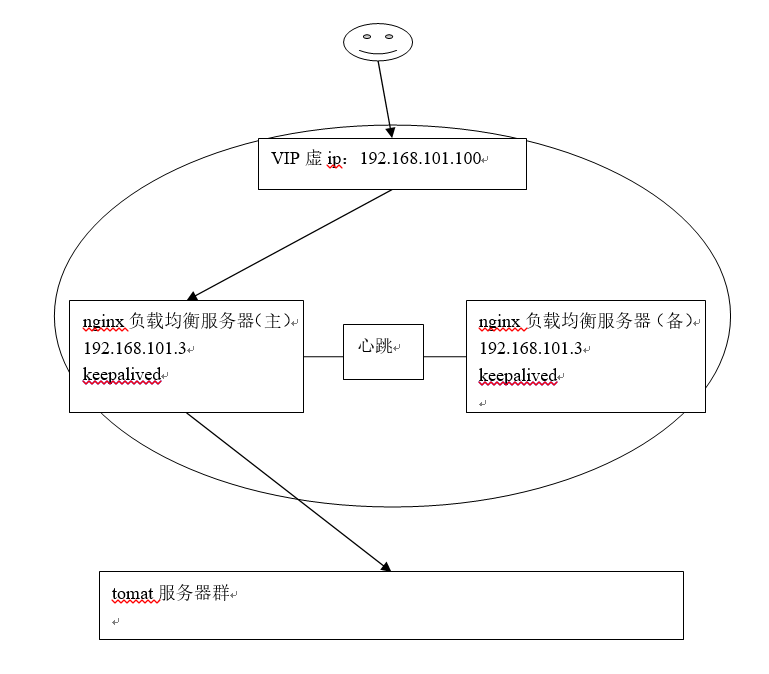
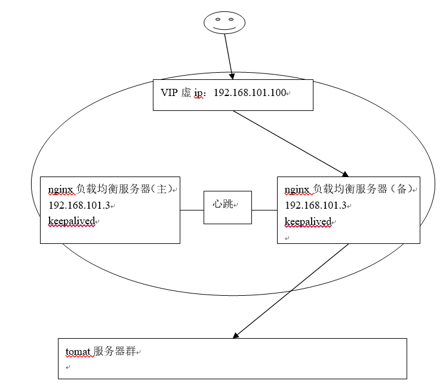
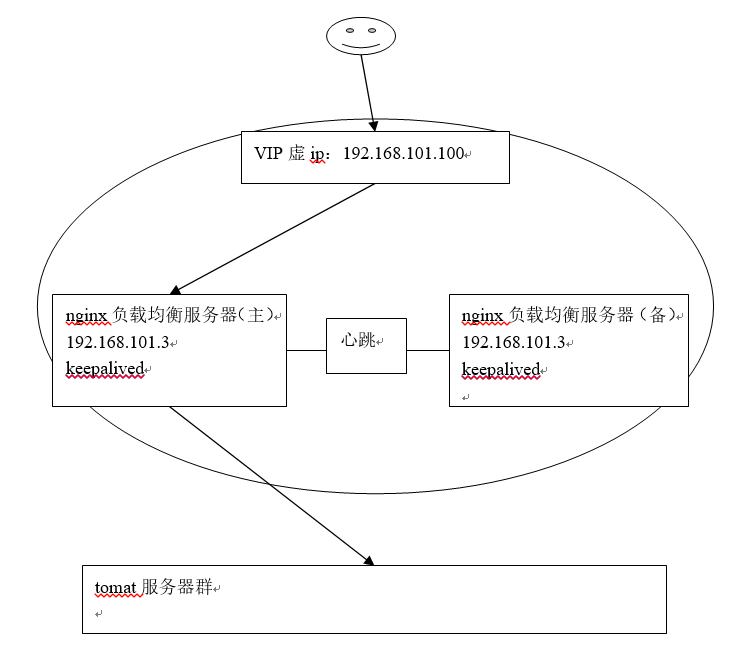

# Nginx

## Nginx简介
1. Nginx是一款高性能的http 服务器/反向代理服务器及电子邮件（IMAP/POP3）代理服务器。由俄罗斯的程序设计师Igor Sysoev所开发，官方测试nginx能够支支撑5万并发链接，并且cpu、内存等资源消耗却非常低，运行非常稳定。

## 应用场景
1. http服务器。Nginx是一个http服务可以独立提供http服务。可以做网页静态服务器。
2. 虚拟主机。可以实现在一台服务器虚拟出多个网站。例如个人网站使用的虚拟主机。
3. 反向代理，负载均衡。当网站的访问量达到一定程度后，单台服务器不能满足用户的请求时，需要用多台服务器集群可以使用nginx做反向代理。并且多台服务器可以平均分担负载，不会因为某台服务器负载高宕机而某台服务器闲置的情况。

## nginx安装

### 要求的安装环境
1. 需要安装gcc的环境。yum install gcc-c++
2. 安装第三方的开发包
3. 源码编译安装nginx
### 第三方的开发包。
3. PCRE
    - PCRE(Perl Compatible Regular Expressions)是一个Perl库，包括 perl 兼容的正则表达式库。nginx的http模块使用pcre来解析正则表达式，所以需要在linux上安装pcre库。
    - `yum install -y pcre pcre-devel`
    - 注：pcre-devel是使用pcre开发的一个二次开发库。nginx也需要此库。
    
4. zlib
    - zlib库提供了很多种压缩和解压缩的方式，nginx使用zlib对http包的内容进行gzip，所以需要在linux上安装zlib库。
    - `yum install -y zlib zlib-devel`

5. openssl
    - OpenSSL 是一个强大的安全套接字层密码库，囊括主要的密码算法、常用的密钥和证书封装管理功能及SSL协议，并提供丰富的应用程序供测试或其它目的使用。
    - nginx不仅支持http协议，还支持https（即在ssl协议上传输http），所以需要在linux安装openssl库。
    - `yum install -y openssl openssl-devel`

### 源码编译安装nginx
1. 解压缩
2. 安装
```
$ ./configure \
    --prefix=/usr/local/nginx \
    --pid-path=/var/run/nginx/nginx.pid \
    --lock-path=/var/lock/nginx.lock \
    --error-log-path=/var/log/nginx/error.log \
    --http-log-path=/var/log/nginx/access.log \
    --with-http_gzip_static_module \
    --http-client-body-temp-path=/var/temp/nginx/client \
    --http-proxy-temp-path=/var/temp/nginx/proxy \
    --http-fastcgi-temp-path=/var/temp/nginx/fastcgi \
    --http-uwsgi-temp-path=/var/temp/nginx/uwsgi \
    --http-scgi-temp-path=/var/temp/nginx/scgi

$ mkdir /var/temp/nginx/client -p

$ make

$ make install
```

### 访问nginx
1. nginx默认端口为80

### nginx启动相关命令
1. 启动nginx: `./nginx`
2. 关闭nginx: 
    - `./nginx -s stop`
    - `./nginx -s quit`
3. nginx重新加载配置文件: `./nginx -s reload`

## nginx配置虚拟主机
1. 通过端口区分不同虚拟机
2. 通过域名区分虚拟主机

### 通过端口区分不同虚拟机
1. 一个server节点就是一个虚拟主机
2. 可以配置多个server,配置多个虚拟主机
3. 重新加载配置文件: `./nginx -s reload`
4. 添加server节点如下
```
 server {
        listen       81;
        server_name  localhost;

        #charset koi8-r;

        #access_log  logs/host.access.log  main;

        location / {
            root   html-81;
            index  index.html index.htm;
        }
    }
```

### 通过域名区分虚拟主机
#### 域名简介
1. Dns服务器：把域名解析为ip地址。保存的就是域名和ip的映射关系
2. 一个域名对应一个ip地址，一个ip地址可以被多个域名绑定
3. 域名分类
    - 一级域名
    - 二级域名
    - 三级域名
    - N级域名就是在N-1级域名前追加一级
4. 配置server节点
```
server {
        listen       80;
        server_name  www.taobao.com;

        #charset koi8-r;

        #access_log  logs/host.access.log  main;

        location / {
            root   html-taobao;
            index  index.html index.htm;
        }
    }
    server {
        listen       80;
        server_name  www.taotaoshop.com;

        #charset koi8-r;

        #access_log  logs/host.access.log  main;

        location / {
            root   html-taotaoshop;
            index  index.html index.htm;
        }
    }
```

## Nginx反向代理
1. 正向代理是代理客户端
2. 反向代理是代理服务器
3. 反向代理服务器决定哪台服务器提供服务,返回代理服务器不提供服务器。也是请求的转发

## Nginx实现反向代理
1. 两个域名指向同一台nginx服务器，用户访问不同的域名显示不同的网页内容
2. 两个域名分别是`www.sina.com.cn`和`www.sohu.com`
3. 反向代理配置节点
```
   upstream tomcat1 {
	server 192.168.85.139:8080;
   }
   upstream tomcat2 {
	server 192.168.85.139:8081;
   }

   server {
        listen       80;
        server_name  www.mytest1.com;

        #charset koi8-r;

        #access_log  logs/host.access.log  main;

        location / {
            proxy_pass 	http://tomcat1;
            index  index.html index.htm;
        }

        #error_page  404              /404.html;

        # redirect server error pages to the static page /50x.html
        #
        error_page   500 502 503 504  /50x.html;
        location = /50x.html {
            root   html;
        }
   }

   server {
        listen       80;
        server_name  www.mytest2.com;

        #charset koi8-r;

        #access_log  logs/host.access.log  main;

        location / {
            proxy_pass 	http://tomcat2;
            index  index.html index.htm;
        }

        #error_page  404              /404.html;

        # redirect server error pages to the static page /50x.html
        #
        error_page   500 502 503 504  /50x.html;
        location = /50x.html {
            root   html;
        }
   }
```

## Nginx负载均衡
1. 如果一个服务由多条服务器提供，需要把负载分配到不同的服务器处理，需要负载均衡
2. 可以根据服务器的实际情况调整服务器权重。权重越高分配的请求越多，权重越低，请求越少。默认是都是1
```
upstream tomcat2 {
	server 192.168.25.148:8081;
	server 192.168.25.148:8082 weight=2;
    }
```

## Nginx的高可用

### 什么是均衡高可用
1. nginx作为负载均衡器，所有请求都到了nginx，可见nginx处于非常重点的位置，如果nginx服务器宕机后端web服务将无法提供服务，影响严重。
2. 为了屏蔽负载均衡服务器的宕机，需要建立一个备份机。主服务器和备份机上都运行高可用（High Availability）监控程序，通过传送诸如“I am alive”这样的信息来监控对方的运行状况。当备份机不能在一定的时间内收到这样的信息时，它就接管主服务器的服务IP并继续提供负载均衡服务；当备份管理器又从主管理器收到“I am alive”这样的信息时，它就释放服务IP地址，这样的主服务器就开始再次提供负载均衡服务。

### keepalived+nginx实现主备
#### 什么是keepalived
1. keepalived是集群管理中保证集群高可用的一个服务软件，用来防止单点故障。
2. Keepalived的作用是检测web服务器的状态，如果有一台web服务器死机，或工作出现故障，Keepalived将检测到，并将有故障的web服务器从系统中剔除，当web服务器工作正常后Keepalived自动将web服务器加入到服务器群中，这些工作全部自动完成，不需要人工干涉，需要人工做的只是修复故障的web服务器。

#### keepalived工作原理
1. keepalived是以VRRP协议为实现基础的，VRRP全称Virtual Router Redundancy Protocol，即虚拟路由冗余协议。
2. 虚拟路由冗余协议，可以认为是实现路由器高可用的协议，即将N台提供相同功能的路由器组成一个路由器组，这个组里面有一个master和多个backup，master上面有一个对外提供服务的vip（VIP = Virtual IP Address，虚拟IP地址，该路由器所在局域网内其他机器的默认路由为该vip），master会发组播，当backup收不到VRRP包时就认为master宕掉了，这时就需要根据VRRP的优先级来选举一个backup当master。这样的话就可以保证路由器的高可用了。
3. keepalived主要有三个模块，分别是core、check和VRRP。
    - core模块为keepalived的核心，负责主进程的启动、维护以及全局配置文件的加载和解析。
    - check负责健康检查，包括常见的各种检查方式。
    - VRRP模块是来实现VRRP协议的。 
    
##### 初始状态


##### 主机宕机


##### 主机回复


#### 高可用环境
1. 两台nginx，一主一备
2. 两台tomcat服务器

##### 安装keepalived

###### 安装环境
```
$ yum -y install kernel-devel*
$ yum -y install openssl-*
$ yum -y install popt-devel
$ yum -y install lrzsz
$ yum -y install openssh-clients
$ yum -y install libnl libnl-devel popt
```

###### 安装keepalived
1. 将keepalived-1.2.15.tar.gz上传到服务器/usr/local/下
2. 执行配置命令
3. 编译
4. 安装
5. 拷贝执行文件
6. 将init.d文件拷贝到etc下,加入开机启动项
7. 将keepalived文件拷贝到etc下，加入网卡配置
8. 创建keepalived文件夹
9. 将keepalived配置文件拷贝到etc下
10. 添加可执行权限
```
===1===
$ cd /usr/local
$ tar -zxvf keepalived-1.2.15.tar.gz
$ cd keepalived-1.2.15
===1===
===2===
$ ./configure --prefix=/usr/local/keepalived
===2===
===3===
$ make
===3===
===4===
$ make install
===4===
===5===
$ cp /usr/local/keepalived/sbin/keepalived /usr/sbin/
===5===
===6===
$ cp /usr/local/keepalived/etc/rc.d/init.d/keepalived /etc/init.d/keepalived
===6===
===7===
$ cp /usr/local/keepalived/etc/sysconfig/keepalived /etc/sysconfig/
===7===
===8===
$ mkdir -p /etc/keepalived
===8===
===9===
$ cp /usr/local/keepalived/etc/keepalived/keepalived.conf /etc/keepalived/keepalived.conf
===9===
===10===
$ chmod +x /etc/init.d/keepalived
===10===
```

###### 加入开机启动
```
$ chkconfig --add keepalived
$ chkconfig keepalived on
$ chkconfig --list
```

####### 启动keepalived
1. 启动
    - `service keepalived start`
2. 停止
    - `service keepalived stop`
3. 重启
    - `service keepalived restart`

###### 配置日志文件
1. 将keepalived日志输出到local0
```
$ vi /etc/sysconfig/keepalived

KEEPALIVED_OPTIONS="-D -d -S 0"
```
2. 在/etc/rsyslog.conf里添加
```
$ local0.*  /var/log/keepalived.log
```
3. 重新启动keepalived和rsyslog服务
```
$ service rsyslog restart 
$ service keepalived restart
```

###### 打开防火墙的通讯地址
```
$ iptables -A INPUT -d 224.0.0.18 -j ACCEPT
$ /etc/rc.d/init.d/iptables save
```


# Sso系统分析
## Sso系统简介
1. SSO英文全称Single Sign On，单点登录。SSO是在多个应用系统中，用户只需要登录一次就可以访问所有相互信任的应用系统。它包括可以将这次主要的登录映射到其他应用中用于同一个用户的登录的机制。它是目前比较流行的企业业务整合的解决方案之一。